# QuickBihar Architecture and Product Flows

This document explains the QuickBihar app for a new developer: what each app does, how the services connect, how each role moves through the system, and which edge cases must be protected.

## Product Surface

QuickBihar has four main user surfaces:

| Surface | App | Primary users | Purpose |
| --- | --- | --- | --- |
| Storefront | Expo Router app in `mobile/` exported to web and built for Android/iOS | Customers | Browse local products, manage cart, checkout, track orders, request returns |
| Admin dashboard | Next.js app in `web/` | Admin / operations team | Manage catalog, sellers, riders, orders, notifications, system settings |
| Seller dashboard | Next.js app in `web/` | Sellers / store owners | Store setup, products, orders, payouts, inventory |
| Rider workspace | Expo app and dashboard paths | Delivery riders | Accept delivery jobs, pickup, deliver, COD settlement, returns |

## System Architecture

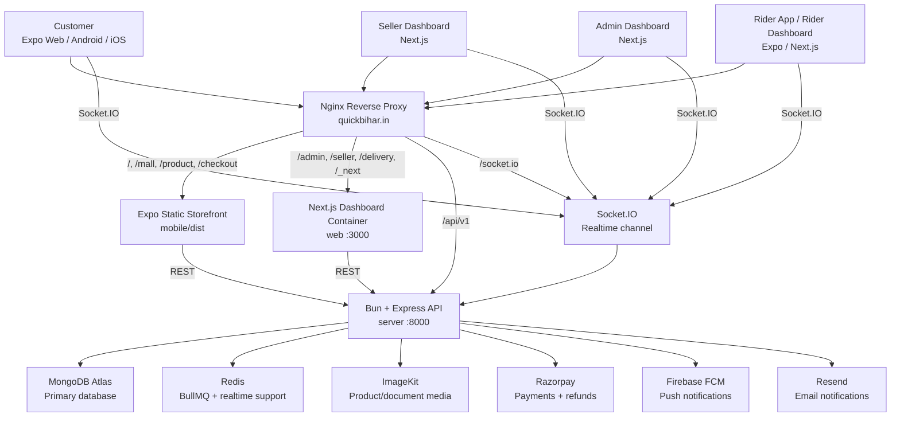

## Backend Module Map

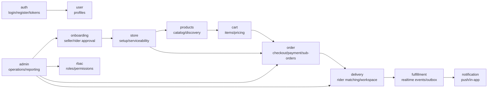

Important backend concepts:

| Concept | Description |
| --- | --- |
| Parent order | Customer-level order containing all cart items and payment information |
| Sub-order | Seller/store-level split of a parent order. Multi-seller orders become multiple sub-orders |
| Store serviceability | Whether a store can deliver to a selected pincode/GPS point |
| Rider offer | A delivery job broadcast to eligible riders |
| Fulfillment event | Realtime event used to recover missed updates after disconnects |
| COD liability | Rider wallet value tracking cash collected but not deposited |

## Data Ownership

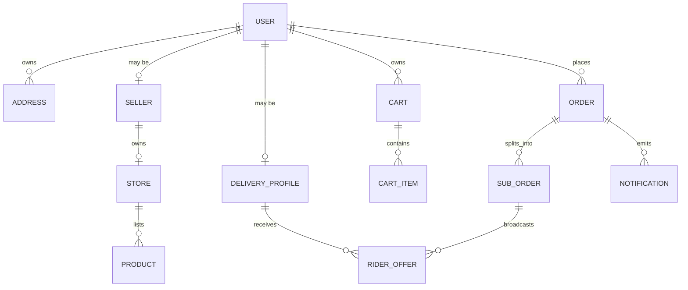

## Customer Discovery Flow

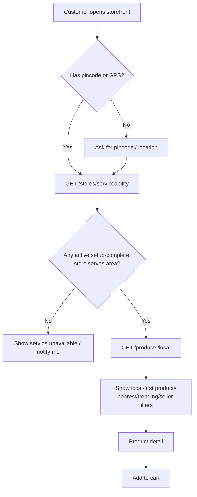

Discovery rules:

| Rule | Why it matters |
| --- | --- |
| Store must be active, open, and setup-complete | Avoid selling from unavailable merchants |
| Pincode or GPS must match store reach | Prevent showing products that cannot be delivered |
| Products must be active and approved | Avoid unreviewed or deleted catalog |
| Local products are store-filtered | Keeps the marketplace hyperlocal |

## Customer Order Flow

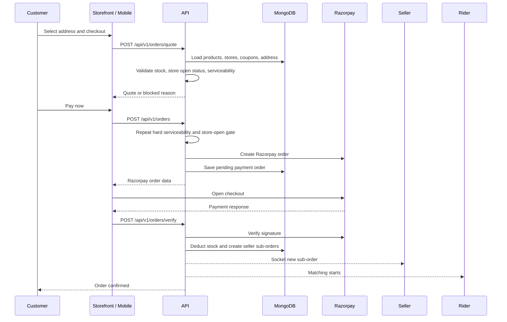

Customer order edge cases:

| Edge case | Required behavior |
| --- | --- |
| Address has no GPS pin | Block checkout and ask user to update address |
| Cart has products from unserviceable store | Quote/order must fail with item/store-level message |
| Store closes before payment | Quote/order must fail before Razorpay order creation |
| Product stock changes during payment | Verify step must reject, avoid negative stock, trigger support/refund path |
| Payment cancelled | Keep order pending/failed, do not deduct stock |
| Payment signature invalid | Reject verification and show support message |
| Coupon becomes invalid | Recalculate quote and block stale discount |
| Multi-seller cart | Split into separate sub-orders after payment |
| User disconnects during checkout | Order remains pending until payment verification succeeds |

## Admin Flow

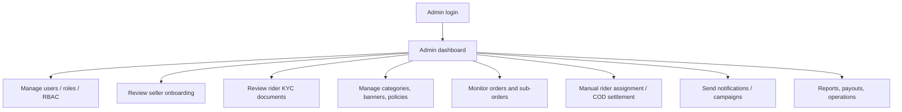

Admin responsibilities:

| Area | Admin action |
| --- | --- |
| Seller onboarding | Approve/reject seller application and store readiness |
| Rider onboarding | Review driving license, Aadhaar, PAN, RC, profile photo independently |
| Catalog governance | Create approved categories, banners, policies, size charts |
| Fulfillment operations | Watch stuck orders, offline riders, no-rider scenarios |
| Finance operations | Monitor seller settlement and rider COD liability |
| Notifications | Trigger order, marketing, and support notifications |

Admin edge cases:

| Edge case | Required behavior |
| --- | --- |
| Seller submits incomplete store setup | Keep products/order acceptance blocked |
| Rider document rejected | Only rejected document should need re-upload |
| Rider offline mid-trip | Admin alert and customer delay notification |
| Order stuck without rider | Manual assign, merchant self-delivery, or cancel/refund path |
| COD liability exceeded | Block rider from new COD jobs until settled |
| Suspicious user/seller/rider | Block account via RBAC/admin controls |

## Seller Flow

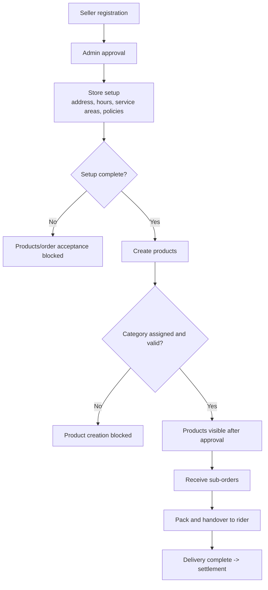

Seller edge cases:

| Edge case | Required behavior |
| --- | --- |
| Store is closed early | Customer checkout must block affected items |
| Store inactive or not setup-complete | Products should not appear in local discovery |
| Product category removed/inactive | Product creation/update should fail |
| Image upload fails | Product creation/update should fail cleanly |
| Seller has one-store limit | Prevent duplicate store creation |
| Return arrives damaged or mismatched | Seller validation and dispute workflow needed |

## Rider Flow

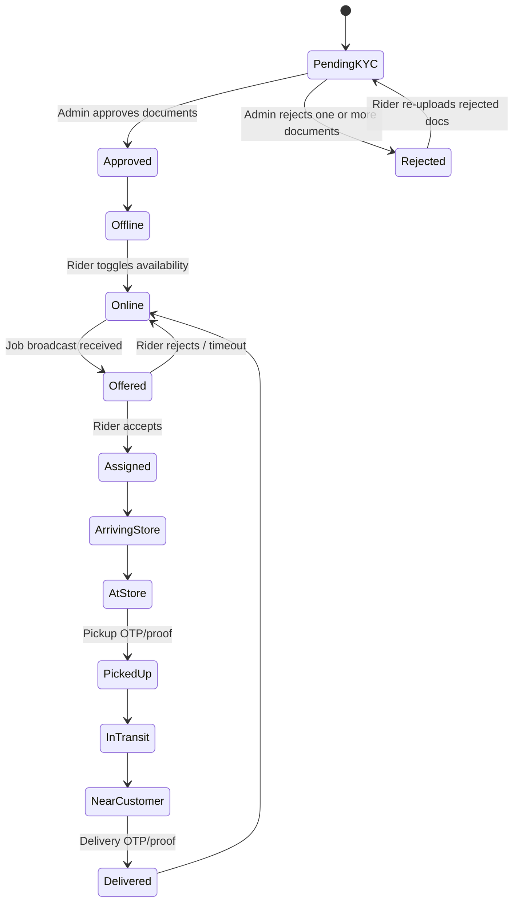

Rider matching and delivery rules:

| Rule | Why it matters |
| --- | --- |
| Rider must be approved, verified, online | Prevent untrusted fulfillment |
| Rider capacity limits apply | Avoid overloading one rider |
| COD liability limit applies | Reduce cash risk |
| GPS/location needed for matching | Enables nearest rider selection |
| OTP/proof checkpoints | Reduces false pickup/delivery claims |

Rider edge cases:

| Edge case | Required behavior |
| --- | --- |
| No rider accepts in first radius | Expand broadcast radius and/or alert admin |
| Rider accepts then disconnects | Reassign or escalate after timeout |
| Rider GPS lost mid-trip | Admin alert and customer delay message |
| COD liability too high | Block new COD acceptance |
| Wrong pickup OTP | Do not mark picked up |
| Wrong delivery OTP | Do not mark delivered |
| Rider cancels after accepting | Return order to matching pool and audit action |

## Return / Exchange Flow

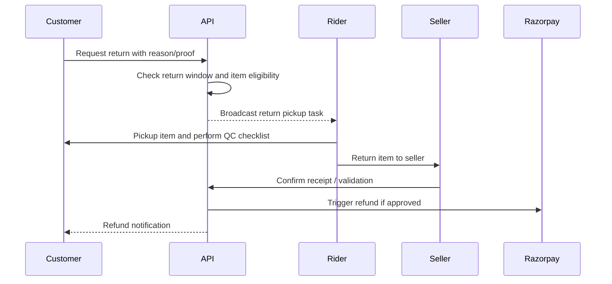

Return edge cases:

| Edge case | Required behavior |
| --- | --- |
| Return window expired | Reject request with policy message |
| Item not returnable | Reject based on policy/category |
| Missing proof photo | Require upload when policy needs proof |
| QC fails at pickup | Mark return rejected/disputed |
| Seller rejects receipt | Open admin dispute path |
| Refund fails | Retry or manual admin refund path |

## Realtime and Notification Flow

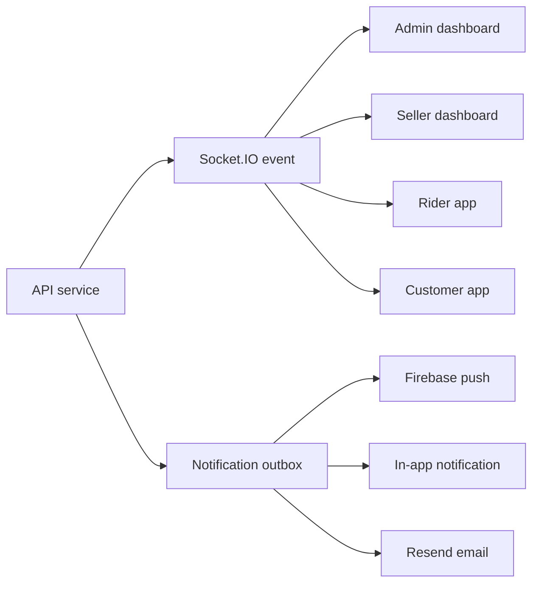

Realtime edge cases:

| Edge case | Required behavior |
| --- | --- |
| Client misses socket event | Recover from fulfillment event feed |
| Push notification fails | Keep in-app notification/outbox state |
| Duplicate event delivery | Consumers must be idempotent by event id |
| Socket auth token expires | Refresh token and reconnect |

## Deployment Flow

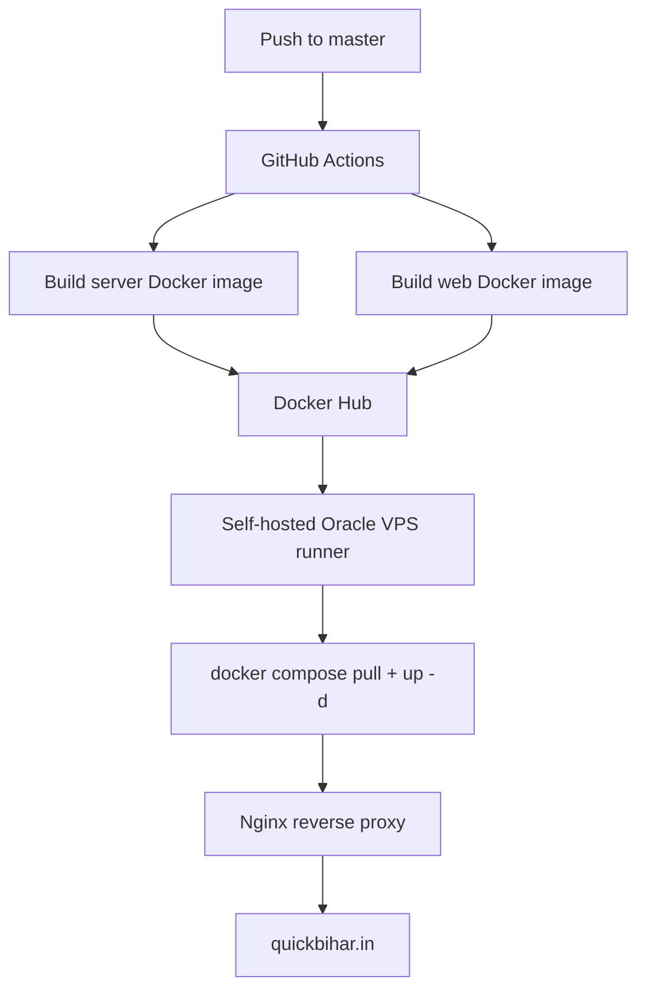

Production deployment checklist:

| Item | Required value |
| --- | --- |
| API URL | `https://quickbihar.in/api/v1` for single-domain launch |
| Socket URL | `https://quickbihar.in` |
| CORS | `https://quickbihar.in,https://www.quickbihar.in` |
| Redis | Internal Docker network only |
| MongoDB Atlas | VPS public IP allowlisted |
| SSL | Certbot/Let’s Encrypt active before public launch |
| Razorpay | Test keys for staging, live keys only after smoke tests |
| Expo web export | Use `--max-workers 2` on Windows if `EMFILE` occurs |

## Developer Entry Points

| Task | Start here |
| --- | --- |
| Add customer API | `server/src/modules/*` and `mobile/src/features/*/api` |
| Add admin dashboard feature | `web/src/features/dashboard` |
| Add seller dashboard feature | `web/src/features/seller` |
| Add rider feature | `server/src/modules/delivery`, `mobile/src/features/Delivery` |
| Change checkout logic | `server/src/modules/order`, `server/src/modules/store/serviceability.service.ts`, `mobile/src/features/Clothings/order` |
| Change serviceability | `server/src/modules/store/serviceability.service.ts` |
| Change payment | `server/src/utils/razorpay.util.ts`, `mobile/src/features/Clothings/order/lib/openRazorpayCheckout.*.ts` |
| Change deployment | `docker-compose.yml`, `deploy/nginx/quickbihar.path-based.conf`, `.github/workflows/docker-ci-cd.yml` |

## Developer Mental Model

1. Customers should only see products from stores that can deliver to their selected location.
2. Quote and order creation must repeat critical validations because frontend checks are only UX.
3. Payment verification is the point where stock is deducted and sub-orders are created.
4. Every multi-seller order becomes independent sub-orders for seller/rider operations.
5. Rider work is state-machine driven: offered, assigned, pickup, transit, delivered.
6. Admin is the recovery layer for edge cases: stuck delivery, KYC rejection, refund dispute, COD risk.
7. Socket events improve UX, but database state remains the source of truth.
