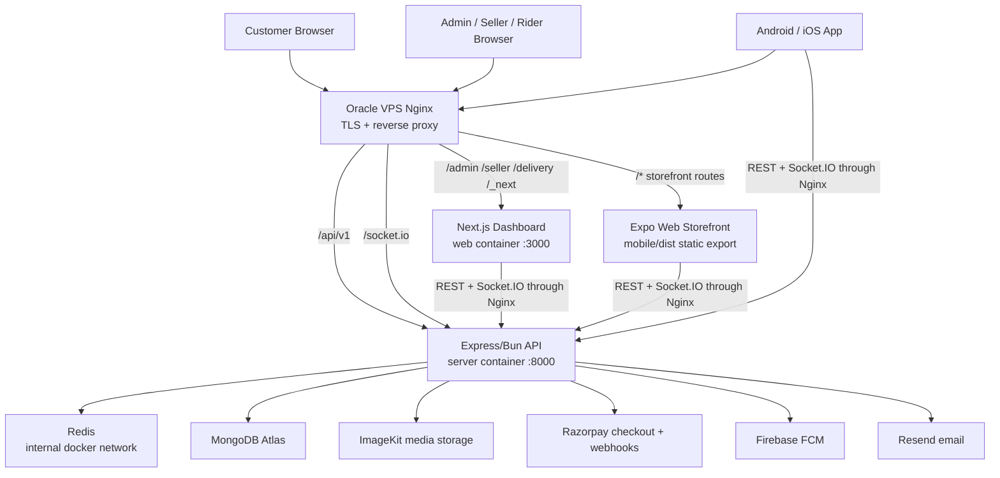
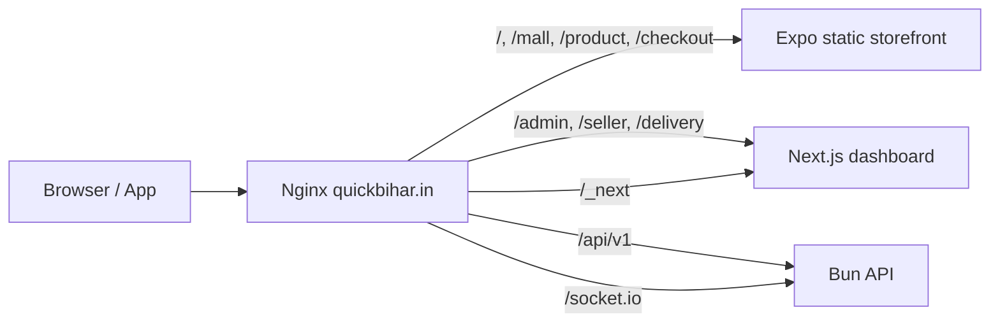
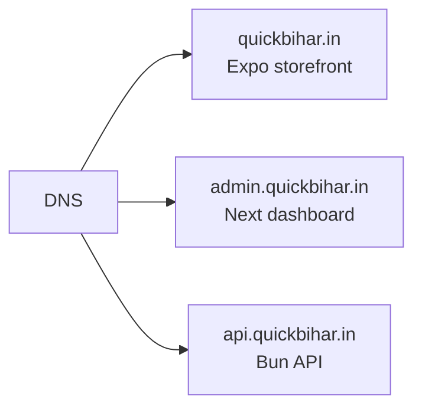
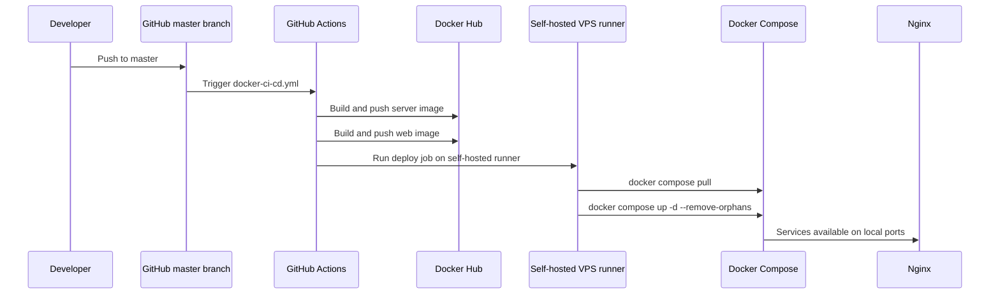
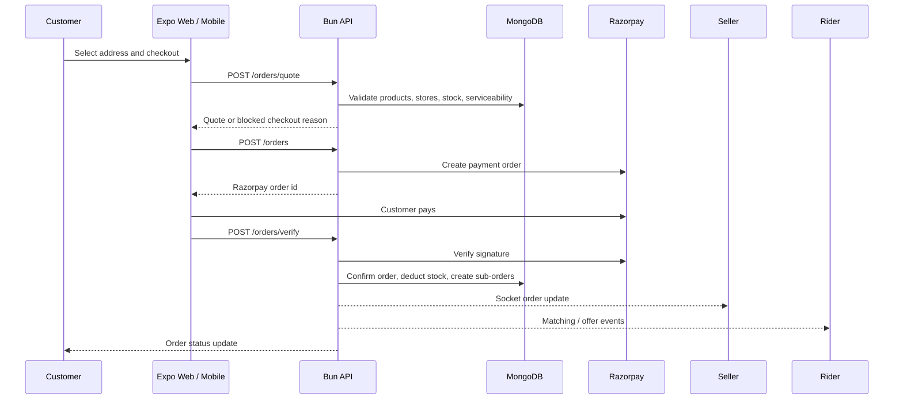

# QuickBihar Stack Architecture and Launch Readiness

Last reviewed: 2026-07-04

## Executive Answer

QuickBihar is partially launch-ready.

You can launch the server, dashboard, and Expo Web storefront on the Oracle VPS after production environment values are corrected and Nginx is configured.

You should not treat the full platform as production-clean yet because the frontend type/lint checks still fail, mobile native builds were not fully verified in this pass, and production secrets/payment/domain settings need final hardening.

For a deeper developer walkthrough of architecture, role flows, and edge cases, see `docs/ARCHITECTURE_AND_FLOWS.md`.

## Current Launch Status

| Area | Status | Notes |
| --- | --- | --- |
| Server API | Ready for staging / near production | TypeScript and Bun production build pass. Delivery tests pass. |
| Redis | Ready after Compose hardening | Redis is now internal-only in Docker Compose. |
| Next.js dashboard | Build-ready | `npm run build` passes when Google Fonts can be fetched. |
| Expo Web storefront | Build-ready with worker limit | `npx expo export --platform web --max-workers 2 --clear` passes. |
| Android/iOS app | Not fully verified | Needs EAS/native build verification with production API env vars. |
| CI/CD | Mostly ready | GitHub Actions builds/pushes Docker images and deploys on self-hosted VPS runner. |
| Production operations | Needs final setup | SSL, CORS, live Razorpay keys, Firebase APNs/FCM, MongoDB network access, and secret rotation/checks. |

## Full Stack Visual



## Single-Domain VPS Routing

Use this while you only have `quickbihar.in` and no subdomains.



Reference config: `deploy/nginx/quickbihar.path-based.conf`

Future preferred routing when DNS supports subdomains:



## CI/CD Visual



## Order and Payment Flow



## Verification Results

Passed:

```bash
cd server
node node_modules/typescript/bin/tsc --noEmit
bun run build
bun test src/_tests_/delivery.test.ts
```

```bash
cd web
npm run build
```

```bash
cd mobile
npx expo export --platform web --max-workers 2 --clear
```

Docker Compose syntax:

```bash
docker-compose config --services
```

Known verification problems:

```bash
cd mobile
node node_modules/typescript/bin/tsc --noEmit
```

Fails due existing Hugeicons and Lottie type errors across many screens. The Expo web export still succeeds.

```bash
cd web
npm run lint
```

Fails due existing `any`, React compiler, unescaped text, and image lint errors. The production build still succeeds.

```bash
cd mobile
npm run lint
```

Fails due existing React compiler/hook lint errors and unescaped text issues.

Onboarding tests currently fail in this environment because Redis is not running locally and several old test payloads no longer match the current validation schema.

## Required Production Environment

Server `.env` must include production-safe values:

```env
NODE_ENV=production
PORT=8000
MONGODB_URI=...
REDIS_URL=redis://redis:6379
CORS_ORIGIN=https://quickbihar.in,https://www.quickbihar.in
ACCESS_TOKEN_SECRET=...
REFRESH_TOKEN_SECRET=...
IMAGEKIT_PUBLIC_KEY=...
IMAGEKIT_PRIVATE_KEY=...
IMAGEKIT_URL_ENDPOINT=...
RAZORPAY_KEY_ID=...
RAZORPAY_KEY_SECRET=...
RAZORPAY_WEBHOOK_SECRET=...
FIREBASE_PROJECT_ID=...
FIREBASE_CLIENT_EMAIL=...
FIREBASE_PRIVATE_KEY=...
RESEND_API_KEY=...
```

Web dashboard `.env`:

```env
NEXT_PUBLIC_API_URL=/api/v1
NEXT_PUBLIC_SOCKET_URL=/
```

Expo/EAS production env:

```env
EXPO_PUBLIC_API_ORIGIN=https://quickbihar.in
EXPO_PUBLIC_API_URL=https://quickbihar.in/api/v1
EXPO_PUBLIC_SOCKET_URL=https://quickbihar.in
```

## Launch Blockers

1. Production `CORS_ORIGIN` must include the real domain values. Localhost-only CORS will break browser requests on `quickbihar.in`.
2. Razorpay must use live keys and a webhook URL that points to the production API.
3. Android/iOS production builds must be verified with EAS using the `EXPO_PUBLIC_*` production URLs.
4. Frontend type/lint debt should be fixed before a serious production launch, even though builds currently pass.
5. MongoDB Atlas must allow the VPS public IP and must not rely on a wide-open network rule.
6. Firebase push credentials must be configured for the final Android package and iOS bundle id.
7. SSL must be installed on Nginx before payment, auth, and geolocation features are used by real users.
8. Real secrets are present in local env files. Keep them out of GitHub and rotate any secret that was ever pasted, logged, or committed.

## Recommended Launch Path

1. Launch a private staging deployment on the Oracle VPS first.
2. Configure Nginx from `deploy/nginx/quickbihar.path-based.conf`.
3. Set `CORS_ORIGIN=https://quickbihar.in,https://www.quickbihar.in`.
4. Build Expo Web with:

```bash
cd mobile
npx expo export --platform web --max-workers 2 --clear
```

5. Copy or mount `mobile/dist` to the Nginx storefront root.
6. Deploy server and dashboard using the existing GitHub Actions Docker pipeline.
7. Smoke test:

```text
Open /
Open /admin/login
Open /seller/login
Open /delivery/login
Call /api/v1/app-config
Login as admin
Create quote from checkout
Verify Socket.IO connects
Run a Razorpay test payment
```

8. Only after the smoke test passes, switch Razorpay to live mode and publish the mobile app.

## Final Recommendation

Launch readiness is: beta/staging yes, full production not yet.

The backend and deployable web builds are in good shape. The remaining work is mostly production configuration, native app verification, and frontend lint/type cleanup.
