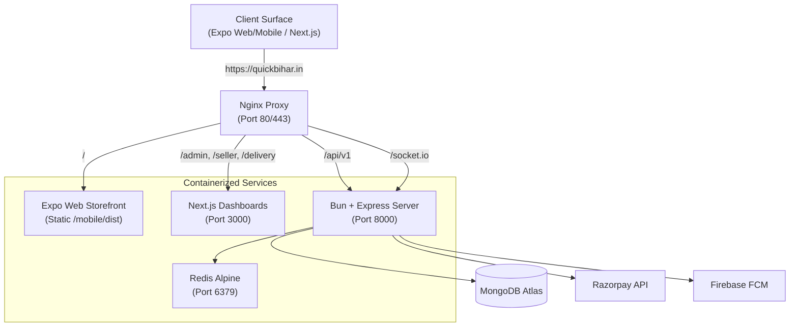
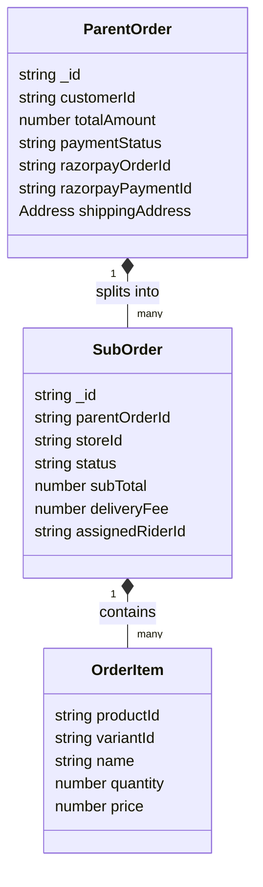
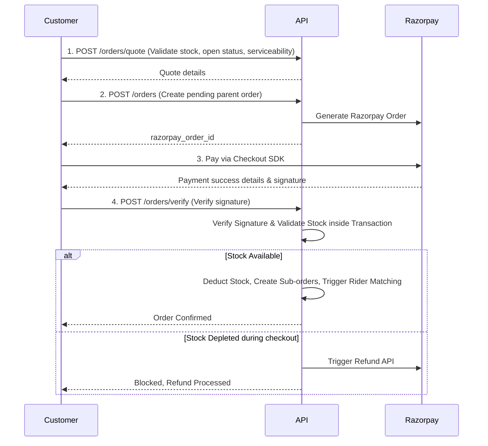

# Technical Requirements Document (TRD) · QuickBihar.in

This document specifies the technical requirements, architecture boundaries, system workflows, and operational edge cases for the QuickBihar fashion-first commerce platform.

---

## 1. Product Scope & Domain Boundaries

QuickBihar.in is designed as a hyper-focused, local fashion marketplace. To avoid speculative complexity, the domain is strictly bounded.

### 1.1 Categories & Product Bounding
- **Scope Limit**: The catalog exclusively supports clothing and apparel (Men, Women, Kids). 
- **Non-Clothing Items**: Strictly blocked at both product creation (admin/seller dashboard) and order validation layers.
- **Product Hierarchy**:
  - **Category**: Top-level apparel categories.
  - **Product**: Catalog item with details, descriptions, and size charts.
  - **Variant**: Atomic SKU defining size, color, stock level, and price.

> [!NOTE]
> *ponytail: clothing-only scope ceiling*. The database structure assumes a flat sizing/color model typical for apparel. Non-clothing categories (e.g., electronics, groceries) are unsupported. To upgrade to multi-vertical, the variant schema must transition to dynamic attribute maps.

### 1.2 System Actors & RBAC
The system supports four distinct roles:
1. **Customer**: Browses nearby inventory, places orders, tracks delivery, initiates return/exchange.
2. **Seller**: Manages store configurations, inventory, packages sub-orders, tracks earnings.
3. **Rider**: Receives delivery jobs, executes pickup/handover, manages cash-on-delivery (COD) settlements.
4. **Admin**: Platform moderator. Approves sellers/riders, overrides assignments, manages platform coupons, settles accounts.

---

## 2. System Architecture & Routing

QuickBihar utilizes a containerized monorepo deploying services to a single domain to minimize setup overhead.

### 2.1 Component Specifications

| Service / Layer | Technology | Build / Runtime Target |
| --- | --- | --- |
| **API Server** | Express.js | Bun runtime (Node.js compatibility layer) |
| **Storefront** | Expo Router | Web (static export HTML/JS) & Native (Android/iOS bundles) |
| **Dashboards** | Next.js | Server & static pages (Port 3000 container) |
| **Queue / Cache** | Redis Alpine | Internal Docker network only, no exposed host ports |
| **Database** | MongoDB | Managed Atlas cluster (with IP access list restriction) |

### 2.2 Domain Routing Rules (Path-Based)
For launch, path-based routing is used on the single domain `quickbihar.in`:
- `/api/v1/*` → Routed to Bun API service (`server:8000`).
- `/socket.io/*` → Routed to Socket.IO layer in Bun API (`server:8000`).
- `/admin`, `/seller`, `/delivery`, `/_next/*` → Routed to Next.js dashboard (`web:3000`).
- `/*` (Storefront routes: `/mall`, `/product`, `/checkout`) → Served as static assets from Expo Web export (`mobile/dist`).

---

## 3. Data Models & Core Schema Requirements

### 3.1 Order Splitting (Parent vs. Sub-Order)
To handle multi-seller checkouts without complicating payment capture:
- **Parent Order**: The customer-facing ledger capturing the aggregate cost, coupon discount, delivery fee, payment gateway transaction ID (`razorpay_order_id`), and shipping address.
- **Sub-Order**: Atomic orders split *per store* containing only that store's items. Each sub-order maintains its own status machine (Pending, Packed, Ready, OutForDelivery, Delivered, Returned) and is used for seller dashboard tracking, payout settlement, and rider assignments.

### 3.2 Rider Profile & Availability
- **GPS Coordinates**: Tracks current location `[longitude, latitude]` updated via Websocket.
- **COD Liability Limit**: Numeric field tracking cash-on-delivery payments collected but not yet deposited/settled.
- **Offer Queue**: Reference list of pending `RiderOffers` broadcasted to the rider.

> [!NOTE]
> *ponytail: naive geofencing ceiling*. Matching relies on Euclidean distance. If platform traffic grows to require real-route distance calculations, the locator must replace trigonometric queries with an external routing service (e.g., OSRM/Google Maps API).

---

## 4. Key Workflows & Core Logic

### 4.1 Hyperlocal Serviceability Check
Products must only be visible/buyable if they can be delivered to the customer's pincode or GPS coordinate.
1. **Customer Location Initialization**: Client provides Pincode or GPS coordinates.
2. **Store Query**: Get active stores whose service radius covers the customer coordinate.
3. **Product Discovery**: Return products belonging exclusively to these serviceable stores.
4. **Checkout Gate**: Re-run the serviceability match on the backend during the `POST /orders/quote` and `POST /orders` phases to block checkout if coordinates or store-open settings changed mid-session.

### 4.2 Checkout and Payment Verification Flow
1. **Quote Request**: Validate stock availability, serviceability, coupons, and store-open times. Return the total quote.
2. **Order Initiation**: Create Razorpay Order via API, store a draft Parent Order in MongoDB with `paymentStatus = "pending"`.
3. **Client Checkout**: SDK launches Razorpay payment screen.
4. **Signature Verification (`POST /orders/verify`)**:
   - Verify payment signature.
   - Deduct product stock within a database transaction session.
   - If stock is insufficient, reject verification, flag the order for support intervention, and trigger a refund.
   - Split the Parent Order into `SubOrders` and emit Socket.IO events to corresponding Sellers and eligible Riders.

### 4.3 Rider Matching State Machine
Fulfillment is handled through broadcast-accept cycles:
1. **Broadcast**: Sub-order transition to `Ready` triggers a broadcast of a `RiderOffer` to online riders within matching radius.
2. **Capacity Limit**: Riders with active delivery jobs or who exceed the **COD liability limit** (e.g., ₹5,000) are excluded from the broadcast.
3. **Acceptance**: First rider to accept is assigned. Broadcast ends.
4. **Fulfillment checkpoints**:
   - **Arriving at Store**: Rider marks arrival.
   - **Pickup**: Merchant shares a secure OTP generated by the system; rider inputs OTP to unlock status to `PickedUp`.
   - **Delivery**: Customer shares a delivery OTP; rider inputs OTP to unlock status to `Delivered`.

> [!NOTE]
> *ponytail: polling-free socket synchronization*. Clients fetch the latest status on reconnect using the `/orders/status` HTTP endpoint as a backup, eliminating complex socket recovery outboxes.

### 4.4 Returns & Exchanges
1. **Return Window**: Customers can request a return within a policy window (e.g., 7 days) only on eligible clothing categories.
2. **Rider QC Check**: Assigned rider performs a physical checklist inspection (tags present, unworn) before accepting the item.
3. **Merchant Validation**: The item is returned to the seller. If accepted, the seller confirms, and the server calls the Razorpay Refund API. If disputed, an admin intervention state is created.

---

## 5. Integrations & Security Configurations

### 5.1 Third-Party Integrations
- **Razorpay**: Used for card/UPI payments and automated refunds. Signature validation must use the SHA256 HMAC utility.
- **Firebase Cloud Messaging (FCM)**: Push notification provider for background customer order tracking updates and foreground rider job alerts.
- **ImageKit**: Media storage provider. Uploads route directly through server-generated authorization tokens to keep keys secure.
- **Resend**: Transactional email notifications (Order placement, refund approvals).

### 5.2 Security & Hardening Requirements
- **Nginx SSL**: Let’s Encrypt certificate must be auto-renewing before public release. Auth, payments, and location services require HTTPS.
- **CORS Configuration**: Restrict API CORS origins to staging/production domains (`https://quickbihar.in`). Block access from `*` or `localhost` in production env.
- **Redis Security**: Redis container is restricted from external port mapping; accessible strictly inside the Docker virtual bridge network.
- **Secrets Management**: No API keys or access keys may be hardcoded. Production values must be loaded exclusively through container environment files.

---

## 6. Technical Debt & Ceiling Registry (Ponytail Dev Ethos)

In accordance with the Ponytail engineering guidelines, we use simple native implementations instead of bloated frameworks. We explicitly map the ceilings and upgrade triggers below to track technical debt:

| Feature / Shortcut | Implementation | Technical Ceiling | Upgrade Trigger / Path |
| --- | --- | --- | --- |
| **Geofencing / Radius Match** | Euclidean distance calculations in MongoDB query. | Does not account for real-world road networks, rivers, or heavy traffic routes. | Upgrade to Open Source Routing Machine (OSRM) or Google Distance Matrix API when delivery times exceed SLA in dense areas. |
| **Product Attributes** | Static relational fields for apparel (Size, Color, Stock, SKU). | Cannot easily support non-clothing items or items with highly custom attributes. | Transition variant fields to JSON/BSON key-value attribute maps if catalog scope expands beyond clothing. |
| **Rider Matching Pool** | First-accept broadcast loop within a fixed radius. | High-volume ordering will create competition lag and rider selection conflicts. | Implement queue-based sequential matching (e.g., closest rider gets 30 seconds to accept before next rider is offered). |
| **Websocket Outbox** | Simple Express middleware pushing events directly. | Disconnected socket clients may missed realtime transition states. | Introduce a lightweight fulfillment event feed (`/api/v1/fulfillment-events`) polled on client re-connection. |
| **Rider Geolocation Tracking** | Active WebSocket connection updates rider location in DB. | High update frequency (e.g., every 5 seconds per rider) will bottleneck MongoDB write limits. | Route real-time GPS tracking coordinates directly through Redis geospatial index, updating MongoDB only on assignment state changes. |

---
*End of Technical Requirements Document.*
