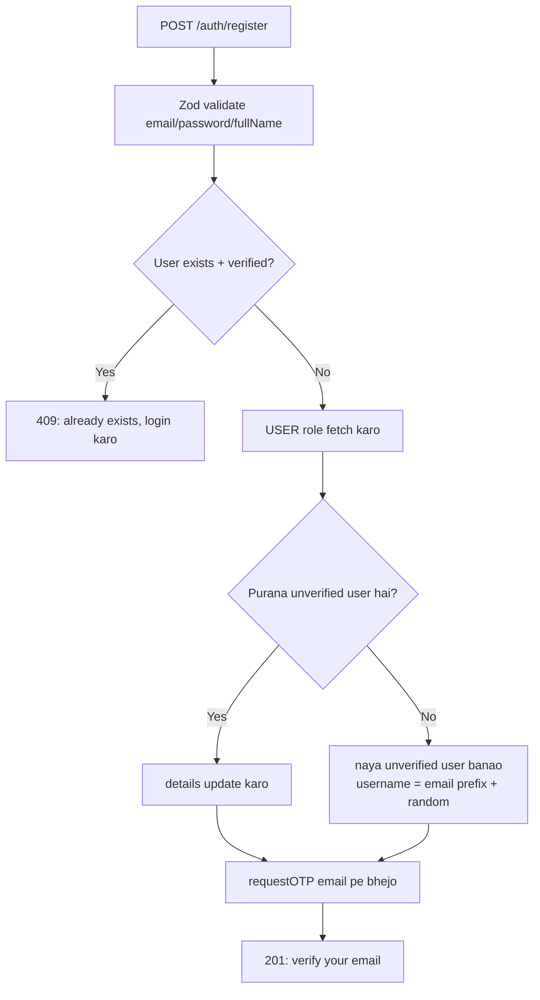
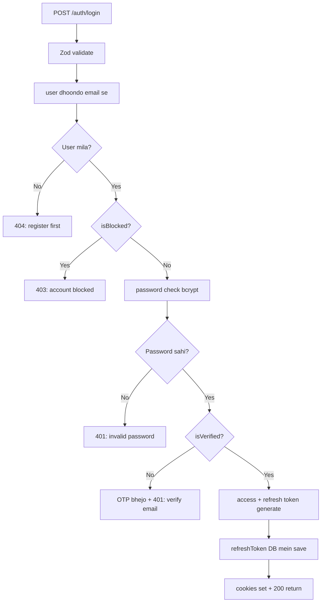
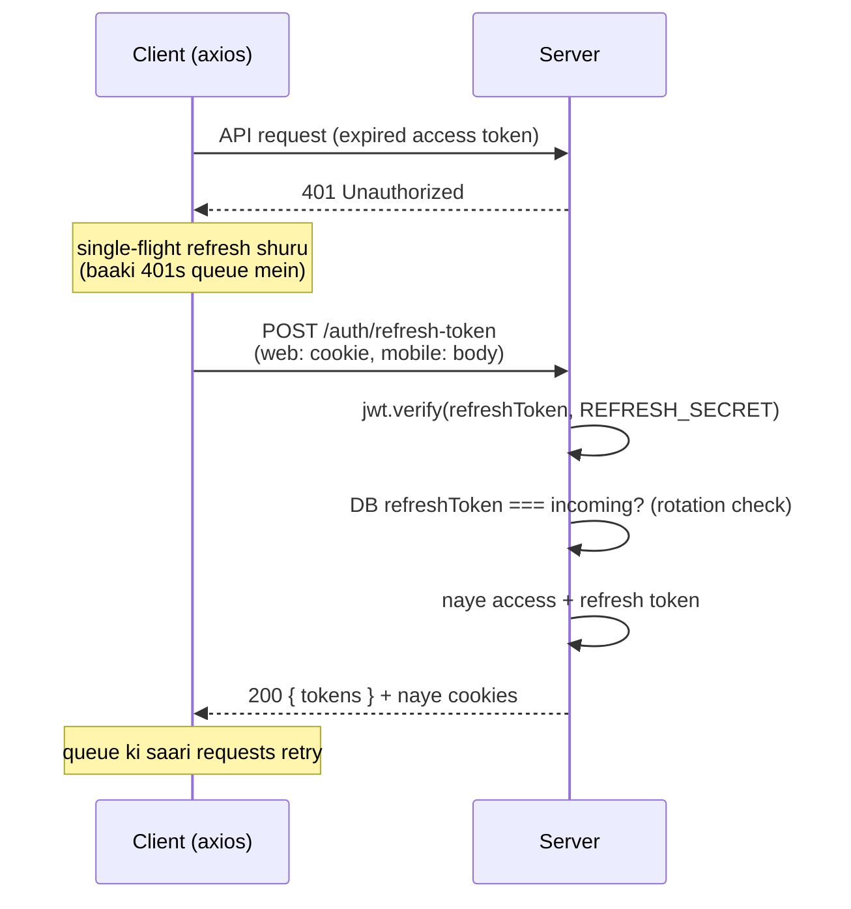

# 08 — Authentication

> **Created:** 2026-08-01
> **File type:** Security deep-dive
> **Padhne ka time:** ~25 min

---

## WHAT — Authentication kya hai is system mein?

"Tum kaun ho?" — yeh confirm karna. QuickBihar do tareeke se authenticate karta hai:
1. **Email + Password** (traditional login)
2. **Email + OTP** (passwordless — OTP se bhi naya account ban jaata hai)

Dono ke baad **JWT tokens** milte hain: ek **access token** (short-lived) aur ek **refresh token** (long-lived).

---

## WHY — JWT + refresh token pattern kyun?

- **Access token** har API request ke saath jaata hai (short expiry — 1 din — taaki chori ho jaaye toh jaldi bekaar ho).
- **Refresh token** sirf naya access token lene ke liye (long expiry — taaki user baar-baar login na kare).
- Yeh **stateless** hai (server ko har request pe DB check nahi karna padta — token khud proof hai), par refresh token DB mein store hota hai (revoke kar sakein).

---

## WHERE — Files (auth ka poora code)

| File | Kaam |
|------|------|
| `modules/common/auth/auth.service.ts` | ★ Business logic (register, login, OTP, refresh, logout) |
| `modules/common/auth/auth.controller.ts` | HTTP handlers + cookie setting |
| `modules/common/auth/auth.router.ts` | Routes |
| `modules/common/auth/auth.validation.ts` | Zod schemas |
| `modules/common/auth/auth.serializer.ts` | User ko safe JSON mein badalna (password hataana) |
| `modules/common/user/user.model.ts` | Token generation + password hashing |
| `middlewares/auth.middleware.ts` | `verifyJWT` (har protected route pe) |

---

## HOW — Token generation (exact code se)

`user.model.ts` mein do instance methods hain:

### Access Token
```javascript
generateAccessToken() {
  return jwt.sign(
    { _id, email, username, fullName },   // payload
    ENV.ACCESS_TOKEN_SECRET,
    { expiresIn: "1d" }                    // ★ 1 din
  );
}
```

### Refresh Token
```javascript
generateRefreshToken() {
  return jwt.sign(
    { _id },                               // sirf _id (minimal)
    ENV.REFRESH_TOKEN_SECRET,
    { expiresIn: ENV.REFRESH_TOKEN_EXPIRY } // env se (default ~10d)
  );
}
```

> **Important (verified):** Access token payload mein **role NAHI hai** — sirf `_id, email, username, fullName`. Isliye har request pe server DB se user (aur uska role) fetch karta hai (`verifyJWT` → `UserDAO.findById`). Yeh web `proxy.ts` ke us comment se match karta hai: "JWT has no role claim".

### Password hashing
```javascript
userSchema.pre("save", async function () {
  if (!this.isModified("password")) return;
  this.password = await bcrypt.hash(this.password, 10);  // bcrypt, 10 rounds
});

isPasswordCorrect(password) {
  return bcrypt.compare(password, this.password);
}
```

Password kabhi plain text mein store nahi hota — bcrypt hash (10 rounds). Pre-save hook automatically hash karta hai (sirf jab password change ho).

---

## FLOW — Register (naya account banana)



**Key points:**
- Register turant login nahi karata — pehle **email verify** karna zaroori (OTP).
- Username auto-generate hota hai: `email.split("@")[0] + "_" + random(1000)` (lowercase).
- Agar user pehle se hai par unverified, toh re-register details update kar deta hai (naya user nahi banata).

---

## FLOW — Login (email + password)



**Security order (important):** Password **pehle** check hota hai, phir verification status. Isse "email verified hai ya nahi" ka info leak nahi hota bina sahi password ke.

---

## FLOW — OTP verify (passwordless login + auto-register)

`verifyOTPAndAuthenticate(email, otp)`:

```
1. Redis se otp:${email} nikaalo
2. Nahi mila → 400 "OTP expired or not found"
3. Match nahi hua → 400 "Invalid OTP"
4. Match hua → Redis se OTP delete karo (one-time use)
5. User dhoondo:
   ├─ Nahi mila → NAYA VERIFIED user banao (OTP-only login)
   │              temp random password, USER role assign
   │              isNewUser = true
   ├─ Mila + already verified → 400 (login with password)
   └─ Mila + unverified → verified mark karo
6. Tokens generate + refreshToken save + return {user, tokens, isNewUser}
```

> **Interesting (verified):** OTP verify **naya account bhi bana deta hai** agar user exist nahi karta. Yeh "passwordless signup" hai — customer sirf email + OTP se account bana sakta hai (temp password internally set hota hai).

---

## HOW — OTP storage (Redis, exact keys)

```
requestOTP(email):
  cooldownKey = "otp_cooldown:${email}"
  ├─ Redis mein cooldown hai? → 429 "wait 60 seconds"
  ├─ User already verified? → 400
  ├─ OTP = 6-digit random (100000–999999)
  ├─ redis.set("otp:${email}", otp, "EX", 600)      ← 10 min TTL
  ├─ redis.set("otp_cooldown:${email}", "true", "EX", 60)  ← 60s cooldown
  └─ MailService.sendOTP(email, otp)  (Resend)
```

| Redis Key | Value | TTL | Kaam |
|-----------|-------|-----|------|
| `otp:${email}` | 6-digit OTP | 600s (10 min) | Verify ke liye |
| `otp_cooldown:${email}` | "true" | 60s | Spam rokne ke liye |

---

## HOW — Cookies (exact config from controller)

Login / verifyOTP / refresh sab yeh cookie options use karte hain:

```javascript
const options = {
  httpOnly: true,                              // JS access nahi (XSS safe)
  secure: process.env.NODE_ENV === "production", // HTTPS only in prod
};
res.cookie("accessToken", accessToken, options)
   .cookie("refreshToken", refreshToken, options)
```

Tokens **dono jagah** milte hain: cookie mein AUR response body mein (`{user, accessToken, refreshToken}`). Kyun?
- **Web** cookie use karta hai (`withCredentials: true`) + body se Zustand mein store karta hai.
- **Mobile** body se token leke SecureStore mein store karta hai (mobile pe cookies reliable nahi).

> ⚠️ **Verified gap:** Cookie mein `sameSite` aur `maxAge`/`expires` set NAHI hai. Iska matlab: (1) cookie **session cookie** hai (browser band hone pe delete), (2) `sameSite` default browser pe depend karta hai. Yeh [19_Security.md](./19_Security.md) mein note kiya gaya hai.

---

## FLOW — Token refresh (silent, single-flight)



**Server side (`refreshAccessToken`):**
```
1. incomingRefreshToken = req.cookies.refreshToken || req.body.refreshToken
2. jwt.verify(token, REFRESH_TOKEN_SECRET)  → invalid = 401
3. UserDAO.findById(decoded._id)            → nahi mila = 401
4. incoming === user.refreshToken?          → nahi = 401 "expired or used"
5. naye access + refresh token generate
6. user.refreshToken = naya refresh (ROTATION) → save
7. return tokens
```

> **Good security (verified):** **Refresh token rotation** hai — har refresh pe naya refresh token milta hai aur purana DB mein replace ho jaata hai. Purana refresh token dubara use karne pe 401 (step 4). Yeh token theft detection mein madad karta hai.

**Client side (single-flight):** Ek saath 5 requests 401 huin toh sirf 1 refresh call jaati hai; baaki `failedQueue` mein wait karti hain aur naya token milne pe retry hongi. Web: `web/src/lib/axios.ts`, Mobile: `mobile/src/api/axiosInstance.ts`. Detail: [03_Frontend.md](./03_Frontend.md), [05_Mobile_App.md](./05_Mobile_App.md).

---

## FLOW — verifyJWT (har protected request pe)

`middlewares/auth.middleware.ts`:
```
1. token = req.cookies?.accessToken || Authorization header "Bearer <token>"
2. token nahi → 401
3. jwt.verify(token, ACCESS_TOKEN_SECRET)
4. UserDAO.findById(decoded._id)  ← DB se user (role ke saath) fetch
5. user nahi → 401
6. req.user = user  ← aage controller/role-guard use karega
```

> **Important:** `UserDAO.findById` user ko `roleId` populate karke laata hai (role guards `user.roleId.name` / `user.roleId._id` use karte hain — dekho [09_Authorization_RBAC.md](./09_Authorization_RBAC.md)). Isiliye har request pe ek DB read hota hai.

---

## Endpoints summary

| Method | Path | Access | Kaam |
|--------|------|--------|------|
| POST | `/api/v1/auth/register` | Public | Naya account (OTP verify pending) |
| POST | `/api/v1/auth/login` | Public | Email + password login |
| POST | `/api/v1/auth/request-otp` | Public | OTP bhejo |
| POST | `/api/v1/auth/verify-otp` | Public | OTP verify + login/signup |
| POST | `/api/v1/auth/refresh-token` | Public | Naya access token |
| POST | `/api/v1/auth/logout` | Protected (verifyJWT) | refreshToken DB se hataao + cookies clear |

---

## DEPENDENCIES

- **Cross-ref:** [09_Authorization_RBAC.md](./09_Authorization_RBAC.md) (auth ke baad authorization), [19_Security.md](./19_Security.md)
- **Client side:** [03_Frontend.md](./03_Frontend.md), [05_Mobile_App.md](./05_Mobile_App.md)
- **Config:** [16_Environment.md](./16_Environment.md) (token secrets + expiry)

---

## RISKS

- ⚠️ **Login pe rate limiting nahi dikhi** — password brute-force ka risk. OTP pe cooldown hai (60s) par login pe nahi. Dekho [19_Security.md](./19_Security.md).
- ⚠️ **Cookie mein sameSite/maxAge missing** — CSRF + cookie lifetime clarity ke liye set karna chahiye.
- ⚠️ **Har request pe DB read** — `verifyJWT` har baar user fetch karta hai (role token mein nahi). Yeh scale pe overhead hai (dekho [20_Performance.md](./20_Performance.md)), par consistency ke liye theek hai.
- ⚠️ **OTP-only signup temp password** — user ko baad mein password set karne ka clear flow hona chahiye.

---

## IMPROVEMENTS

- Login endpoint pe rate limiting (express-rate-limit ya Redis-based).
- Cookies mein `sameSite: "strict"` + explicit `maxAge` (access token expiry ke barabar).
- Access token mein role claim add karna (DB read bachega) — par tab role change instant nahi hoga (trade-off).

---

*Verified against `auth.service.ts`, `auth.controller.ts`, `auth.router.ts`, `user.model.ts`, `auth.middleware.ts` — sab 2026-08-01 ko line-by-line padhe gaye.*
