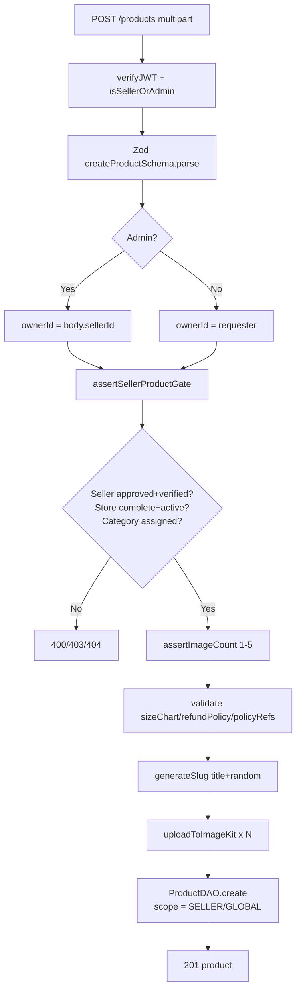
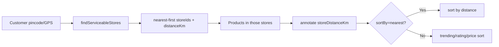

# 10 — Product System

> **Created:** 2026-08-01
> **File type:** Feature deep-dive
> **Padhne ka time:** ~30 min

---

## WHAT — Yeh doc kya cover karti hai?

QuickBihar ka **catalog engine** — product create/update/delete, seller gating (kaun product bana sakta hai), image handling (ImageKit, max 5), category/size-chart/refund-policy validation, aur **hyperlocal discovery** (customer ko sirf woh products dikhein jo uske pate pe deliver ho sakti hain). Yeh **clothing vertical** ka core hai (`modules/clothing/products/`).

---

## WHY — Product system itna guarded kyun?

Kyunki yeh **marketplace** hai — koi bhi seller apna maal daal sakta hai. Agar gating na ho toh unverified seller, incomplete store, ya galat category ka product live ho jaayega. Isliye product create karne se pehle **multiple gates** hain (seller approved? store complete? category admin-assigned?). Customer side pe **serviceability** filter hai (jo deliver na ho sake woh dikhna hi nahi chahiye).

---

## WHERE — Files (product module)

| File | Kaam |
|------|------|
| `product.model.ts` | Mongoose schema (variants, approvalStatus, scope) — dekho [07_Database.md](./07_Database.md) |
| `product.validation.ts` | Zod create/update schemas |
| `products.service.ts` | ★ Business logic — gates, slug, image upload, discovery |
| `product.dao.ts` | DB queries (findAll, findBySlug, findSimilar, top-selling) |
| `product.controller.ts` | HTTP handlers |
| `product.router.ts` | Routes (public + protected) |
| `product.type.ts` | Types |

Related services: `store.setup.ts` (`buildStoreSetupStatus`), `serviceability.service.ts` (`findServiceableStores`).

---

## WHERE — Endpoints (`/api/v1/products`)

```
Public (no auth):
  GET  /products/public          ← public catalog (isActive + approved)
  GET  /products/trending        ← top 10 selling
  GET  /products/local           ← ★ hyperlocal (pincode/GPS serviceable)
  GET  /products/slug/:slug      ← product by slug
  GET  /products/:id/similar     ← similar products
  GET  /products/:id             ← product by id

Protected (verifyJWT + isSellerOrAdmin):
  GET    /products               ← seller: apne; admin: sab
  POST   /products               ← create (multipart, up to 5 images)
  PATCH  /products/:id           ← update (images add/remove)
  DELETE /products/:id           ← soft delete
```

- **Public routes pehle** mount hote hain, phir `router.use(verifyJWT)` — order matter karta hai. `/public`, `/:id` etc. bina token accessible.
- **CRUD** `isSellerOrAdmin` se guarded + `multer` `upload.array("images", 5)`.

---

## HOW — Product create ke GATES (sabse important part)

`createProduct()` ye sab check karta hai **create se pehle** (`assertSellerProductGate`):

```
1. Seller profile exists?          → 404 nahi toh
2. seller.status === "APPROVED"
   AND seller.isVerified === true  → 403 warna
   ("Seller approval is required before creating products")
3. Store exists (sellerId se)?     → 400 warna
4. buildStoreSetupStatus(store)
   .isComplete === true?           → 400 + missingFields warna
5. store.isActive === true?        → 400 warna
6. assertCategoryAssigned:
   - category active + admin-assigned (Category collection)  → 400 warna
   - subCategory (agar hai) us category ka active child ho    → 400 warna
```

Phir reference validation (parallel):
- `assertSizeChartAllowed` → sizeChart GLOBAL + APPROVED ho.
- `assertRefundPolicyActive` → refundPolicy active ho.
- `assertPolicyRefsActive` → policyRefs (return/refund/shipping/terms) sahi `policyType` ke active admin policies ho.
- `assertImageCount` → **min 1, max 5** images.

> ★ **Yahi asli moderation hai.** Yaad hai `approvalStatus` ka default `APPROVED` hai (dekho [07_Database.md](./07_Database.md))? Woh isliye theek hai kyunki **seller khud pehle se vetted hai** (approved + verified + store complete). Gate seller pe hai, per-product review pe nahi. Isliye "PENDING" wala purana assumption galat tha — product turant live, par sirf trusted seller hi bana sakta hai.

---

## FLOW — Product create (end-to-end)



**scope decide:** seller create kare → `scope="SELLER"`; admin create kare → `scope="GLOBAL"`. Yeh multi-tenant seam hai (dekho [28_Add_New_Business_Type.md](./28_Add_New_Business_Type.md)).

---

## HOW — Hyperlocal discovery (`getLocalProducts`) ★ signature feature

QuickBihar **local-first** hai — customer ko sirf woh products dikhein jo uske pate pe **deliver ho sakti hain**. Yeh `/products/local` karta hai:

```
1. Input: pincode YA (lat + lng)  → warna 400
2. findServiceableStores(target)   → nearest-first serviceable stores
   (store.currentLocation 2dsphere + deliveryRadiusKm + pincode match)
3. Koi store nahi → { serviceable:false, products:[] }
4. storeIds nikaalo + har store ka distanceKm map karo
5. getProducts({ storeIds, isActive, publicOnly })  ← in stores ke products
6. Har product pe storeDistanceKm annotate karo
7. sortBy=nearest ho toh distance se sort
   → { serviceable:true, storeCount, total, products }
```



> **Why this matters:** Amazon/Flipkart "sab kuch dikhao" karte hain; QuickBihar "jo mil sakta hai wahi dikhao" karta hai (quick-commerce local model). Serviceability logic `store.currentLocation` ke 2dsphere geo index pe depend karti hai (dekho [07_Database.md](./07_Database.md)).

---

## HOW — Update, delete, visibility

### Update (`updateProduct`)
- **Ownership check:** seller ho toh `product.sellerId === requester` warna **403**.
- Category/subCategory change ho ya seller ho toh **dobara seller gate** chalta hai.
- **Image diff:** `existingImages` payload se retain hone waali images decide; nayi files upload; jo retain nahi hui unki ImageKit se **delete** (`deleteFromImageKit`, best-effort). Total 1–5 enforce.
- Title change → naya slug generate.

### Delete (`deleteProduct`)
- Ownership check (seller apna hi delete kare).
- **Soft delete** (`softDeleteById` → `isDeleted:true`), hard delete nahi. Order items ka ref safe rehta hai.

### Public visibility guard (`isApprovedForPublic`)
```javascript
product.isActive && (!product.approvalStatus || product.approvalStatus === "APPROVED")
```
`getProductBySlug` / `getProductById` public ke liye yeh check karte hain — inactive ya non-approved product **404** (exist karta hai par public ko nahi dikhta).

### Similar products (`getSimilarProducts`)
Source product ke `category + tags + brand` se milte-julte products (`findSimilar`, default 10).

---

## WHO — Kaun kya karta hai

| Actor | Product ke saath kya |
|-------|----------------------|
| **Customer (USER)** | Browse (`/public`, `/local`, `/trending`), detail (`/slug`, `/:id`), similar. Sirf read. |
| **Seller** | Apne products CRUD (scope SELLER). Sirf approved+verified+store-complete seller. |
| **Admin** | Sab products dekhe/edit/delete; create pe `sellerId` de sakta hai (scope GLOBAL). |

---

## DEPENDENCIES

- **Isse pehle:** [07_Database.md](./07_Database.md) (Product/Store/Category/SizeChart schemas)
- **Related:** [11_Order_System.md](./11_Order_System.md) (product → order item + stock), [13_File_Uploads.md](./13_File_Uploads.md) (ImageKit), [09_Authorization_RBAC.md](./09_Authorization_RBAC.md) (isSellerOrAdmin)
- **Discovery:** `serviceability.service.ts`, `store.setup.ts`

---

## RISKS

- ⚠️ **Auto-approve (`approvalStatus` default APPROVED)** — product turant live. Trust seller-gating pe hai, per-product review pe nahi. Agar spam/abuse ho toh moderation queue chahiye.
- ⚠️ **Stock variants mein** — `variants[].stock` source of truth; `totalStock` derived. Order stock deduction variant-level hona chahiye (dekho [11_Order_System.md](./11_Order_System.md)).
- ⚠️ **Image delete best-effort** — `deleteFromImageKit(...).catch(() => undefined)` — orphan images ImageKit pe reh sakti hain (silently ignore). Cost/cleanup risk.
- ⚠️ **Serviceability = store geo + radius** — agar store `currentLocation` galat/missing ho toh product kahin discover na ho. Store setup GPS accuracy critical.
- ⚠️ **Slug random suffix** — har title change pe naya slug; purane slug ke bookmarks/SEO links toot sakte hain (redirect nahi).

---

## IMPROVEMENTS

- Optional moderation queue (`PENDING_REVIEW`) high-risk categories ke liye.
- Variant-level stock APIs + low-stock alerts.
- Orphan ImageKit asset cleanup job.
- Slug history (301 redirect purane slug se naye pe).
- Serviceability cache (har request pe geo query mehnga).

---

*Verified against `products.service.ts`, `product.router.ts`, `product.model.ts` on 2026-08-01. Seller gate, hyperlocal discovery, image diff, aur `isApprovedForPublic` logic line-by-line padha gaya. `approvalStatus` auto-approve behaviour reconciled with seller-gating (07_Database.md).*


