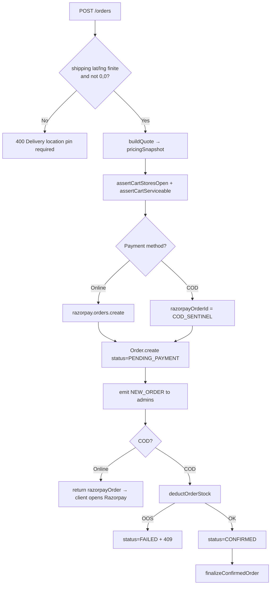
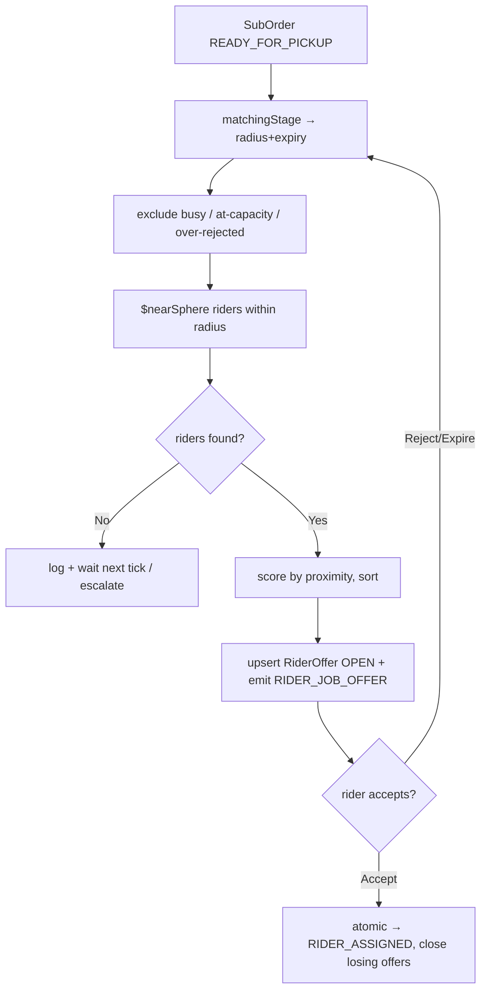
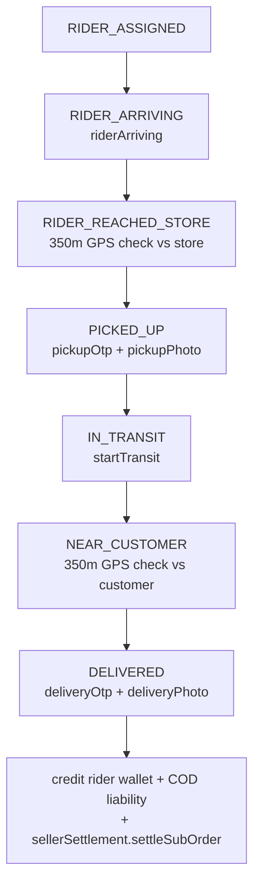
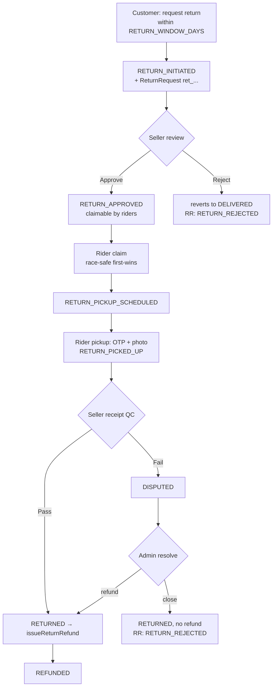

# 11 — Order System (Fulfillment Engine)

> **Created:** 2026-08-01
> **File type:** Feature deep-dive (★ core)
> **Padhne ka time:** ~45 min

---

## WHAT — Yeh doc kya cover karti hai?

QuickBihar ka **sabse bada aur sabse important** system — **order lifecycle end-to-end**:
quote → payment → **per-seller SubOrder split** → **rider matching** (apna delivery fleet) →
pickup (OTP) → delivery (OTP) → returns/refunds → COD settlement. Yeh `common/order/`,
`common/delivery/`, aur `common/fulfillment/` modules ka core hai.

Yeh ek **quick-commerce hyperlocal** fulfillment engine hai — Amazon jaisa 3rd-party courier
nahi, balki **apne riders** ko real-time GPS + socket se match karta hai (Swiggy/Zomato model).

---

## WHY — Itna complex kyun?

1. **Multi-seller cart:** Ek customer ke cart mein 3 alag sellers ke products ho sakte hain.
   Har seller alag store se, alag rider se ship karta hai → isliye ek `Order` ko **per-seller
   `SubOrder`s** mein todna padta hai.
2. **Paise-accurate money split:** Coupon discount, shipping fee, commission — sab multiple
   sellers mein baantna padta hai bina ek paisa idhar-udhar hue (rounding se ₹0.01 bhi leak na ho).
3. **Apna rider fleet:** Rider ko real-time match karna (nearest-first, capacity-aware) +
   GPS-verified pickup/delivery + COD cash liability track karna.
4. **Trust & proof:** Har handoff pe OTP + photo proof (pickup aur delivery dono pe).

---

## WHERE — Files (order + delivery + fulfillment)

| File | Kaam |
|------|------|
| `order/order.model.ts` | `Order` schema (`QB-` id, items snapshot, pricing, paymentInfo) |
| `order/order.type.ts` | ★ `OrderStatus` (10) + `DeliveryStatus` (18) enums + interfaces |
| `order/order.service.ts` | ★ Order lifecycle — quote/create/verify/finalize/admin (783 lines) |
| `order/orderPricing.service.ts` | ★ `HYBRID_MARKETPLACE_V1` pricing engine (quote) |
| `order/subOrder.model.ts` | `SubOrder` schema + `SubOrderStatus` enum (30+ states) |
| `order/subOrder.service.ts` | ★ SubOrder + rider + return state machine (2140 lines) |
| `order/returnEligibility.ts` | Return window check (`assertReturnWindowOpen`) |
| `order/timeline.helper.ts` | `TimelineHelper.createEvent` (audit timeline) |
| `order/order.controller.ts` / `order.router.ts` | HTTP handlers + routes |
| `delivery/matching.service.ts` | ★ Rider matching engine (stage-based radius escalation) |
| `delivery/riderCapacity.ts` | Rolling-window accepted-order capacity |
| `delivery/riderEligibility.ts` | Rider profile/COD eligibility asserts |
| `fulfillment/riderOffer.model.ts` | `RiderOffer` (time-boxed offer, partial-unique OPEN) |
| `fulfillment/returnRequest.model.ts` | `ReturnRequest` (`ret_` id, return timeline) |
| `fulfillment/codSettlement.model.ts` | `CodSettlement` (rider cash deposit ledger) |
| `fulfillment/fulfillmentEvent.service.ts` | Event ledger + notification outbox (dekho [14](./14_Notifications.md)) |
| `seller/sellerSettlement.service.ts` | Seller earning credit/reverse on delivery/return |

> ⚠️ **Tech-debt note (verified):** `OrderService` aur `SubOrderService` **class-based** hain
> (`export const orderService = new OrderService()`, `SubOrderService` static methods). Yeh
> project ke `rule.md` **function-based convention ko violate** karta hai (baaki naye modules
> jaise `products.service.ts`, `orderPricing` ka `buildQuote` bhi function/loose hain). Core order
> logic abhi purane class pattern pe hai — refactor pending. Dekho [30_Tech_Debt.md](./30_Tech_Debt.md).

---

## WHERE — Endpoints

### `/api/v1/orders` (`order.router.ts` — poora router `verifyJWT` ke peeche)

```
User:
  POST   /orders/quote                 ← price quote (buildQuote, no DB write)
  POST   /orders                       ← order create (COD ya Razorpay order)
  POST   /orders/verify                ← Razorpay payment verify (online)
  GET    /orders/me                    ← mere orders
  GET    /orders/sub-orders/:id        ← ek sub-order detail
  POST   /orders/sub-orders/:id/cancel ← customer cancel/cancel-request
  POST   /orders/sub-orders/:id/return ← customer return request
  GET    /orders/:id                   ← ek order (ownership check)

Admin (isAdmin):
  GET    /orders/admin/all
  PATCH  /orders/admin/status/:id
  GET    /orders/admin/sub-orders
  POST   /orders/admin/sub-orders/:id/assign          ← manual rider assign
  POST   /orders/admin/sub-orders/:id/cod-settle       ← confirm COD deposit
  POST   /orders/admin/sub-orders/:id/return-resolve   ← dispute resolve
  PATCH/DELETE /orders/admin/:id/delivery-assignment   ← legacyDeliveryGone (410)
```

> ⚠️ **Order-level delivery assignment RETIRED:** `/admin/:id/delivery-assignment` ab
> `legacyParentDeliveryGone` middleware pe jaata hai (410 Gone). Delivery ab **SubOrder-level**
> hai, order-level nahi. Yeh migration ka nishaan hai.

### Seller + Rider actions kahan hain?
Seller ke sub-order transitions (accept → pack → ready-for-pickup) aur **rider ke lifecycle
actions** (offer accept/reject, arriving, reached-store, pickup, transit, near-customer, deliver)
**`order.router.ts` mein NAHI hain** — woh **seller** aur **delivery** routers pe mount hote hain
(dekho `sellerPanel`/`delivery` routers). Business logic `subOrder.service.ts` ke `SubOrderService`
methods mein hai (neeche detail). Yeh doc logic pe focus karti hai, kyunki wahi asli engine hai.

---

## HOW — Status enums (teen level ka state)

QuickBihar mein **teen alag status** hain — yeh confuse mat karo:

```
Order.status         (OrderStatus)     ← poore order ka rollup (derived from sub-orders)
SubOrder.status      (SubOrderStatus)  ← ek seller ke shipment ka asli lifecycle (★ main)
SubOrder.delivery.status (DeliveryStatus) ← rider leg ka fine-grained status
```

### `OrderStatus` (10) — parent rollup
```
PENDING_PAYMENT → PAID → CONFIRMED → PROCESSING → SHIPPED → DELIVERED
                                    ↘ CANCELLED / REJECTED / REFUNDED / FAILED
```
Parent status kabhi **directly set nahi hota** (create ke baad) — `syncParentOrderStatus()`
saare sub-orders ke statuses dekhkar **derive** karta hai (neeche FLOW mein).

### `DeliveryStatus` (18) — rider leg
```
UNASSIGNED → ASSIGNMENT_OPEN → ASSIGNED → ACCEPTED → ARRIVING_AT_STORE →
REACHED_STORE → PICKED_UP → IN_TRANSIT → NEAR_CUSTOMER → OUT_FOR_DELIVERY →
DELIVERED / DELIVERY_CONFIRMED   |   RIDER_REJECTED / CANCELLED / FAILED
                                 |   RETURNING → RETURNED
```

### `SubOrderStatus` — asli state machine (★)
```
Forward:  CONFIRMED → PROCESSING → PACKED → READY_FOR_PICKUP →
          RIDER_ASSIGNED → RIDER_ARRIVING → RIDER_REACHED_STORE →
          PICKED_UP → IN_TRANSIT → NEAR_CUSTOMER → DELIVERED (→ COMPLETED)

Cancel:   CANCELLED / REJECTED / SELLER_REJECTED / SELLER_CANCELLED /
          CUSTOMER_CANCELLED
Fail:     PICKUP_FAILED / DELIVERY_FAILED / CUSTOMER_UNREACHABLE / DISPUTED
Return:   RETURN_INITIATED → RETURN_REQUESTED → RETURN_APPROVED →
          RETURN_PICKUP_SCHEDULED → RETURN_PICKED_UP → RETURNED → REFUNDED
```

---

## HOW — Step 1: Quote (`orderPricing.service.buildQuote`) ★ money engine

Order banane se pehle **quote** milta hai (`POST /orders/quote`). Yeh **DB write nahi** karta —
sirf calculate karta hai. Model: **`HYBRID_MARKETPLACE_V1`**.

```
buildQuote(userId, { items, shippingAddress, couponCodes }):
1. GPS gate: shippingAddress.lat/lng finite + not (0,0)  → warna 400
2. Har item pe (loop):
   - ProductDAO.findById → active + approved? warna 400
   - variant (sku) exist? stock >= qty? warna 400/404
   - itemPrice = GST-applicable ? round(base*(1+gst%)) : base
   - taxAmount = itemPrice - base ; itemSubtotal = itemPrice * qty
   - accumulate totalAmount, totalTax, mrpTotal
3. productDiscount = mrpTotal - totalAmount
4. Coupons (multi): validateMultipleCouponsForCart → per-seller discount
   distribute (proportional, last item takes remainder — paise safe)
5. Config load (AppConfig singleton):
   - shipping: payableBeforeShipping >= freeShippingThreshold ? 0 : shippingFee
   - commissionPercent (config.marketplace ?? ENV)
6. Per-seller breakdown (loop over sellerIds):
   - sellerItemSubtotal, sellerCouponShare
   - commissionBase = subtotal - couponShare
   - platformCommission = commissionBase * commission% / 100
   - sellerNet = commissionBase - platformCommission
   - distanceKm = store.currentLocation ↔ customer (haversine)
   - detectBonusFlags (rain/peak/festival/night)
   - calculateRiderPayout(distance, bonuses) → base + bonuses
   - customerDeliveryFeeShare = splitAmount(shippingFee, N, index)  ← paise-accurate
   - appGrossRevenue = commission + deliveryFeeShare + surchargeShare
7. payableAmount = payableBeforeShipping + shippingFee + dynamicDeliverySurcharge
8. return quote + pricingSnapshot (locked for order create)
```

> **Detail:** Pricing math, commission, rider payout tiers, aur bonus detection (open-meteo rain
> API, peak/festival/night windows, AUTO/FORCE_ON/FORCE_OFF modes) — sab [12_Payment_System.md](./12_Payment_System.md)
> mein deep cover hai. Yahaan sirf order flow ka part hai.

---

## HOW — Step 2: Order create + payment (`createOrder` / `verifyPayment`)

### COD_SENTINEL trick
COD orders ka koi Razorpay order nahi hota, par `paymentInfo.razorpayOrderId` field required hai.
Isliye **`COD_SENTINEL = "COD"`** us field mein store hota hai. `findByRazorpayOrderId` isse
distinguish karta hai. (Verified: `order.service.ts`.)



### Online payment verify (`POST /orders/verify`)
```
1. verifyRazorpaySignature(orderId, paymentId, signature)  ← HMAC SHA256
   fail → 400 (dekho 12_Payment_System.md)
2. findByRazorpayOrderId → order must be PENDING_PAYMENT (warna 400/409)
3. deductOrderStock:
     - success → CONFIRMED → finalizeConfirmedOrder
     - OUT OF STOCK after payment → refundAndFailOrder (★ M1 auto-refund)
```

> ★ **M1 fix — auto-refund on stock-race:** Agar customer ne pay kar diya par order confirm hone
> tak stock khatam ho gaya, toh `refundAndFailOrder` Razorpay se **paisa wapas** karta hai aur order
> `REFUNDED` mark karta hai. Refund khud fail ho jaaye toh `FAILED` + manual reconciliation log
> (paisa kabhi silently nahi khota). Yeh critical race-condition guard hai.

---

## HOW — Step 3: Stock deduction (`deductOrderStock`) — all-or-nothing

Stock **variant-level** (SKU) pe deduct hota hai, aur **atomic all-or-nothing** hai:

```
deductOrderStock(order):
  deducted = []
  for each item:
    ProductDAO.deductStock(productId, sku, qty)   ← conditional update (stock >= qty)
    success → deducted.push(item)
    FAIL    → for each already-deducted: restoreStock(...)   ← ROLLBACK
              throw ApiError(409, "Out of stock")
  emit STOCK_UPDATE   ← sirf poora order safal hone ke BAAD (partial emit nahi)
```

> **Kyun important:** Do customer ek hi last-piece ko simultaneously kharide toh ek ko 409 milega,
> aur uske pehle-deduct hue items **wapas** ho jaayenge (koi phantom deduction nahi). Lekin yeh
> **MongoDB transaction nahi** hai — do alag documents (product + order) ke beech crash window
> theoretically possible hai. Dekho RISKS.

---

## HOW — Step 4: Finalize + per-seller SubOrder split (`finalizeConfirmedOrder`) ★

Jab order `CONFIRMED` ho jaata hai (COD ya paid), yeh chalta hai:

```
finalizeConfirmedOrder(order):
1. Coupons: har applied coupon pe couponService.incrementUsage (usage count badhao)
2. Group items by sellerId
3. For each seller group (index i):
   - subOrderId = `${orderId}-S${i+1}`   ← deterministic (idempotency)
   - Idempotency: agar SubOrder already exist → skip (double-finalize safe)
   - splitAmount(...) se shipping/surcharge is seller ka hissa (paise-accurate)
   - pickupOtp + deliveryOtp generate (6-digit)
   - SubOrder.create:
       status = CONFIRMED
       delivery.status = UNASSIGNED
       items, pricing breakdown, isCod, timeline[CONFIRMED]
4. Socket emit: seller ko NEW_SUBORDER, user ko ORDER_CONFIRMED, admin ko update
5. notifyOrderSellers (push/notification outbox)
```

```
Order QB-1042  (payable ₹2,340)
   ├── SubOrder QB-1042-S1  → Seller A  (₹1,200)  [own rider leg]
   ├── SubOrder QB-1042-S2  → Seller B  (₹  840)  [own rider leg]
   └── SubOrder QB-1042-S3  → Seller C  (₹  300)  [own rider leg]
```

---

## HOW — Step 5: SubOrder lifecycle (seller side)

Har `SubOrder` apna independent lifecycle chalata hai (`SubOrderService`):

```
CONFIRMED --[seller accepts]--> PROCESSING          (transitionToProcessing)
PROCESSING --[seller packs]--> PACKED               (transitionToPacked)
PACKED --[seller locks package details]--> READY_FOR_PICKUP  (transitionToReadyForPickup)
                                              │
                                              └──► matching engine trigger (initiateMatching)
```

`transitionToReadyForPickup` **package details lock** karta hai (weight, dimensions, packageCount,
isFragile, pickupTiming) aur `delivery.status = ASSIGNMENT_OPEN` set karke **rider matching**
turant trigger karta hai (dynamic `import()` se, non-blocking).

Har transition ka **common pattern** (poore service mein consistent):
```
validate ownership+status → mutate subOrder → timeline.push(TimelineHelper.createEvent)
→ subOrder.save() → syncParentOrderStatus() → publishUpdate() → socket emit
```
`publishUpdate` → `fulfillmentEventService.record(...)` — DB-first event ledger + notification
outbox (idempotent). Dekho [14_Notifications.md](./14_Notifications.md).

---

## HOW — Step 6: Rider matching engine (`matching.service.ts`) ★ signature feature

READY_FOR_PICKUP hote hi rider dhoondha jaata hai — **stage-based radius escalation** se.
Do trigger: (a) **polling loop** `setInterval` har **10 second**, (b) **on-demand**
`initiateMatching(subOrderId)` jab sub-order ready ho.

### Stage escalation (time-based, `matchingStage`)
```
elapsed ≤ 30s   → Stage 1 : radius 3 km , offer expires 30s
elapsed > 30s   → Stage 2 : radius 5 km , offer expires 30s
elapsed > 60s   → Stage 3 : radius 8 km , offer expires 60s
elapsed > 120s  → Stage 4 : radius ENV.MATCHING_STAGE4_RADIUS_KM , expires 60s
                            + admin_unassigned_escalation emit (admin queue)
```
Stage 4 pe bhi broadcasting chalti rehti hai (late-online rider abhi bhi accept kar sakta hai).

### Rider selection (`matchSubOrder`)
```
1. Expire stale OPEN offers (expiresAt ≤ now → EXPIRED) + emit RIDER_OFFER_CLOSED
2. Exclude riders:
   - busy (already on an active delivery leg)
   - at rolling capacity (riderCapacityCountsByRider — MAX accepted in window)
   - rejected THIS sub-order ≥ MAX_RIDER_REJECTIONS_PER_SUB_ORDER (=3)
3. Geo query: DeliveryBoy.find({ APPROVED, isVerified, isOnline,
                 userId $nin excluded,
                 currentLocation $nearSphere store within radiusMeters })
4. Filter riderProfileMissingFields === 0 (complete profile only)
5. Score = max(0, 10 - riderDistanceToStoreKm)   ← proximity ONLY
6. Sort desc, upsert RiderOffer (partial-unique OPEN) + emit RIDER_JOB_OFFER
```



> ⚠️ **Score = proximity only (verified from code comment):** Purana formula rating /
> acceptanceRate / completionRate / onlineHours use karta tha, par rider model mein yeh signals
> **exist hi nahi karte** — isliye woh fixed constants the jo ranking ko affect nahi karte the.
> Ab sirf **distance-to-store** se rank hota hai. Reputation-based matching ek future improvement hai.

### Rider accept (`riderAcceptOrder` / `riderAcceptOffer`) — race-safe
```
1. assertRiderCanAcceptOffers (profile complete)
2. riderCapacitySnapshot → canAccept? warna 429
3. assertRiderCanAcceptCod (COD job rider ki cash-liability ceiling cross na kare)
4. ATOMIC: SubOrder.findOneAndUpdate({ _id, status: READY_FOR_PICKUP },
              { status: RIDER_ASSIGNED, delivery.riderId, payout, ... })
   → null mila? → 409 "already assigned to another rider"
5. Winning offer → ACCEPTED ; baaki OPEN offers → EXPIRED + RIDER_OFFER_CLOSED (dismiss modal)
```
Atomic `findOneAndUpdate` **do rider ek saath accept** karne ki race ko rokta hai — sirf pehla jeetega.

---

## HOW — Step 7: Rider delivery leg (GPS + OTP gated)

Rider accept ke baad ka poora leg, har step pe validation ke saath:



**Checkpoints (verified):**
- **Reached store:** rider GPS store ke **350m** ke andar hona chahiye (`distanceKmBetween > 0.35` → 400).
  Seller ko `pickupOtp` bhej diya jaata hai.
- **Pickup:** `pickupOtp` match + `pickupPhoto` required (warna 400).
- **Near customer:** rider GPS customer address ke **350m** ke andar. Agar order shipping GPS
  missing/`(0,0)` ho toh `customerLocationFor` **saved address se backfill** karta hai (verified).
  Customer ko `deliveryOtp` bhej diya jaata hai.
- **Deliver:** `deliveryOtp` match + `deliveryPhoto` required. Optional `deliverySignature`.

**Delivery pe (`riderDeliver`):**
```
- rider wallet: lifetimeEarnings += payout ; availableBalance += payout
- COD hai? collectedCodLiability += payableAmount   ← rider ke paas cash liability
- sellerSettlementService.settleSubOrder → seller ki earning credit
- syncParentOrderStatus → parent order rollup
```

---

## HOW — Step 8: Parent status rollup (`syncParentOrderStatus`)

Parent `Order.status` **kabhi manually set nahi** hota — har sub-order change pe yeh **derive**
karta hai (saare sub-orders ke statuses dekhkar):

```
allRefundedOrCancelled + anyRefunded → REFUNDED (refundedAt set)
allDelivered (delivered-like incl. return-in-progress) → DELIVERED
allCancelled → CANCELLED
any failed status → FAILED
mixed complete/cancelled → DELIVERED (partial)
any picked_up/in_transit/near → SHIPPED
any processing/packed/ready/rider-* → PROCESSING
```
> **Design insight:** Return-in-progress statuses (RETURN_*) ko **delivered-like** treat kiya jaata
> hai — kyunki return post-delivery hota hai, parent ko wapas CONFIRMED/PROCESSING nahi karna chahiye.
> Sirf jab paisa actually wapas ho (REFUNDED) tab parent REFUNDED hota hai. (`OrderStatus` mein
> `RETURNED` state hai hi nahi — REFUNDED terminal hai.)

---

## HOW — Cancellation rules (customer-initiated, 4 gates)

`customerRequestCancellation` sub-order ke status ke hisaab se alag behave karta hai:

| Rule | SubOrder status | Behaviour |
|------|-----------------|-----------|
| **A** | `CONFIRMED` (seller ne accept nahi kiya) | Turant `CANCELLED` (no approval needed) |
| **B** | `PROCESSING` / `PACKED` | Seller approval chahiye (request bheja jaata hai) |
| **C** | `RIDER_ASSIGNED` / `RIDER_ARRIVING` / `RIDER_REACHED_STORE` | Seller approval + **cancellation fee** lag sakti hai |
| **D** | `PICKED_UP` ya aage | **Blocked** — 400 "already picked up" |

Seller `sellerApproveCancellation(approve)` se approve/reject karta hai. Approve pe rider assignment
clear ho jaati hai + rider ko notify. Rider khud bhi pickup se pehle `riderCancelBeforePickup` kar
sakta hai → sub-order wapas `READY_FOR_PICKUP` pool mein (offer REJECTED mark) + re-matching trigger.

---

## HOW — Returns lifecycle (M2 — full state machine) ★

Delivery ke baad returns (`RETURN_WINDOW_DAYS` ke andar). Poora flow **subOrder + ReturnRequest
dono** ko sync mein rakhta hai:



### `issueReturnRefund` (verified — mirrors M1 auto-refund safety)
```
1. restoreStock per item (best-effort, failed SKU logged not fatal)
2. sellerSettlementService.reverseSubOrderSettlement (seller earning claw-back)
3. Refund customer:
   - prepaid (razorpayPaymentId hai) → razorpay.payments.refund
       fail → subOrder STAYS RETURNED + MANUAL_RECONCILE flag (never crashes)
   - COD (kuch charge nahi hua online) → MANUAL_CASH marker, REFUNDED
4. timeline + publishUpdate + socket
```
Razorpay refund fail hone pe **exception throw nahi hota** — sub-order RETURNED rehta hai aur manual
reconciliation ke liye flag hota hai (M1 ke `refundAndFailOrder` jaisa hi safety pattern).

---

## HOW — COD settlement (rider cash liability)

COD order deliver hone pe rider ne **cash collect** kiya — yeh uski **liability** ban jaati hai
(`wallet.collectedCodLiability += payableAmount`). Rider ko yeh cash platform ko deposit karna hota hai.

```
adminConfirmCodDeposit(subOrderId, adminUserId):
1. isCod? warna 400 ; already COD_SETTLED (timeline)? warna 400
2. rider.wallet.collectedCodLiability -= payableAmount  (min 0)
3. CodSettlement.create({ riderId, amount, previousLiability, newLiability, VERIFIED, verifiedBy })
4. timeline "COD_SETTLED" + notify rider
```

`CodSettlement` collection ek **audit ledger** hai (kaun rider ne kitna, kab deposit kiya).

---

## FLOW — Poora order safar (bird's-eye)

```
Customer                 Server                        Seller           Rider
   │  POST /quote          │                             │                │
   │─────────────────────► │ buildQuote (price lock)     │                │
   │  POST /orders         │                             │                │
   │─────────────────────► │ PENDING_PAYMENT + razorpay  │                │
   │  (pay online)         │                             │                │
   │  POST /verify         │ HMAC verify                 │                │
   │─────────────────────► │ deductStock → CONFIRMED     │                │
   │                       │ finalize → SubOrders split ─►│ NEW_SUBORDER   │
   │                       │                    accept ◄──│                │
   │                       │           PROCESSING→PACKED→READY_FOR_PICKUP  │
   │                       │ matching engine ────────────────────────────►│ JOB_OFFER
   │                       │                                     accept ◄──│
   │  ORDER_STATUS_UPDATE ◄│ RIDER_ASSIGNED (socket)                       │
   │                       │              pickup(OTP+photo) ◄──────────────│
   │                       │              deliver(OTP+photo)◄──────────────│
   │  DELIVERED ◄──────────│ credit rider + seller settlement              │
```

---

## WHO — Kaun kya karta hai

| Actor | Order/SubOrder ke saath kya |
|-------|------------------------------|
| **Customer (USER)** | Quote, order create, pay/verify, apne orders dekhe, cancel (rules A-D), return request |
| **Seller** | Sub-order accept→pack→ready-for-pickup, cancellation approve/reject, return review + receipt QC |
| **Rider (DELIVERY)** | Offer accept/reject, arriving→reached→pickup→transit→near→deliver (GPS+OTP), return claim/pickup |
| **Admin** | Sab orders/sub-orders dekhe, manual rider assign, COD deposit confirm, return dispute resolve, status override |
| **System** | Matching loop (10s poll), auto-refund (M1), settlement, event ledger + notification outbox |

---

## DEPENDENCIES

- **Isse pehle:** [07_Database.md](./07_Database.md) (Order/SubOrder/RiderOffer/ReturnRequest/CodSettlement schemas)
- **Payment/pricing:** [12_Payment_System.md](./12_Payment_System.md) (HYBRID_MARKETPLACE_V1, Razorpay, commission, rider payout, bonuses)
- **Stock:** [10_Product_System.md](./10_Product_System.md) (`ProductDAO.deductStock`/`restoreStock`, variant stock)
- **Realtime/push:** [14_Notifications.md](./14_Notifications.md) (FulfillmentEvent ledger + NotificationOutbox)
- **RBAC:** [09_Authorization_RBAC.md](./09_Authorization_RBAC.md) (isAdmin, isSeller, isDelivery guards)
- **Config knobs:** [16_Environment.md](./16_Environment.md) (AppConfig: shipping, commission, rider payout rules, bonus windows)

---

## RISKS

- ⚠️ **`OrderService`/`SubOrderService` class-based** — `rule.md` function-convention violate. Core module tech debt. [30](./30_Tech_Debt.md)
- ⚠️ **No multi-doc transactions** — stock deduct + order update alag writes. `deductOrderStock` app-level rollback karta hai, par crash-window mein inconsistency theoretically possible. MongoDB transactions (replica set) chahiye.
- ⚠️ **Matching loop in-process `setInterval`** — multi-instance deploy pe har instance apna loop chalayega → **duplicate offers / double work**. Distributed lock ya single-worker queue chahiye.
- ⚠️ **Refund failure → manual reconciliation** — M1 aur return-refund dono Razorpay fail pe sirf log + flag karte hain; koi **automated retry queue nahi**. Ops ko manually pakadna padta hai.
- ⚠️ **350m GPS hard gate** — kharab GPS/indoor store pe rider genuinely pahunch ke bhi pickup/deliver nahi kar paayega. Fixed 0.35km tolerance.
- ⚠️ **`syncParentOrderStatus` har change pe** — saare sub-orders re-fetch + recompute. Bade orders pe repeated reads (N+1-ish). [20_Performance.md](./20_Performance.md)
- ⚠️ **Rider score = proximity only** — reputation signals dead code the (verified). Fast-but-unreliable rider bhi nearest hone pe jeet jaayega.
- ⚠️ **Cancellation fee "may apply" (Rule C)** — sirf message/metadata flag; actual fee deduction logic implement nahi dikha. Business gap.

---

## IMPROVEMENTS

- MongoDB **transactions** (session) for stock+order+suborder atomicity (replica set required).
- **Refund retry queue** (outbox-style) — failed Razorpay refunds ko background retry + alert, manual reconciliation ki jagah.
- **Distributed matching** — matching loop ko single-worker/queue (BullMQ/Agenda) pe move karo taaki multi-instance safe ho.
- `OrderService`/`SubOrderService` ko **function-based** refactor (rule.md compliance).
- **Rider reputation signals** (rating, acceptance rate, completion rate) add karke scoring ko proximity se aage le jaao.
- **Configurable GPS tolerance** (per-store / urban-vs-rural) 350m hard-code ki jagah.
- **Cancellation fee** actual deduction implement (Rule C abhi sirf warning hai).
- Sub-order timeline ko event-sourced read-model se project karke `syncParentOrderStatus` ke repeated reads kam karo.

---

*Verified against `order.service.ts` (783 lines), `subOrder.service.ts` (2140 lines),
`orderPricing.service.ts`, `matching.service.ts`, `order.type.ts`, `order.router.ts` on 2026-08-01.
Order lifecycle (quote→create→verify→finalize→split), rider matching (stage escalation, proximity
scoring, atomic accept), delivery leg (GPS+OTP gates), cancellation rules A-D, M2 return state
machine, aur COD settlement line-by-line padhe gaye. Class-based service tech-debt honestly flagged.
Pricing math ka deep-dive [12_Payment_System.md](./12_Payment_System.md) mein.*
