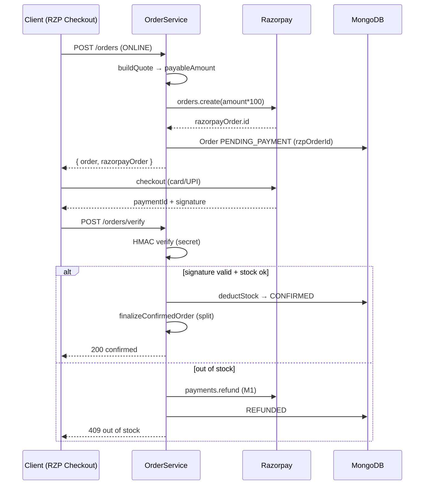
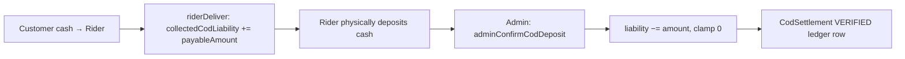

# 12 — Payment System

> **Created:** 2026-08-01
> **File type:** Feature deep-dive
> **Padhne ka time:** ~35 min

---

## WHAT — Yeh doc kya cover karti hai?

QuickBihar ka **paisa engine** — customer se paisa lena (Razorpay online + COD), phir us paise ko **teen taraf** baantna (app commission, seller earning, rider payout), aur ulti-taraf ke flows (refunds, seller earning claw-back, COD cash liability settlement). Yeh **HYBRID_MARKETPLACE_V1** model implement karta hai jaha har seller ka apna commission katta hai aur paisa **paise-accurate** (₹0.01 tak) split hota hai.

Yeh doc money ke **4 movements** cover karti hai:

```
1. Customer  → App        (Razorpay capture ya COD cash)
2. App       → Seller      (delivery ke baad SellerEarning credit)
3. App       → Rider       (delivery ke baad wallet credit)
4. Rider     → App         (COD cash deposit — ulta flow, liability settle)
   + Refunds  (App → Customer, out-of-stock / return par)
```

---

## WHY — Payment system itna careful kyun likha gaya?

Kyunki **yaha galti = asli paisa idhar-udhar**. Marketplace hai, isliye ek order mein **kai sellers** ho sakte hain, aur har ek ka hisaab alag rakhna padta hai. Do sabse bade risks jinke against yeh code defend karta hai:

1. **Paisa gum na ho / double na ho** — settlement **idempotent** hai (`idempotencyKey` unique index). Chahe delivery event do baar fire ho, seller ko ek hi baar credit hoga.
2. **Confirmed order bina stock ke na bane** — online payment capture hone ke baad agar stock khatam (race), toh **auto-refund** (M1) hota hai, order kabhi CONFIRMED nahi hota bina inventory secure kiye.

> ★ **Golden principle (code se):** "DB never holds a confirmed order without its inventory secured." Stock pehle deduct hota hai (all-or-nothing, rollback ke saath), **tab** order CONFIRMED banta hai — dono COD aur online path pe. Dekho [11_Order_System.md](./11_Order_System.md).

---

## WHERE — Files (payment surface)

| File | Kaam |
|------|------|
| `utils/razorpay.util.ts` | Razorpay client + `verifyRazorpaySignature` (HMAC SHA-256) |
| `modules/common/order/orderPricing.service.ts` | ★ Pricing math — commission, `splitAmount`, dynamic bonuses, rider estimate |
| `modules/common/order/order.service.ts` | `createOrder` (Razorpay order / COD), `verifyPayment`, `refundAndFailOrder` (M1) |
| `modules/common/order/subOrder.service.ts` | `calculateRiderPayout`, rider wallet credit, COD liability, `adminConfirmCodDeposit` |
| `modules/common/seller/sellerSettlement.service.ts` | ★ `settleSubOrder` / `reverseSubOrderSettlement` — seller wallet credit + claw-back |
| `modules/common/seller/sellerPanel.model.ts` | `SellerEarning` schema (status, idempotencyKey, netAmount) |
| `modules/common/fulfillment/codSettlement.model.ts` | `CodSettlement` ledger (rider cash deposit record) |
| `modules/common/paymentMethod/*` | Saved payment methods (cards/UPI tokens) — CRUD |

> ⚠️ **Tech-debt note (verified, consistent with [11_Order_System.md](./11_Order_System.md)):** `OrderPricingService`, `OrderService`, aur `SellerSettlementService` **class-based** hain. Project ka `rule.md` **function-based** modules maangta hai (jaise `matching.service.ts` aur `paymentMethod.service.ts` sahi hain). Yeh teeno refactor candidates hain.

---

## WHERE — Endpoints

Payment ke endpoints **do jagah** bikhre hain:

```
Order/payment lifecycle (order.router.ts, verifyJWT):
  POST /orders/quote      ← pricing quote (buildQuote) — abhi paisa nahi
  POST /orders            ← createOrder: COD confirm YA Razorpay order banao
  POST /orders/verify     ← verifyPayment: HMAC verify + stock + CONFIRM
  ...admin/sub-orders/:id/cod-settle  ← adminConfirmCodDeposit

Saved payment methods (paymentMethod.router.ts, verifyJWT):
  POST   /payment-methods         ← save card/UPI token
  GET    /payment-methods         ← mere saved methods (default first)
  DELETE /payment-methods/:id     ← delete (owner-scoped)
  PATCH  /payment-methods/:id/default  ← ek ko default banao
```

> **Note:** "Payment lena/verify/refund" **order module** ke andar hai (kyunki paisa order se juda hai). `paymentMethod` module sirf **saved instruments** (tokenized card/UPI) manage karta hai — actual charge Razorpay checkout SDK client-side karta hai.

---

## HOW — Razorpay online payment (2-step: create → verify)

QuickBihar **client-side Razorpay Checkout** pattern use karta hai. Server kabhi card number nahi chhuता — sirf **order banata hai** aur baad mein **signature verify** karta hai.

### Step 1 — `createOrder` (online path)

```
POST /orders  { paymentMethod: "ONLINE", shippingAddress, items, ... }
  1. GPS gate: shippingAddress.latitude/longitude finite ho (0,0 nahi) → warna 400
  2. buildQuote(userId, data) → payableAmount (poora pricing calc)
  3. assertCartStoresOpen + assertCartServiceable (hard gates)
  4. razorpay.orders.create({ amount: payableAmount*100 paise, currency:"INR", receipt })
  5. Order DB mein banega: status = PENDING_PAYMENT
                           paymentInfo.razorpayOrderId = razorpayOrder.id
  6. emitToAdmins(NEW_ORDER)
  7. Return { order, razorpayOrder:{id,amount,currency} } → client checkout kholta hai
```

> ⚠️ Yaha **stock abhi deduct nahi hua**. Sirf Razorpay order bana hai. Actual reservation `verify` step pe hoti hai (taaki bina paise ke stock lock na ho).

### Step 2 — `verifyPayment` (payment ke baad)

Client checkout complete karke `razorpayOrderId + razorpayPaymentId + razorpaySignature` wapas bhejta hai:

```
POST /orders/verify
  1. verifyRazorpaySignature(orderId, paymentId, signature)  → invalid? 400
  2. orderDAO.findByRazorpayOrderId → order (nahi mila? 404)
  3. order.status !== PENDING_PAYMENT? → 400 "already ..."  (replay guard)
  4. deductOrderStock(order)  ← all-or-nothing (dekho 11)
       fail (out of stock)? → refundAndFailOrder(order, paymentId) → throw  (M1)
  5. stock secure → updateStatus(CONFIRMED, paymentId, signature)
  6. finalizeConfirmedOrder(order)  ← coupon usage + SubOrder split + emit
```

### HMAC signature verify (`verifyRazorpaySignature`)

Yeh hi asli **security check** hai — proof ki payment sach mein Razorpay ne authorize ki, koi client fake nahi kar raha:

```javascript
body = razorpayOrderId + "|" + razorpayPaymentId
expectedSignature = HMAC_SHA256(body, RAZORPAY_KEY_SECRET).hex()
return expectedSignature === razorpaySignature   // constant string compare
```

- Secret **sirf server pe** (`ENV.RAZORPAY_KEY_SECRET`), client ke paas kabhi nahi.
- Signature match nahi hua → 400, order PENDING_PAYMENT hi reh jaata hai (kabhi confirm nahi).



---

## HOW — COD flow (`COD_SENTINEL`)

COD orders ka koi Razorpay order nahi hota. Par schema `paymentInfo.razorpayOrderId` **required-ish** treat hota hai, isliye ek **sentinel string** store hoti hai:

```javascript
const COD_SENTINEL = "COD";   // paymentInfo.razorpayOrderId = "COD"
```

`createOrder` mein COD path:

```
isCod = (data.paymentMethod === "COD")
  → razorpayOrder = null  (koi gateway order nahi)
  → Order banega: paymentInfo.razorpayOrderId = "COD", status = PENDING_PAYMENT
  → deductOrderStock(order)          ← COD bhi stock pehle secure karta hai
       fail? → updateStatus(FAILED) → throw  (koi paisa nahi tha, refund nahi — bas FAIL)
  → updateStatus(CONFIRMED)
  → finalizeConfirmedOrder(order)    ← online jaisa hi split + emit
  → return { order, razorpayOrder: null }
```

> **Online vs COD ka farak sirf 2 jagah:** (1) COD pe Razorpay order nahi banta, `razorpayOrderId="COD"`; (2) COD out-of-stock pe **FAILED** (refund ka sawaal nahi), online pe **REFUNDED** (M1 auto-refund). Baaki `finalizeConfirmedOrder` pipeline **bilkul same** hai — yeh deliberate design hai (ek hi confirm pipeline, do entry points).
>
> Baad mein `finalizeConfirmedOrder` / settlement `isCod` dobara sentinel se detect karta hai: `order.paymentInfo?.razorpayOrderId === COD_SENTINEL`.

---

## HOW — HYBRID_MARKETPLACE_V1 pricing math (`buildQuote`)

`orderPricingService.buildQuote(userId, data)` poore order ka paisa **quote** banata hai aur ek `pricingSnapshot` (model `"HYBRID_MARKETPLACE_V1"`) return karta hai jo order pe freeze ho jaata hai. Yeh snapshot hi baad mein SubOrder split aur settlement ka **source of truth** hai.

### Per-item price (GST-inclusive)

```
itemPrice = product.gst ? round(basePrice * (1 + gst/100)) : basePrice
```
GST **item ke andar** add hota hai (tax-inclusive display), alag line nahi.

### Coupon distribution (per-seller proportional)

Ek order-level coupon ko **har seller ke hisse** mein baanta jaata hai proportional to unke subtotal. **Last item/seller ko remainder** milta hai taaki rupaye-paise exactly match karein (koi ₹0.01 leak na ho).

### Commission (marketplace cut)

```
commissionPercent = config.marketplace.commissionPercent ?? ENV.<default>
per-seller:
  commissionBase    = seller ka taxable subtotal (coupon adjust ke baad)
  platformCommission = round(commissionBase * commissionPercent / 100)
  sellerNet          = commissionBase − platformCommission
```

### Shipping (free-threshold)

```
payableBeforeShipping >= freeShippingThreshold ? shippingFee = 0 : shippingFee = <config fee>
```
Phir shippingFee ko sellers mein `splitAmount` se baanta jaata hai (`customerDeliveryFeeShare`).

### ★ `splitAmount(amount, count, index)` — paise-accurate split

Yeh **poore payment system ka dil** hai. Kabhi bhi ek paisa (₹0.01) na khoye na double ho, isliye **integer paise** mein calculate karke remainder pehle indices mein baanta jaata hai:

```javascript
splitAmount(amount, count, index):
  paise     = Math.round(amount * 100)      // rupaye → integer paise
  base      = Math.floor(paise / count)     // har hisse ka floor
  remainder = paise % count                 // bache hue paise
  // pehle `remainder` indices ko 1 paisa extra
  return round(((base + (index < remainder ? 1 : 0)) / 100) * 100) / 100
```

**Example:** ₹100 shipping, 3 sellers → 10000 paise / 3 = 3333 base, remainder 1.
- index 0 → ₹33.34, index 1 → ₹33.33, index 2 → ₹33.33. **Total = ₹100.00 exact.** ✔

> ★ Yehi `splitAmount` logic `order.service.ts` ke `finalizeConfirmedOrder` mein bhi **duplicate** hai (SubOrder split ke waqt fallback ke liye). Do jagah same math — dekho RISKS.

### `roundMoney` — 2-decimal safety

```javascript
roundMoney(v) = Math.round(Number(v||0) * 100) / 100
```
Har paisa calc ke baad float drift rokne ke liye. `sellerSettlement.service.ts` bhi yehi use karta hai.

---

## HOW — Rider payout (`calculateRiderPayout`) + dynamic bonuses

Rider ka paisa **distance tiers + situational bonuses** se banta hai. Quote ke waqt yeh **estimate** hota hai (`riderPayoutEstimate`), aur delivery ke waqt **lock/recalculate** hota hai (`lockedOrCalculatedRiderPayout`).

### Distance tiers (`calculateRiderPayout(distanceKm, bonuses, rules)`)

```
distanceKm <= 3   → basePayout = upto3Km
distanceKm <= 5   → basePayout = upto5Km
distanceKm <= 8   → basePayout = upto8Km
distanceKm  > 8   → extraKm = ceil(distanceKm − 8)
                    basePayout = upto8Km + extraKm * extraPerKmAfter8
```

Rules **config-driven** hain, warna `ENV` defaults:
`RIDER_PAYOUT_UPTO_3_KM / _5_KM / _8_KM / _EXTRA_PER_KM_AFTER_8`. Admin app-config se in tiers ko override kar sakta hai (dekho [16_Environment.md](./16_Environment.md)).

### Dynamic bonuses (rain / peak / festival / night)

```
totalPayout = basePayout + rain + peak + festival + night

configuredBonus(activeValue, configuredAmount):
  activeValue <= 0            → 0            (bonus active hi nahi)
  configuredAmount > 0        → configuredAmount   (config wala amount)
  else                        → activeValue        (fallback)
```

Bonus **kab active** hota hai — `detectBonusFlags` (in `orderPricing.service.ts`):

| Bonus | Kaise detect hota hai | Modes |
|-------|----------------------|-------|
| **rain** | `detectRain` → open-meteo API (`api.open-meteo.com/v1/forecast`), 5-min cache, weather-code rainCodes set mein ho | AUTO / FORCE_ON / FORCE_OFF |
| **peak** | Kolkata time (Asia/Kolkata) window mein (default **18:00–21:00**) | AUTO / FORCE_ON / FORCE_OFF |
| **festival** | Config flag (admin manually enable) | FORCE_ON / FORCE_OFF |
| **night** | Kolkata time window (default **22:00–06:00**) | AUTO / FORCE_ON / FORCE_OFF |

- **AUTO** → real-world signal (weather/time) se decide.
- **FORCE_ON** → hamesha on (admin override).
- **FORCE_OFF** → hamesha off (even if raining).

> ⚠️ **External dependency:** rain detection **open-meteo** (free public API) pe depend karti hai. API down/slow ho toh 5-min cache fallback; phir bhi fail ho toh rain bonus 0 (fail-safe, order block nahi hota). Yeh ek **network call in the pricing hot-path** hai — dekho RISKS.

### App revenue accounting (order-level totals)

`buildQuote` in order-level fields bhi bharta hai (settlement analytics ke liye):

```
platformCommissionTotal    = Σ per-seller platformCommission
riderPayoutEstimateTotal   = Σ per-seller riderPayoutEstimate
appGrossRevenue            = commission + delivery fee share (app ki taraf)
appNetAfterRiderEstimate   = appGrossRevenue − riderPayoutEstimateTotal
```

```
Customer payableAmount (ek order)
        │
        ├──> Seller(s) sellerNet        (product ka paisa − commission)
        ├──> App platformCommission     (marketplace cut)
        ├──> Delivery fee + dynamicSurcharge (customer se)
        │         └──> Rider payout (base + bonuses)  ← app delivery fee se deta hai
        └──> App net = commission + (deliveryFee − riderPayout)
```

---

## HOW — Seller settlement (`settleSubOrder`) — App → Seller

Jab ek **sub-order DELIVERED/DELIVERY_CONFIRMED/COMPLETED** ho jaata hai, seller ka paisa uske wallet mein credit hota hai. Yeh `riderDeliver` ke andar automatically call hota hai (dekho [11_Order_System.md](./11_Order_System.md)).

### Amount calc

```
grossAmount     = subOrder.subtotal (ya items ka sellerSubtotal sum)
commissionAmount = subOrder.platformCommission
netAmount        = subOrder.sellerNet (snapshot)  ya  max(0, gross − commission)
```

### Idempotent credit (double-pay guard)

```
idempotencyKey = `seller-suborder:<subOrder._id>`
  1. SellerEarning.findOne({ idempotencyKey })  → mila? { alreadySettled:true }  (no-op)
  2. SellerEarning.create({ ...amounts, status:"AVAILABLE", idempotencyKey })
  3. Seller.updateOne($inc: wallet.availableBalance += net, wallet.lifetimeEarnings += net)
  4. create fail with 11000 (duplicate key)? → race: re-fetch, treat as alreadySettled
```

- `SellerEarning` pe **do unique sparse index**: `idempotencyKey` aur `subOrderObjectId`. Dono milke guarantee dete hain ki **ek sub-order = ek earning**, chahe delivery event repeat ho ya do process race karein.
- `status` lifecycle: **PENDING → AVAILABLE → PAID → REVERSED**. Delivery pe seedha `AVAILABLE` (withdraw ke liye ready). Payout hone pe `PAID`. Return pe `REVERSED`.

### Bulk / repair utilities (admin reconciliation)

`SellerSettlementService` mein reconciliation helpers bhi hain:

| Method | Kaam |
|--------|------|
| `settleDeliveredSubOrdersForOrder` | Ek order ke saare delivered sub-orders settle karo (backfill) |
| `missingDeliveredSubOrderSettlements` | Delivered hain par SellerEarning nahi bana — audit list |
| `underpaidDeliveredSubOrderSettlements` | Credited < expected net — delta list |
| `repairUnderpaidSubOrderSettlement` | Underpaid earning ko top-up karo (delta wallet mein add) |

Yeh audit jobs batate hain ki koi settlement drop toh nahi hua (ops safety net).

---

## HOW — Settlement reversal (`reverseSubOrderSettlement`) — return par claw-back

Jab delivered order **return** ho jaata hai (M2, dekho [11_Order_System.md](./11_Order_System.md)), seller ka credit **wapas leni** padti hai. Yeh `issueReturnRefund` ke andar call hota hai.

```
reverseSubOrderSettlement(subOrder):
  1. SellerEarning.findOne({ idempotencyKey })
       nahi mila / already REVERSED? → no-op { alreadyReversed }  (double-claw guard)
  2. wasPaid = (existing.status === "PAID")
  3. updateOne({ idempotencyKey, status: existing.status }, $set status="REVERSED", metadata)
       modifiedCount === 0? → race lost, wallet ko haath mat lagao
  4. Seller.updateOne($inc):
       lifetimeEarnings -= net    (hamesha)
       availableBalance -= net    (SIRF agar !wasPaid)
```

### PAID edge-case (critical honesty)

Agar earning **pehle hi PAID** ho chuki (paisa seller ke bank mein ja chuka), toh:
- `availableBalance` ko touch nahi karte (woh cash already nikal chuka).
- `lifetimeEarnings` decrement hota hai.
- **`console.error` CRITICAL log** — "Payout was already sent — needs admin claw-back."

> ⚠️ Yeh ek **known gap** hai: already-PAID earning ka claw-back **automated nahi** — admin ko manually seller se recover karna padega. Return-after-payout ka paisa recover karne ka koi automatic mechanism nahi hai. Dekho RISKS.

Status-guarded `updateOne` (`{ idempotencyKey, status: existing.status }`) concurrent reversals ko **race-safe** banata hai — do reversal ek saath aayein toh sirf ek `modifiedCount:1` paayega, doosra no-op.

---

## HOW — Refund paths (App → Customer)

Teen tarah ke refund hote hain, teeno ka behaviour alag:

| Refund kab | Kaise | Failure behaviour |
|-----------|-------|-------------------|
| **M1 — out of stock after online payment** | `refundAndFailOrder`: `razorpay.payments.refund(paymentId, amount*100)` → order **REFUNDED** | refund call fail → order **FAILED** + `console.error CRITICAL ... manual reconciliation`. **Kabhi silently confirm nahi karta.** |
| **Return refund (prepaid)** | `issueReturnRefund`: `razorpay.payments.refund` + `restoreStock` + `reverseSubOrderSettlement` | fail → sub-order **RETURNED + MANUAL_RECONCILE** flag, **never throws** (order flow block na ho) |
| **Return refund (COD)** | Koi gateway refund nahi (paisa cash mein tha) → **MANUAL_CASH** mark, admin cash wapas kare | same manual-reconcile fallback |

```
M1 auto-refund (verifyPayment ke andar):
  deductOrderStock fail
    → refundAndFailOrder(order, paymentId)
        try:  razorpay.payments.refund(paymentId, payableAmount*100)
              order → REFUNDED, refundedAt = now
        catch: order → FAILED
              console.error CRITICAL (manual reconciliation)
    → throw stockError  (client ko 409 "out of stock")
```

> ★ **Design principle:** Refund failure kabhi order ko galat state mein nahi chhodta. Ya toh REFUNDED (success), ya FAILED/MANUAL_RECONCILE (loud log). "Fail loud, never silent" — paise ke code ka rule.

---

## HOW — COD cash liability (Rider → App, ulta flow)

COD mein customer **cash rider ko** deta hai. Woh cash abhi app ka hai (seller/commission ka hissa usme hai), isliye rider pe ek **liability** ban jaati hai jo baad mein deposit karke clear hoti hai.

### Step 1 — Delivery pe liability banti hai (`riderDeliver`)

```
COD sub-order deliver hua:
  riderProfile.wallet.lifetimeEarnings   += payout     (rider ki kamai)
  riderProfile.wallet.availableBalance   += payout
  if (isCod):
     riderProfile.wallet.collectedCodLiability += subOrder.payableAmount  ← rider ke paas app ka cash
```

Dhyan do: rider ka **payout** (kamai) alag hai, **collectedCodLiability** (app ka cash jo rider ne collect kiya) alag. Rider ko payout milega, par usse pehle collected cash deposit karna hoga.

### Step 2 — Admin deposit confirm karta hai (`adminConfirmCodDeposit`)

```
POST /orders/admin/sub-orders/:id/cod-settle  (isAdmin)
  1. isCod nahi? → 400
  2. timeline mein already "COD_SETTLED"? → 400 (double-settle guard)
  3. settlementAmount = subOrder.payableAmount
  4. previousLiability = wallet.collectedCodLiability
     newLiability = max(0, previousLiability − settlementAmount)   ← clamp at 0
     wallet.collectedCodLiability = newLiability
  5. CodSettlement.create({ riderId, amount, previousLiability, newLiability,
                            status:"VERIFIED", verifiedBy: adminUserId })
  6. timeline.push("COD_SETTLED") + publishUpdate + notify rider
```



> **COD ceiling:** rider naya COD job accept karne se pehle `riderAcceptOrder` check karta hai ki `collectedCodLiability + naya payableAmount` ceiling cross toh nahi karega (warna **429**). Yeh rider ke paas bahut zyada app-cash jama hone se rokta hai. Dekho [11_Order_System.md](./11_Order_System.md).

---

## HOW — Saved payment methods (`paymentMethod` module)

Yeh module **tokenized instruments** (saved card/UPI) manage karta hai — actual paisa nahi, sirf convenience. **Function-based** (rule.md compliant ✔).

```
IPaymentMethod: { userId, provider(default RAZORPAY), methodType("card"/"upi"/"wallet"),
                  last4, brand, isDefault, providerToken }
```

- **Owner-scoped:** har query `userId` se filtered — user sirf apne methods dekhe/delete kare (dusre ka `_id` guess kare bhi toh 404).
- **Single-default invariant:** `isDefault:true` set karne pe `pre("save")` hook + DAO `setAsDefault` baaki sab ko `false` kar dete hain. Ek user, ek default.
- **`providerToken`** gateway se aaya recurring/saved-payment token hai — **raw card number kabhi store nahi hota** (PCI safe).

> ⚠️ `providerToken` sensitive hai. Iska serialization filter hona chahiye (client ko token expose na ho). Abhi model level pe koi `select:false` nahi — dekho RISKS + [19_Security.md](./19_Security.md).

---

## FLOW — Ek order ka poora paisa safar (bird's-eye)

```
┌──────────────────────────────────────────────────────────────────────┐
│                         CUSTOMER PAYMENT                                │
│  ONLINE:  createOrder → razorpay.orders.create → checkout →            │
│           verify(HMAC) → deductStock → CONFIRMED                        │
│  COD:     createOrder → deductStock → CONFIRMED (rzpOrderId="COD")      │
└───────────────────────────────┬──────────────────────────────────────┘
                                 │ finalizeConfirmedOrder → SubOrder split
                                 ▼
┌──────────────────────────────────────────────────────────────────────┐
│                     FULFILLMENT (per sub-order)                         │
│  seller pack → rider match → pickup(OTP) → deliver(OTP)                 │
└───────────────────────────────┬──────────────────────────────────────┘
                                 │ riderDeliver
             ┌───────────────────┼────────────────────┐
             ▼                    ▼                    ▼
   ┌──────────────────┐  ┌─────────────────┐  ┌────────────────────┐
   │ SELLER settle    │  │ RIDER wallet    │  │ COD liability (if   │
   │ SellerEarning    │  │ payout credit   │  │ COD): collectedCod  │
   │ AVAILABLE (idem) │  │ (base+bonuses)  │  │ Liability += amount │
   └────────┬─────────┘  └─────────────────┘  └─────────┬──────────┘
            │                                            │
   ┌────────▼─────────┐                        ┌─────────▼──────────┐
   │ RETURN? →         │                        │ Admin confirms      │
   │ reverseSettlement │                        │ deposit → liability │
   │ + refund customer │                        │ −= amount, ledger   │
   └───────────────────┘                        └────────────────────┘
```

---

## WHO — Kaun kya karta hai

| Actor | Payment ke saath kya |
|-------|----------------------|
| **Customer** | Paisa deta hai (Razorpay online / COD cash). Refund paata hai (out-of-stock/return). Saved methods manage karta hai. |
| **Seller** | Delivery ke baad `sellerNet` wallet mein paata hai (`AVAILABLE`). Return pe claw-back. Payout withdraw karta hai. |
| **Rider** | Delivery payout (base+bonuses) paata hai. COD cash collect karke app ko deposit karta hai (liability). |
| **Admin** | COD deposit confirm karta hai; underpaid/missing settlements repair karta hai; failed refunds manually reconcile karta hai; commission % / payout tiers config karta hai. |
| **System** | HMAC verify, idempotent settlement, M1 auto-refund, dynamic bonus detection (open-meteo). |

---

## DEPENDENCIES

- **Isse pehle:** [11_Order_System.md](./11_Order_System.md) (order lifecycle, SubOrder split, rider leg jaha settlement trigger hota hai)
- **Related:** [07_Database.md](./07_Database.md) (Order/SubOrder/SellerEarning/CodSettlement/Seller wallet schemas), [16_Environment.md](./16_Environment.md) (Razorpay keys, payout tier ENV, app-config overrides)
- **Security:** [19_Security.md](./19_Security.md) (secret handling, `providerToken`/wallet serialization), [09_Authorization_RBAC.md](./09_Authorization_RBAC.md) (admin cod-settle guard)
- **Realtime:** [14_Notifications.md](./14_Notifications.md) (payout/settlement notifications)
- **External:** Razorpay (payments/orders/refunds), open-meteo (rain detection)

---

## RISKS

- ⚠️ **No DB transactions (multi-document money moves)** — settlement, wallet `$inc`, aur ledger create alag-alag ops hain (Mongo transaction wrap nahi). Idempotency keys duplicate-pay se bachate hain, par ek op fail-mid-flow ho toh partial state ban sakta hai. Consistent with [11_Order_System.md](./11_Order_System.md) ka same risk.
- ⚠️ **Already-PAID earning reversal = manual claw-back** — return-after-payout ka paisa recover karne ka automatic mechanism nahi. Sirf `console.error CRITICAL` log; admin ko manually seller se recover karna padta hai.
- ⚠️ **Refund failure → manual reconciliation** — `refundAndFailOrder` aur `issueReturnRefund` refund fail hone pe MANUAL_RECONCILE/FAILED mark karke loud log karte hain, par koi retry queue nahi. Ops ko logs monitor karne padenge (koi alerting/dashboard nahi verified).
- ⚠️ **`splitAmount` do jagah duplicate** — `orderPricing.service.ts` aur `order.service.ts` dono mein same paise-split logic. Ek jagah change, doosri bhoolna = mismatch. Shared util hona chahiye.
- ⚠️ **open-meteo pricing hot-path pe** — rain bonus ke liye external API call (5-min cache ke saath). API down = rain bonus silently 0 (rider ko kam paisa raining day pe, fail-safe par unfair). Third-party availability pe paisa depend karta hai.
- ⚠️ **Class-based services (tech debt)** — `OrderPricingService`, `OrderService`, `SellerSettlementService` `rule.md` function-based convention todte hain. Consistent flag with [11_Order_System.md](./11_Order_System.md) + [30_Tech_Debt.md](./30_Tech_Debt.md).
- ⚠️ **`providerToken` / wallet fields serialization** — `PaymentMethod.providerToken` aur `Seller.wallet` / `DeliveryBoy.wallet` pe koi `select:false` ya toJSON filter verified nahi. Sensitive financial data client ko leak ho sakta hai. Dekho [07_Database.md](./07_Database.md) RISKS.
- ⚠️ **Commission snapshot vs live config** — commission `pricingSnapshot` pe freeze hota hai (sahi), par agar snapshot missing/corrupt ho toh settlement `max(0, gross−commission)` fallback pe chala jaata hai — silent behaviour change.
- ⚠️ **COD liability clamp at 0** — `max(0, previous − amount)` galat/duplicate settle pe liability negative nahi hone deta, par yeh **error ko hide** bhi kar sakta hai (over-settlement silently swallow). Ledger se audit zaroori.

---

## IMPROVEMENTS

- **Mongo multi-document transactions** (replica set) — settlement + wallet + ledger ko atomic banao. Sabse bada correctness upgrade.
- **Refund retry queue** — failed refunds ko background job se retry + admin dashboard pe surface karo (abhi sirf logs).
- **Automated PAID-earning claw-back** — return-after-payout ke liye seller ke next payout se auto-deduct (negative earning) mechanism.
- **`splitAmount` + `roundMoney` ko shared `utils/money.ts`** mein nikaalo — duplication khatam.
- **Rain detection ko async/pre-warmed** — pricing request ke bahar background refresh, taaki checkout kabhi external API pe block na ho.
- **Reconciliation dashboard** — `missing`/`underpaid`/COD-liability audit outputs ko admin UI pe (abhi service methods hain, UI verified nahi).
- **Money as integer paise everywhere** — float rupaye ke bajaye poore system mein integer paise store karo (rounding risk poori tarah khatam).
- **Refactor teeno class services** ko function-based (rule.md).

---

*Verified against `razorpay.util.ts`, `order.service.ts` (createOrder/verifyPayment/refundAndFailOrder/deductOrderStock/finalizeConfirmedOrder), `orderPricing.service.ts` (buildQuote/splitAmount/dynamic bonuses), `subOrder.service.ts` (calculateRiderPayout/riderDeliver wallet credit/adminConfirmCodDeposit), `sellerSettlement.service.ts` (settleSubOrder/reverseSubOrderSettlement/repair helpers), `sellerPanel.model.ts` (SellerEarning), aur `paymentMethod/*` on 2026-08-01. HMAC verify, COD_SENTINEL, HYBRID_MARKETPLACE_V1 split math, rider payout tiers, idempotent settlement, M1 auto-refund, aur COD liability line-by-line padha gaya.*
