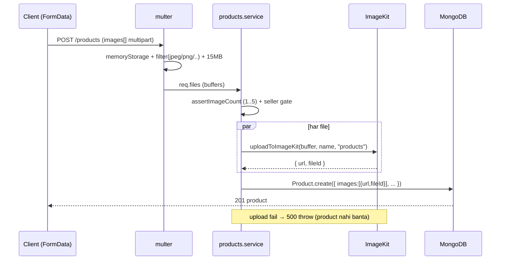

# 13 — File Uploads (ImageKit)

> **Created:** 2026-08-01
> **File type:** Feature deep-dive
> **Padhne ka time:** ~20 min

---

## WHAT — Yeh doc kya cover karti hai?

QuickBihar ka **image upload pipeline** — multipart file aata hai → `multer` memory mein rakhta hai → `uploadToImageKit` CDN pe bhejta hai → wapas `{ url, fileId }` milta hai jo DB mein store hota hai. Plus cleanup (`deleteFromImageKit`), folder taxonomy, aur har upload endpoint. **Sab images ImageKit** (external CDN) pe jaati hain — server pe koi image file save nahi hoti.

---

## WHY — Images alag pipeline se kyun jaati hain?

Do bade reasons:

1. **JSON body limit 16kb hai** (dekho [06_API_Flow.md](./06_API_Flow.md)). Base64 image body mein daaloge toh fail. Isliye images **`multipart/form-data`** se jaati hain (multer parse karta hai), JSON se nahi.
2. **CDN chahiye** — images ko fast, globally serve karne ke liye ImageKit (transformations + CDN). Server sirf ek **pass-through** hai: file receive karo, ImageKit ko bhejo, URL DB mein rakho. Server disk pe kuch nahi rehta (`memoryStorage`).

```
Client (multipart) → multer (RAM buffer) → uploadToImageKit → ImageKit CDN
                                                  │
                                          { url, fileId } → DB
```

> **fileId kyun store karte hain?** Kyunki delete/replace ke liye ImageKit ko `fileId` chahiye. Sirf URL kaafi nahi — orphan cleanup ke liye `fileId` DB mein rakhna zaroori hai.

---

## WHERE — Files

| File | Kaam |
|------|------|
| `middlewares/multer.middleware.ts` | `upload` — memory storage, 15MB limit, image-only filter |
| `utils/imagekit.util.ts` | ★ `uploadToImageKit` (sanitize+folder), `deleteFromImageKit` (best-effort) |
| `config/imagekit.config.ts` | ImageKit client (publicKey/privateKey/urlEndpoint from ENV) |
| `modules/common/mall/mall.media.ts` | Mall multi-field media helper (`uploadMallMediaFiles`, `normalizeMallPayload`) |
| `modules/clothing/products/products.service.ts` | Product image add/remove diff (dekho [10_Product_System.md](./10_Product_System.md)) |

---

## WHERE — Upload endpoints (poora surface)

Har upload route pe `upload.*` multer middleware lagta hai (field name matter karta hai):

| Endpoint | Multer | Field(s) | Folder | Kaun |
|----------|--------|----------|--------|------|
| `POST/PATCH /products`, `/products/:id` | `array("images", 5)` | `images` (max 5) | `products` | Seller/Admin |
| `POST/PATCH /sellers/products` | `array("images", 5)` | `images` | `products` | Seller |
| `POST/PATCH /categories`, `/:id` | `single("image")` | `image` | `categories` | Admin |
| `POST/PATCH /banners`, `/:id` | `single("image")` | `image` | `banners` | Admin |
| `POST/PATCH /sellers/banners` | `single("image")` | `image` | `seller-banners` | Seller |
| `PATCH /users/avatar` | `single("avatar")` | `avatar` | (avatar folder) | User |
| `POST/PATCH /admin/malls`, `/sellers/malls` | `fields([logo,coverImage,images])` | `logo`,`coverImage`,`images` | `malls/logos`,`malls/covers`,`malls/images` | Admin/Seller |
| `POST /onboarding/documents` | `array("documents", 5)` | `documents` | `onboarding-documents` | Partner |
| `POST /delivery/proof-upload` | `single("file")` | `file` | `delivery-proofs` | Rider |
| `POST/PATCH /notifications/send`, `/:id` | `single("image")` | `image` | `notifications` | Admin |

> ⚠️ **Field name galat = file drop.** Multer sirf named field pakadta hai (`upload.single("image")` sirf `image` field padhega). Frontend ka `FormData` key aur backend ka multer field **exactly match** hone chahiye, warna file silently miss ho jaati hai.

---

## HOW — `multer` config (`upload`)

```javascript
storage: multer.memoryStorage()        // disk pe nahi, RAM buffer mein (file.buffer)
limits:  { fileSize: 15 * 1024 * 1024 } // 15 MB per file
fileFilter: allowedTypes = /jpeg|jpg|png|webp|gif/
            (extname AND mimetype dono match hone chahiye)
            warna → ApiError(400, "Only images ... allowed")
```

- **`memoryStorage`** → har file `req.file.buffer` (single) ya `req.files` (array/fields) mein RAM mein aati hai. Server disk pe kabhi nahi likhi jaati — ImageKit ko direct buffer bhejte hain.
- **Double check** (extension + mimetype) — sirf mimetype trust nahi karte (spoofable), extension bhi validate.
- **15MB × 5 files** = ek request 75MB tak RAM le sakti hai — dekho RISKS.

---

## HOW — `uploadToImageKit(fileBuffer, fileName, folder="banners")`

```
1. sanitizeFileName(fileName):
     "My Red Shirt (L).png" → "my_red_shirt_l_1723526400000.png"
     - lowercase, non-alphanumeric → "_", collapse "__", trim edges
     - Date.now() suffix append → uniqueness + CDN cache-bust on replace
2. normalizedFolder = folder minus leading/trailing "/", empty ho toh "general"
3. imagekit.upload({ file: buffer, fileName, folder })
4. return { url, fileId }     ← url DB display ke liye, fileId delete ke liye
   error → ApiError(500, "Failed to upload image to ImageKit")  (THROWS)
```

> **Timestamp suffix kyun?** Do fayde: (1) do same-naam files collide na karein; (2) image replace karne pe naya filename = CDN cache turant naya dikhata hai (purana cached version stale na ho).

---

## HOW — `deleteFromImageKit(fileId)` (best-effort)

```javascript
deleteFromImageKit(fileId):
  try:   await imagekit.deleteFile(fileId); return true
  catch: console.error(...); return false      // ← DOES NOT THROW
```

> ★ **Deliberate asymmetry:** `uploadToImageKit` **throw** karta hai (upload fail = request fail, kyunki bina image ke product banana pointless). Par `deleteFromImageKit` **throw nahi** karta (`return false`) — delete fail hone se main flow (product update/delete) block nahi hona chahiye. Result: **orphan images ImageKit pe reh sakti hain** (upload hui par DB se de-link ho gayi, delete fail). Yeh known cost/cleanup risk hai. Dekho RISKS.

---

## HOW — Folder taxonomy (ImageKit pe organization)

Har feature apne folder mein upload karti hai (code se verified):

```
products/                ← product images (max 5 per product)
categories/              ← category thumbnails
banners/                 ← home banners (default folder)
seller-banners/          ← seller ke apne banners
malls/logos/             ← mall logo
malls/covers/            ← mall cover image
malls/images/            ← mall gallery (max 5)
onboarding-documents/    ← partner KYC docs (max 5)  ⚠️ sensitive
delivery-proofs/         ← pickup/delivery/signature photos
notifications/           ← push notification images
general/                 ← fallback (folder empty ho toh)
```

> ⚠️ **`onboarding-documents/` sensitive hai** — KYC/ID documents public ImageKit URL pe. Signed/private URLs ya access control hona chahiye (abhi public CDN URL). Dekho RISKS + [19_Security.md](./19_Security.md).

---

## HOW — Multi-field upload (mall media)

Mall ke paas **teen alag media slots** hain, isliye `upload.fields([...])` use hota hai. `uploadMallMediaFiles(files)` unhe route karta hai:

```
files.logo       → uploadToImageKit(..., "malls/logos")   → { logoUrl, logoImagePublicId }
files.coverImage → uploadToImageKit(..., "malls/covers")  → { coverImageUrl, coverImagePublicId }
files.images[]   → uploadToImageKit(..., "malls/images")  → images:[{ url, fileId }]
```

Saath mein `normalizeMallPayload(body)` multipart ke string fields ko parse karta hai (multipart mein sab kuch string aata hai):
- `address`, `contact`, `images` → `JSON.parse` (JSON strings)
- `isMobileVisible`, `isFeatured`, `isActive` → boolean (`"true"/"1"/"on"/"yes"` → true)

> **Kyun zaroori:** `multipart/form-data` mein har value **string** hoti hai (JSON ki tarah typed nahi). Isliye nested objects (address) aur booleans ko manually parse karna padta hai. Yeh ek common gotcha hai — multipart route pe `req.body.isActive` `"false"` string aayega, `false` boolean nahi.

---

## HOW — Product image diff (update pe add/remove)

`updateProduct` ka image handling (detail [10_Product_System.md](./10_Product_System.md) mein):

```
existingImages payload → kaunsi purani images retain karni hain
naye files            → uploadToImageKit (add)
jo retain nahi hui    → deleteFromImageKit(fileId) (best-effort, .catch ignore)
Total enforce: min 1, max 5
```

Yeh **diff** pattern hai — client batata hai kaunsi rakhni hain, backend baaki delete karta hai aur nayi add karta hai. Delete best-effort hai (orphan risk).

---

## HOW — Delivery proof upload (rider photos)

Rider pickup/delivery pe photo proof deta hai. Yeh alag endpoint hai jo sirf URL return karta hai (baad mein OTP-verify step us URL ko sub-order pe attach karta hai):

```
POST /delivery/proof-upload  (isDelivery, upload.single("file"))
  1. req.file nahi? → 400 "A proof image file is required"
  2. kind = body.kind, whitelist ["pickup","delivery","signature"] warna "proof"
  3. uploadToImageKit(buffer, `${kind}_${riderUserId}_${originalname}`, "delivery-proofs")
  4. res.ok({ url, fileId })
```

Yeh URL phir `riderPickup` (pickupPhoto) / `riderDeliver` (deliveryPhoto) mein sub-order pe save hota hai (dekho [11_Order_System.md](./11_Order_System.md)). Do-step design: pehle upload (URL milta hai), phir OTP action mein woh URL bhejo.

---

## FLOW — Seller product images ke saath add karta hai



---

## WHO — Kaun kya upload karta hai

| Actor | Kya upload karta hai |
|-------|---------------------|
| **Seller** | Product images (≤5), seller banners, mall media (request) |
| **Admin** | Categories, banners, malls, notification images |
| **User** | Profile avatar |
| **Rider** | Delivery/pickup/signature proof photos |
| **Partner (onboarding)** | KYC documents (≤5) ⚠️ sensitive |

---

## DEPENDENCIES

- **Isse pehle:** [06_API_Flow.md](./06_API_Flow.md) (16kb JSON limit — isliye multipart), [04_Backend.md](./04_Backend.md) (middleware chain)
- **Related:** [10_Product_System.md](./10_Product_System.md) (product image diff), [11_Order_System.md](./11_Order_System.md) (delivery proof photos), [16_Environment.md](./16_Environment.md) (ImageKit keys)
- **Security:** [19_Security.md](./19_Security.md) (public URLs, KYC docs, no virus scan)
- **External:** ImageKit (upload/delete/CDN)

---

## RISKS

- ⚠️ **Orphan images (best-effort delete)** — `deleteFromImageKit` fail hone pe `return false` (no throw). Update/delete pe purani image ImageKit pe reh jaati hai (DB se de-linked). Cost + clutter over time. Koi cleanup/reconciliation job verified nahi.
- ⚠️ **Memory pressure** — `memoryStorage` + 15MB × 5 files = ek request 75MB RAM. Concurrent uploads pe memory spike / OOM risk. Bade scale pe streaming ya direct-to-ImageKit signed upload better.
- ⚠️ **No virus/malware scan** — file content scan nahi hota, sirf extension+mimetype. Malicious file (image ke bhes mein) upload ho sakti hai. Public serve hone se pehle scan hona chahiye.
- ⚠️ **KYC docs public CDN URL pe** — `onboarding-documents/` mein ID/KYC public ImageKit URL pe. URL guess/leak hua toh sensitive PII expose. Signed/private URLs chahiye. Dekho [19_Security.md](./19_Security.md).
- ⚠️ **fileId store na hua toh delete impossible** — agar kisi legacy record mein sirf URL hai (fileId nahi), toh us image ko ImageKit se kabhi delete nahi kar sakte (permanent orphan).
- ⚠️ **Field-name mismatch = silent drop** — multer named field expect karta hai. Frontend key aur backend field match na karein toh file bina error ke miss ho jaati hai (`req.file` undefined → downstream 400 ya missing image).
- ⚠️ **No rate limit on uploads** — upload endpoints pe koi throttle verified nahi. Abuse se ImageKit quota/cost spike.

---

## IMPROVEMENTS

- **Orphan cleanup job** — periodic reconciliation: ImageKit assets vs DB references, unreferenced delete.
- **Signed/private URLs for sensitive folders** (`onboarding-documents`, kuch `delivery-proofs`) — public access band.
- **Client-side direct upload** (ImageKit signed upload token) — server ko buffer se bypass, memory pressure khatam.
- **Virus/content scanning** upload pipeline mein (serve se pehle).
- **Image optimization** — server ya ImageKit transformation se resize/compress on upload (bandwidth + storage bachao).
- **Upload rate limiting** per user/role.
- **Guaranteed fileId persistence** — schema level pe `fileId` required jaha delete zaroori hai.

---

*Verified against `multer.middleware.ts` (memoryStorage/15MB/image filter), `imagekit.util.ts` (sanitizeFileName/uploadToImageKit/deleteFromImageKit), `imagekit.config.ts`, `mall.media.ts` (multi-field), `delivery.controller.ts` (uploadProof), aur saare `upload.*` router usages + `uploadToImageKit` folder args on 2026-08-01. Best-effort delete asymmetry aur folder taxonomy line-by-line confirm kiye gaye.*
