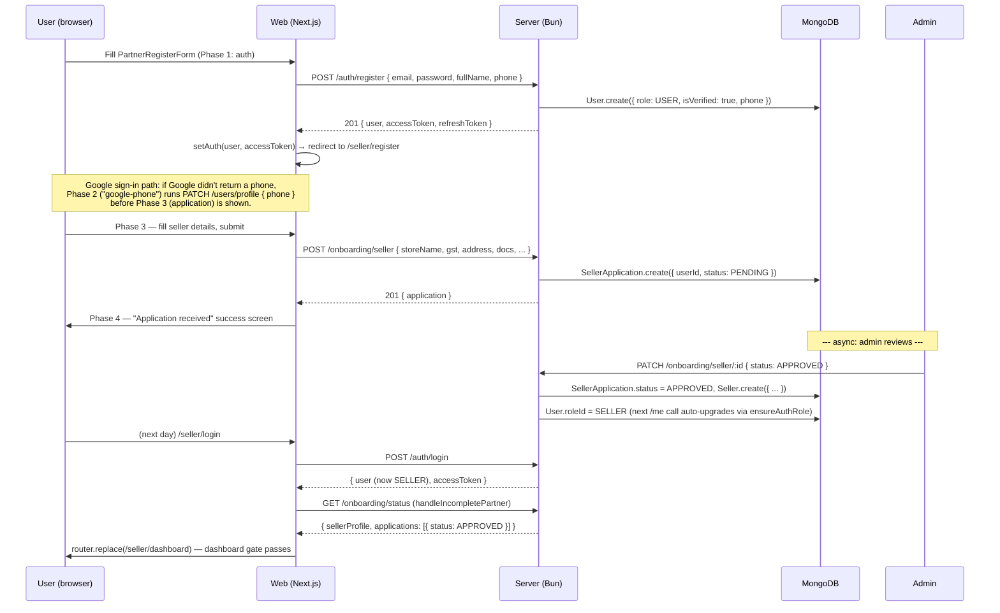
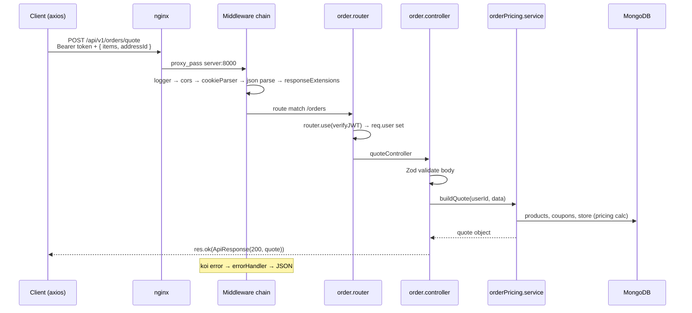

# 06 — API Flow

> **Created:** 2026-08-01 · **Updated:** 2026-09-04 (added admin-verification gate + phone-on-`/auth/register`)
> **File type:** App deep-dive
> **Padhne ka time:** ~20 min

---

## WHAT — Yeh doc kya cover karti hai?

Ek API request **start se end tak** kaise chalti hai — client se request banti hai, nginx proxy karta hai, server ke layers se guzarti hai (middleware → controller → service → dao → model), response wapas aata hai. Plus: standard request/response shape, error shape, aur poora endpoint surface.

---

## WHY — Yeh samajhna kyun zaroori?

Kyunki har feature ek API call hai. Agar aapko yeh mental model clear hai — "request kaha jaati hai, kaunsi layer kya karti hai, error kaha handle hota hai" — toh aap kisi bhi endpoint ko debug/extend kar sakte ho.

---

## WHERE — API ka base structure

```
Base URL:  <origin>/api/v1
Auth:      Authorization: Bearer <accessToken>   (ya cookie: accessToken)
Content:   application/json  (body limit: 16kb)
```

- **Web** (`web/src/lib/axios.ts`): `NEXT_PUBLIC_API_URL || http://localhost:8000/api/v1`, `withCredentials: true`.
- **Mobile** (`mobile/src/api/axiosInstance.ts`): `${EXPO_PUBLIC_API_ORIGIN}/api/v1`.
- Production mein nginx `/api/` ko `server:8000` pe proxy karta hai.

---

## HOW — Standard response shape (`ApiResponse`)

Har success response yeh shape follow karta hai (`utils/ApiResponse.ts`):

```json
{
  "statusCode": 200,
  "data": { /* actual payload */ },
  "message": "User logged in successfully",
  "success": true
}
```

Controller `res.status(200).json(new ApiResponse(200, data, message))` use karta hai. Client (axios) `response.data.data` se actual payload nikaalta hai (isiliye `response.data.data.accessToken` jaisa pattern dikhta hai).

## HOW — Standard error shape (`ApiError`)

Koi bhi error `errorHandler` (global middleware) se guzarta hai aur yeh shape banta hai (`utils/ApiError.ts`):

```json
{
  "statusCode": 400,
  "message": "Validation failed",
  "errors": [ /* Zod issues ya detail */ ],
  "success": false
}
```

`ApiError(statusCode, message, errors[])` — services yeh throw karte hain, `asyncHandler` `.catch(next)` karta hai, `errorHandler` JSON banata hai. Detail: 18_Error_Handling.md.

---

## FLOW — A partner applies (end-to-end: `POST /auth/register` → application → admin approval)

This is the most behavior-rich flow in the system right now — it touches `/auth/register`, `/users/profile`, `/onboarding/*`, the RBAC auto-upgrade, and the dashboard gate. Everything below is verified against the source.



> **Two layers, one source of truth.** The login hook (`useRoleLogin` / `useRoleGoogleAuth`) checks `onboardingApi.status()` so the user is redirected to `/seller/register` *before* hitting the dashboard when the application is `PENDING` / `REJECTED` / missing. The seller / delivery dashboard pages *also* call the same status hook, so a stale cookie or a manual role change can't leak a live dashboard to an unapproved partner. The two layers read the same endpoint, so there is no drift.

## FLOW — Ek request ka poora safar (example: `POST /api/v1/orders/quote`)



### Step-by-step (words mein)

```
1. Client axios se request banata hai
   - Request interceptor token attach karta hai (Bearer)

2. nginx (production) /api/ → server:8000 proxy

3. Global middleware chain (app.ts order):
   logger → cors → cookieParser → json(16kb) → urlencoded → static → responseExtensions

4. Router match (/api/v1/orders → order.router)
   - router.use(verifyJWT): token verify + req.user attach (roleId populated)
   - (kuch routes pe role guard: isAdmin/isSeller/etc.)

5. Controller (asyncHandler-wrapped)
   - req.body / req.params nikaalta hai
   - Zod validate (validator schema)
   - service call

6. Service (business logic)
   - rules, calculations, orchestration
   - DAO call (DB queries)

7. DAO → Mongoose model → MongoDB

8. Response wapas:
   - res.ok / res.created / res.json(new ApiResponse(...))
   - client response.data.data se payload leta hai

9. Error hua toh:
   - service ApiError throw → asyncHandler catch → errorHandler → standard JSON
```

---

## HOW — Authentication in requests (recap)

```
Protected route:
  Request → verifyJWT
    token = cookie.accessToken || "Bearer <token>" header
    jwt.verify(token, ACCESS_TOKEN_SECRET)
    UserDAO.findById → req.user (roleId populated)
  → role guard (validateRole/validatePermission)
  → controller
```

401 aaye toh client **single-flight silent refresh** karta hai (dekho [08_Authentication.md](./../features/authentication.md)).

---

## WHERE — Poora endpoint surface (25 routers)

Sab `/api/v1/` prefix ke saath (`app.ts` se):

| Router | Base path | Detail doc |
|--------|-----------|-----------|
| auth | `/auth` | [08_Authentication.md](./../features/authentication.md) |
| admin | `/admin` | — |
| sellers | `/sellers` | — |
| malls | `/malls` | — |
| delivery | `/delivery` | [11_Order_System.md](./../features/orders.md) |
| events | `/events` | [14_Notifications.md](./../features/notifications.md) |
| notifications | `/notifications` | [14_Notifications.md](./../features/notifications.md) |
| onboarding | `/onboarding` | Seller + rider applications, admin review, status endpoint used by login hook + dashboard gate |
| stores | `/stores` | — |
| categories | `/categories` | — |
| users | `/users` | — |
| rbac | `/rbac` | [09_Authorization_RBAC.md](./../features/authorization-rbac.md) |
| banners | `/banners` | — |
| products | `/products` | [10_Product_System.md](./../features/products.md) |
| size-charts | `/size-charts` | [10_Product_System.md](./../features/products.md) |
| coupons | `/coupons` | — |
| addresses | `/addresses` | — |
| orders | `/orders` | [11_Order_System.md](./../features/orders.md) |
| labels | `/labels` | — |
| payment-methods | `/payment-methods` | [12_Payment_System.md](./../features/payments.md) |
| cart | `/cart` | — |
| wishlist | `/wishlist` | — |
| app-config | `/app-config` | [16_Environment.md](./../operations/environment.md) |
| refund-policies | `/refund-policies` | — |

### Example: order endpoints (`order.router.ts`)
```
router.use(verifyJWT)   ← saari order routes protected

User:
  POST   /orders/quote                    ← price quote
  POST   /orders                          ← order banao
  POST   /orders/verify                   ← payment verify
  GET    /orders/me                       ← mere orders
  GET    /orders/sub-orders/:id           ← ek suborder
  POST   /orders/sub-orders/:id/cancel    ← cancel
  POST   /orders/sub-orders/:id/return    ← return request
  GET    /orders/:id                      ← ek order

Admin:
  GET    /orders/admin/all
  PATCH  /orders/admin/status/:id
  GET    /orders/admin/sub-orders
  POST   /orders/admin/sub-orders/:id/assign
  POST   /orders/admin/sub-orders/:id/cod-settle
  POST   /orders/admin/sub-orders/:id/return-resolve
```

---

## WHO — Kaun kaunse endpoints call karta hai

| Client | Zyadatar endpoints |
|--------|-------------------|
| Mobile (customer) | `/products`, `/cart`, `/orders/*`, `/addresses`, `/wishlist` |
| Mobile (rider) | `/delivery/*` (offers, lifecycle) |
| Web (admin) | `/admin/*`, `/rbac`, `/categories`, `/orders/admin/*`, `/onboarding/*` (admin review queue — approve/reject seller & rider applications) |
| Web (seller) | `/sellers/*`, `/products`, `/orders`, `/coupons` (gated: see [authentication.md → Admin verification gate](./../features/authentication.md#admin-verification-gate-login--dashboard)) |
| Web (delivery) | `/delivery/*` (gated: same admin-verification gate — PENDING/REJECTED/missing application → "Application Under Review" screen) |

---

## DEPENDENCIES

- **Isse pehle:** [04_Backend.md](././server.md) (layered architecture)
- **Deep:** 23_Request_Lifecycle.md (HTTP + socket lifecycle)
- **Related:** 18_Error_Handling.md, [08_Authentication.md](./../features/authentication.md)

---

## RISKS

- ⚠️ **16kb body limit** — bade payloads (jaise base64 image body mein) fail honge. Images multipart se jaati hain (multer), JSON nahi. Dekho [13_File_Uploads.md](./../features/file-uploads.md).
- ⚠️ **`response.data.data` nesting** — ApiResponse wrapper ki wajah se double `.data`. Naye devs yaha confuse hote hain.
- ⚠️ **Har protected request pe DB read** (verifyJWT). Scale pe overhead. Dekho 20_Performance.md.

---

## IMPROVEMENTS

- OpenAPI/Swagger spec generate karna (abhi manual documentation).
- Consistent pagination pattern saare list endpoints pe.
- Request-id header (tracing ke liye).

---

*Verified against `app.ts` (router mounts), `order.router.ts`, `auth.router.ts`, `utils/ApiResponse.ts` + `ApiError.ts` patterns on 2026-08-01.*
