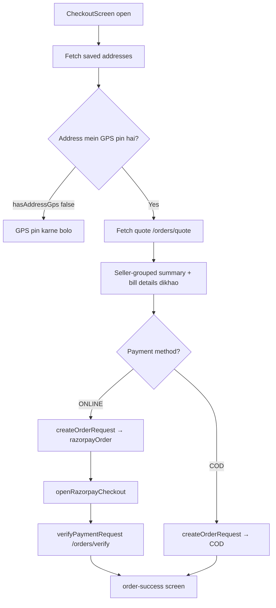

# 05 — Mobile App

> **Created:** 2026-08-01
> **File type:** App deep-dive
> **Padhne ka time:** ~25 min

---

## WHAT — Yeh doc kya cover karti hai?

`mobile/` app — **Expo SDK 56 + React Native 0.85 + expo-router**. Yeh **customer + rider + admin** ka mobile app hai. Iska navigation (file-based), auth + token storage, data fetching, socket, push notifications, aur checkout flow.

---

## WHY — Mobile app kis liye?

Customer (USER) **sirf mobile pe** hi platform use karta hai — browse, cart, order, track. Rider bhi mobile se deliveries manage kar sakta hai (web ke alawa). Admin ke liye bhi ek mobile tab hai.

```
Mobile app ke users:
┌──────────┬──────────────────────────────────────────┐
│ Customer │ Browse, cart, checkout, orders, track     │
│ Rider    │ Rider tab — offers, deliveries, earnings  │
│ Admin    │ Admin tab — quick management              │
└──────────┴──────────────────────────────────────────┘
```

---

## WHERE — Navigation (expo-router = file-based)

expo-router mein **file = route** (bilkul Next.js jaisa, par React Native ke liye). `mobile/app/` folder ki har file ek screen hai:

```
mobile/app/
├── _layout.tsx           ← root layout (providers)
├── index.tsx             ← entry redirect (kaha bhejein)
├── Onboarding/           ← first-time onboarding slides
├── auth/                 ← login, register, OTP screens
├── (tabs)/               ← ★ TAB NAVIGATOR (bottom tabs)
│   ├── _layout.tsx        ← tab bar config
│   ├── index.tsx
│   └── clothing/          ← home, cart, search, account, admin, rider tabs
├── account/              ← addresses, orders, wishlist, profile, notifications
├── admin/                ← admin screens (products, categories, coupons...)
├── rider/                ← rider workspace
├── product/[id].tsx      ← product detail (dynamic route)
├── mall/                 ← mall list + detail
├── checkout.tsx          ← ★ checkout screen
├── order-success.tsx     ← order placed confirmation
├── track-order/[id].tsx  ← live order tracking (socket)
├── food/                 ← ⚠️ PLACEHOLDER (koi real feature nahi)
└── jewelery/             ← ✅ LIVE (real catalog/cart/auth, Sec: Jewelery status)
```

- `(tabs)` — parentheses waala folder **route group** hai (URL mein nahi aata, sirf layout ke liye).
- `[id]` — dynamic segment (jaise `/product/123`).
- `food/` **placeholder** hai — confuse mat ho. `jewelery/` live jewelry storefront hai.

---

## WHERE — Business logic (`mobile/src/`)

`app/` sirf screens (routing). Asli logic `src/` mein:

```
mobile/src/
├── api/axiosInstance.ts   ← ★ HTTP client
├── lib/
│   ├── socket.ts           ← ★ Socket.IO client
│   ├── authStorage.ts      ← token storage (SecureStore/localStorage)
│   └── notification.ts     ← push registration + FCM token
├── store/                  ← Zustand stores (toast, socket, module switcher)
├── provider/               ← QueryProvider, SafeViewWrapper
├── context/               ← ScrollContext
├── constants/             ← tabs, modules
├── theme/                 ← colors, spacing, themed components
├── components/            ← shared UI (Skeleton, Toast)
├── hooks/
├── utils/                 ← validation
├── shims/                 ← expo-haptics web shim
├── __tests__/             ← Jest tests
└── features/             ← ★ feature modules
    ├── clothing/          ← home, product, search, sizeChart
    ├── common/            ← account, address, admin, auth, banner, cart,
    │                        category, coupon, notification, order,
    │                        profileInfo, refundPolicy, trackOrder, wishlist
    ├── Delivery/          ← rider components + screens
    ├── Onboarding/
    ├── Food/              ← ⚠️ placeholder
    └── Jewelery/          ← ✅ LIVE (catalog, cart, wishlist, checkout, one-tap auth)
```

**Yaha bhi `common` / `clothing` seam hai** (server jaisa). `common/` sab verticals ke liye, `clothing/` sirf clothing ke liye.

### Feature layout (order example)
```
common/order/
├── api/         ← order.api.ts (createOrder, quote, verify, cancel, return)
├── screen/      ← CheckoutScreen, OrderListScreen, OrderSuccessScreen
├── config/      ← razorpay.config.ts
├── lib/         ← openRazorpayCheckout (native + web variants)
└── style/       ← styles
```

---

## HOW — Auth + token storage

### Token storage (`mobile/src/lib/authStorage.ts`)

Mobile mein token **SecureStore** mein rakha jaata hai (encrypted, safe). Par web build ke liye fallback bhi hai:

```
authStorage:
  native (iOS/Android) → expo-secure-store (encrypted)
  web                  → globalThis.localStorage (fallback)

  Methods: getItemAsync(key), setItemAsync(key, val), deleteItemAsync(key)
  Keys: "userToken" (access), "refreshToken"
```

> ⚠️ **Web vs mobile difference:** Web app (Next.js) Zustand+localStorage use karta hai; mobile app SecureStore. Dono ka token handling alag hai — yeh yaad rakho.

### axios (`mobile/src/api/axiosInstance.ts`)

```
API_ORIGIN: EXPO_PUBLIC_API_ORIGIN
API_URL: ${API_ORIGIN}/api/v1

Request interceptor:
  authStorage.getItemAsync("userToken") → Authorization: Bearer <token>

Error handling:
  ERR_NETWORK → special friendly message (network down)

401 refresh (single-flight):
  ┌────────────────────────────────────────────────────┐
  │ authStorage.getItemAsync("refreshToken")            │
  │ POST /auth/refresh-token { refreshToken }           │
  │ success → setAuth(user, accessToken, newRefreshToken)│
  │ (concurrent 401s failedQueue mein wait karti hain)  │
  └────────────────────────────────────────────────────┘
```

**Web se difference:** Web refresh token **cookie** se bhejta hai (`withCredentials`); mobile refresh token **body** mein bhejta hai (`{refreshToken}`), kyunki mobile mein cookies reliable nahi.

---

## HOW — Socket (`mobile/src/lib/socket.ts`)

```
class SocketClient
  io(API_ORIGIN, {
    auth: { token },
    transports: ["websocket"],
    reconnectionAttempts: 5
  })

singleton: socketClient
```

Web jaisa hi pattern (token-keyed). Reconnection attempts 5 (web mein 8). `track-order/[id].tsx` socket use karta hai live tracking ke liye.

---

## HOW — Push notifications (`mobile/src/lib/notification.ts`)

```
registerForPushNotificationsAsync():
  - Expo Go mein SKIP karta hai (Expo Go push support nahi)
  - dynamic import expo-notifications
  - Android channels: "default", "promotions"
  - getDevicePushTokenAsync() → native FCM token (Expo token nahi)

initializeNotificationHandler():
  - 12 notification categories set karta hai
    (PROMOTION_EXPLORE_MALL, BUY_NOW, SHOP_NOW, etc.)
  - action buttons ke liye
```

FCM token server ko bheja jaata hai (user document mein save hota hai) taaki server push bhej sake. Detail: [14_Notifications.md](./../features/notifications.md).

---

## FLOW — Checkout (mobile ka sabse important flow)

`mobile/src/features/common/order/screen/CheckoutScreen.tsx`:



**Key points (verified):**
- **GPS pin zaroori hai** — agar address mein latitude/longitude 0,0 hai toh order nahi banega (server 400 throw karta hai). Checkout `hasAddressGps` check karta hai.
- **Quote re-fetch** hota hai jab address ya items change ho (pricing address pe depend karti hai — distance, serviceability).
- **Bill details** mein dynamic surcharge + bonus labels dikhte hain (rain/peak/festival/night).
- COD directly success pe jaata hai; online Razorpay checkout → verify → success.

### order.api.ts functions
```
quoteOrderRequest       POST /orders/quote
createOrderRequest      POST /orders
verifyPaymentRequest    POST /orders/verify
getMyOrdersRequest      GET  /orders/me
cancelSubOrderRequest   POST /orders/sub-orders/:id/cancel
returnSubOrderRequest   POST /orders/sub-orders/:id/return
```

Detail: [11_Order_System.md](./../features/orders.md), [12_Payment_System.md](./../features/payments.md).

---

## WHERE — State management (Zustand)

`mobile/src/store/` mein Zustand stores:
- **toast store** — global toast messages
- **socket store** — socket connection state
- **module switcher** — clothing/food/jewelery vertical switch (UI level)

Data fetching **React Query** se (server state), UI state **Zustand** se. `QueryProvider` (`src/provider/`) root layout mein wrap hota hai.

---

## DEPENDENCIES

- **Isse pehle:** [02_System_Architecture.md](./../getting-started/system-architecture.md)
- **Web counterpart:** [03_Frontend.md](././web-dashboard.md)
- **Related:** [08_Authentication.md](./../features/authentication.md), [11_Order_System.md](./../features/orders.md), [12_Payment_System.md](./../features/payments.md), [14_Notifications.md](./../features/notifications.md)

---

## RISKS

- ⚠️ **food placeholder** — isme real feature nahi. Naye dev ko lag sakta hai yeh working hai. (Jewelery Sep 2026 se live hai — Sec: Jewelery status.)
- ⚠️ **Web vs native differences** — token storage (SecureStore vs localStorage), refresh token (body vs cookie), push (native FCM vs skip on Expo Go). Platform-specific bugs yahi se aate hain.
- ⚠️ **GPS pin mandatory** — customer agar address pin na kare toh order fail. UX pe dhyan.
- ⚠️ **Expo Go pe push kaam nahi karta** — dev build zaroori push testing ke liye.

---

## IMPROVEMENTS

- food placeholder ko clearly "coming soon" mark karna (ya remove karna jab tak build na ho).
- Push notification testing ke liye proper dev build documentation.
- `common`/`clothing` seam ko generalize karna (abhi clothing hardcoded jagah-jagah).

---

## Jewelery status (live since Sep 2026)

`app/jewelery/` + `src/features/Jewelery/` real storefront hai (mock purge ho chuka hai):
- Catalog: `api/jewelery.api.ts` + `hooks/useJeweleryCatalog.ts` — server `vertical=JEWELERY` reads, React Query.
- Cart/wishlist: shared `useCartStore` / `useWishlistStore` par bridge (`context/CartContext.tsx`) — same server cart + `/checkout` flow (address + GPS + WhatsApp OTP + Razorpay/COD).
- Auth: clothing jaisa one-tap Google (`app/jewelery/auth/sign-in.tsx`); sign-up/forgot/reset/otp → sign-in redirect.
- Icons: single system `@expo/vector-icons` (`components/common/AppIcon.tsx`); company info `src/constants/app.constants.ts` se.
- Server: `vertical=JEWELERY` + strict `jeweleryDetails` validation + 8 seeded categories (`bun run seed:jewelry`).
- Dash-web: shared `features/catalog/` tabs (Clothing | Jewelry | Food) admin + seller panels me.

---

*Verified against `axiosInstance.ts`, `lib/socket.ts`, `authStorage.ts`, `notification.ts`, `CheckoutScreen.tsx`, `order.api.ts` + app/ & src/ trees on 2026-08-01.*
