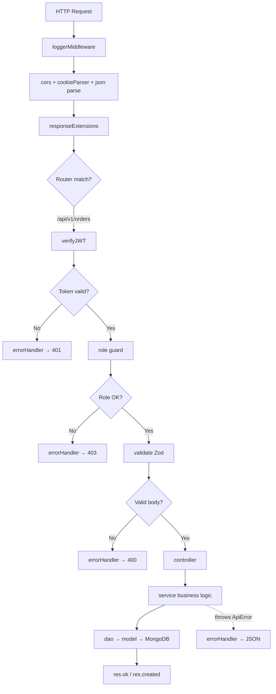

# 04 — Backend (Server)

> **Created:** 2026-08-01
> **File type:** App deep-dive
> **Padhne ka time:** ~30 min

---

## WHAT — Yeh doc kya cover karti hai?

`server/` app — poore system ka **brain**. Tech: **Bun + Express 5 + Mongoose 9 + TypeScript**. Iska layered architecture, module structure, coding conventions (`rule.md`), middlewares, utils, aur background workers.

---

## WHY — Server itna important kyun?

Kyunki **saara business logic yaha hai**. Web aur mobile sirf "clients" hain — woh kuch decide nahi karte. Pricing, stock, payment verify, rider matching, settlement — sab server pe hota hai. Client pe kabhi trust nahi kiya jaata (security + integrity ke liye).

---

## WHERE — Tech stack (exact)

| Cheez | Kya | Kyun |
|-------|-----|------|
| Runtime | **Bun 1** | Fast JS/TS runtime (Node se tez), native TS support |
| Framework | **Express 5** | HTTP routing + middleware |
| ODM | **Mongoose 9** | MongoDB ke liye schema + queries |
| Language | **TypeScript** | Type safety (path alias `@/*` → `src/*`) |
| Queue | **BullMQ + ioredis** | Background jobs (notifications) |
| Validation | **Zod** | Env + request validation |
| Auth | **jsonwebtoken + bcrypt** | JWT + password hashing |

Detail versions: 22_Dependency_Graph.md.

---

## HOW — Layered architecture (deep)

Har module in layers mein bata hai. `order` module ko example lo:

```
┌──────────────────────────────────────────────────────────────┐
│  order.router.ts                                              │
│    "URL → controller mapping"                                 │
│    router.use(verifyJWT)  ← saari routes protected            │
│    router.post("/", createOrderController)                    │
└───────────────────────┬──────────────────────────────────────┘
                        │
┌───────────────────────▼──────────────────────────────────────┐
│  order.controller.ts                                          │
│    "HTTP layer — req/res sambhalta hai"                       │
│    - req.body / req.params nikaalta hai                       │
│    - service call karta hai                                   │
│    - res.ok(...) / res.created(...) return                    │
│    - asyncHandler se wrap (errors auto → errorHandler)        │
└───────────────────────┬──────────────────────────────────────┘
                        │
┌───────────────────────▼──────────────────────────────────────┐
│  order.service.ts   ★ ASLI KAAM YAHA                          │
│    "Business logic — rules, calculations, orchestration"      │
│    - createOrder: quote → stock → razorpay → save → emit      │
│    - koi req/res nahi (pure logic)                            │
│    - DAO + doosre services call karta hai                     │
└───────────────────────┬──────────────────────────────────────┘
                        │
┌───────────────────────▼──────────────────────────────────────┐
│  order.dao.ts                                                 │
│    "Data Access Object — DB queries"                          │
│    - findById, findByRazorpayOrderId, create, updateStatus    │
│    - Mongoose model use karta hai                             │
└───────────────────────┬──────────────────────────────────────┘
                        │
┌───────────────────────▼──────────────────────────────────────┐
│  order.model.ts                                               │
│    "Mongoose schema — DB structure"                           │
│    → MongoDB collection                                       │
└───────────────────────────────────────────────────────────────┘

     order.validator.ts  ← Zod schemas (controller/middleware use karta hai)
     order.type.ts       ← TypeScript types + enums (OrderStatus, etc.)
```

**Golden rule:** Business logic **hamesha service mein**. Controller patla rakho (sirf req/res). DAO sirf DB queries. Yeh separation testing + maintainability ke liye zaroori hai.

> **Reality note (verified):** Sab modules mein DAO nahi hai. Kuch chhote modules directly service mein model use karte hain. Yeh inconsistency tech debt hai. Dekho 30_Tech_Debt.md.

---

## HOW — Coding conventions (`rule.md`)

Codebase ek **refactoring convention** follow karta hai: **class-based → function-based**. `rule.md` root mein yeh contract define karta hai:

```
1. Services → top-level exported functions (class nahi)
   ❌ class OrderService { createOrder() {} }
   ✅ export async function createOrder() {}

2. Controllers → exported consts
   ✅ export const createOrderController = asyncHandler(async (req, res) => {})

3. Koi singleton instance export nahi
   ❌ export default new OrderService()
   ✅ export * (individual functions)

4. Namespace imports
   ✅ import * as orderService from "./order.service"
      orderService.createOrder(...)

5. ZodError pattern
   if (error instanceof ZodError)
     throw new ApiError(400, "Validation Error", error.issues)

6. Reserved word aliasing
   export { deleteX as delete }

7. JSDoc headers + section banners
   /* ── Section Name ── */
```

> ⚠️ **Naye modules isi convention mein likho.** Purane modules mein kahin class bhi dikh sakti hai (migration adhoora), par **naya code function-based** hona chahiye. `rule.md` ko modify mat karo — woh contract hai.

---

## WHERE — Middlewares (`server/src/middlewares/`)

Middleware **request ke beech mein** run hota hai (controller se pehle). Order matters:

```
Request
  │
  ▼ loggerMiddleware        → request log karta hai
  ▼ cors                    → origin whitelist check
  ▼ cookieParser            → cookies parse (req.cookies)
  ▼ express.json (16kb)     → JSON body parse
  ▼ express.urlencoded      → form body parse
  ▼ express.static          → public/ folder serve
  ▼ responseExtensions      → res.ok/res.created/res.nocontent add
  │
  ▼ [per-route] verifyJWT   → token verify + req.user attach
  ▼ [per-route] role guard  → isAdmin/isSeller/isDelivery
  ▼ [per-route] validate    → Zod schema check
  │
  ▼ CONTROLLER
  │
  ▼ errorHandler (LAST)     → koi bhi error → standard JSON
```

| Middleware | File | Kaam |
|-----------|------|------|
| `loggerMiddleware` | `logger.middleware.ts` | Har request log |
| `verifyJWT` | `auth.middleware.ts` | Token verify, `req.user` set |
| `isAdmin` / `isSeller` / `isDelivery` / `isSuperAdmin` | `auth.middleware.ts` | Role gating |
| `validate` | `validate.middleware.ts` | Zod request validation |
| `upload` (multer) | `multer.middleware.ts` | File upload (memory, 15MB, image-only) |
| `responseExtensions` | `responseExtensions.middleware.ts` | `res.ok()` etc. helpers |
| `errorHandler` | `error.middleware.ts` | Global error → JSON |

Detail: [08_Authentication.md](./../features/authentication.md), 18_Error_Handling.md.

---

## WHERE — Utils (`server/src/utils/`)

| File | Export | Kaam |
|------|--------|------|
| `ApiError.ts` | `ApiError` class | `new ApiError(statusCode, message, errors[])` — standard error |
| `ApiResponse.ts` | `ApiResponse` class | Standard success wrapper `{statusCode, data, message}` |
| `asyncHandler.ts` | `asyncHandler` | Async route wrap — errors auto `.catch(next)` |
| `geo.util.ts` | `distanceKmBetween`, GeoJSON helpers | Haversine distance calc |
| `imagekit.util.ts` | upload/delete | ImageKit image operations |
| `mail.service.ts` | send email | Resend integration |
| `razorpay.util.ts` | client + `verifyRazorpaySignature` | Razorpay HMAC verify |

**Pattern:** `asyncHandler` + `ApiError` + `ApiResponse` = consistent error/success handling poore codebase mein.

```typescript
export const someController = asyncHandler(async (req, res) => {
  const result = await someService.doWork(req.body);
  return res.ok(new ApiResponse(200, result, "Success"));
  // koi error → automatically errorHandler → standard JSON
});
```

---

## WHEN — Background workers (server start pe chalte hain)

`server.ts` do background processes start karta hai (MongoDB connect ke baad):

### 1. Rider Matching Loop (`matchingService.start()`)
```
Har ~10 second:
  - ASSIGNMENT_OPEN sub-orders dhoondo
  - stage-based radius escalation ($nearSphere geo query)
  - nearest available rider ko offer bhejo
  - proximity score: max(0, 10 - distanceToStore)
```
Detail: [11_Order_System.md](./../features/orders.md) (matching engine section).

### 2. Notification Worker (`startNotificationWorker()`)
```
BullMQ worker (concurrency 2):
  - notification queue se job uthata hai
  - FCM (native) / Expo push bhejta hai
  - NotificationOutbox update karta hai
```
Detail: [14_Notifications.md](./../features/notifications.md).

> **Verified:** Dono workers **same process** mein chalte hain (koi alag worker container nahi). Server crash = workers bhi band.

---

## HOW — Config layer (`server/src/config/`)

| File | Kaam |
|------|------|
| `env.config.ts` | ★ Zod-validated env. Invalid env = `process.exit(1)` (server start hi nahi hoga) |
| `db.ts` | MongoDB connect (`connectDB()`) |
| `redis.config.ts` | Redis connection (cache + BullMQ + OTP) |
| `imagekit.config.ts` | ImageKit client |

**`env.config.ts` ka fail-fast design:** Agar koi required env variable missing/galat ho, toh Zod validation fail hoti hai aur server **turant exit** ho jaata hai (silently galat config se chalne se accha crash). Detail: [16_Environment.md](./../operations/environment.md).

---

## FLOW — Ek request ka poora backend safar



Detail: 23_Request_Lifecycle.md.

---

## DEPENDENCIES

- **Isse pehle:** [02_System_Architecture.md](./../getting-started/system-architecture.md)
- **Related:** [06_API_Flow.md](././api-flow.md), [07_Database.md](./../data/database.md), 18_Error_Handling.md
- **Conventions:** `rule.md` (root), 27_Add_New_Module.md

---

## RISKS

- ⚠️ **Business logic client pe kabhi mat daalo.** Pricing, stock, payment verify — sab server pe. Client se aaya data hamesha "untrusted" maano.
- ⚠️ **Module inconsistency** — kuch modules mein DAO hai, kuch mein nahi. Naya module likhte time full layered pattern follow karo.
- ⚠️ **Workers same process mein** — server crash pe matching + notifications bhi ruk jaate hain.

---

## IMPROVEMENTS

- Sab modules mein consistent DAO layer.
- Background workers ko alag process/container mein nikaalna (resilience).
- `class → function` migration complete karna (kuch purane modules abhi class-based ho sakte hain).

---

*Verified against `app.ts`, `server.ts`, `middlewares/`, `utils/`, `rule.md` + module layout (order module as canonical example) on 2026-08-01.*
