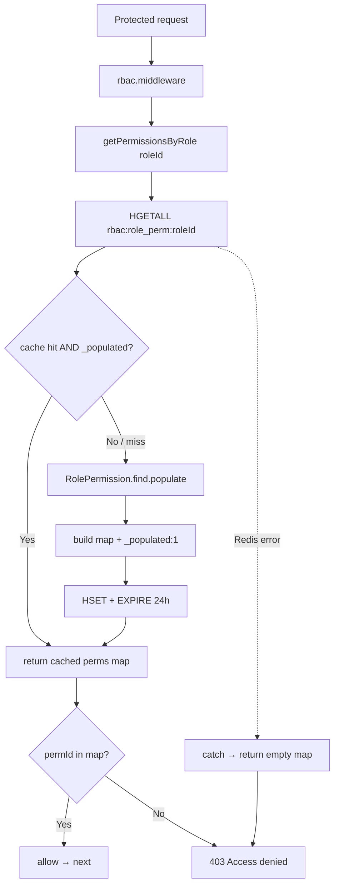

# 15 — Caching & Redis

> **Created:** 2026-08-01
> **File type:** Infra deep-dive
> **Padhne ka time:** ~25 min

---

## WHAT — Yeh doc kya cover karti hai?

QuickBihar ka **caching layer** — jo actually code mein wired hai, na kम na zyada. Do storage tiers:

```
TIER 1 — REDIS (ioredis, shared client, cross-process)
  1. RBAC permission cache   ← role → permission-codes hash, 24h TTL   (hot path)
  2. Password-reset replay store ← pwd_reset:<userId>:<tokenTail> (15min)  (see [authentication.md](../features/authentication.md))
  3. BullMQ notification queue ← job store + delivery (shared Redis)   (dekho 14)

TIER 2 — IN-MEMORY (per-process Map, NOT shared)
  4. Rain detection cache    ← open-meteo result, 5-min TTL, coords-keyed  (dekho 12)
```

> ★ **Honesty upfront (verified):** QuickBihar mein **koi general-purpose HTTP/response cache nahi** hai (product list, catalog, cart — sab har request pe DB se aata hai). Redis sirf **4 specific cheezein** ke liye use hoti hai. Koi "sab kuch cache karo" layer nahi — isliye yeh doc sirf wahi 4 usages document karti hai jo code mein sach mein hain.

---

## WHY — Yeh 4 cheezein hi kyun cache hoti hain?

Har cache ka ek **specific reason** hai — blanket caching nahi:

| Cache | Kyun cache kiya |
|-------|-----------------|
| **RBAC permissions** | Har protected request pe permission check hota hai. Har baar `RolePermission.find().populate()` = do collection hit per request. Role ke permissions **rarely change**, isliye 24h cache = massive DB save. **Hot path optimization.** |
| **Password-reset replay store** | Reset JWT 15 min ke liye valid hai — ek baar use ho jaaye toh dobara use nahi hona chahiye. `pwd_reset:<userId>:<tokenTail>` ki maujoodgi = "is token ko already consume kar liya gaya". Redis native TTL ke saath 15 min baad gayab. |
| **Rain (in-memory)** | open-meteo ek **external paid-ish API** hai (rate limits). Har order pe call karna = slow + quota burn. Same area ke liye 5-min cache kaafi (mausam 5 min mein nahi badalta). |
| **BullMQ** | Queue ko durable backing store chahiye — Redis is the standard. Job persistence + retry BullMQ khud manage karta hai. |

> ★ **Pattern:** Cache tab jab (a) data **rarely changes** (permissions), ya (b) data **inherently temporary** hai (OTP), ya (c) source **expensive/rate-limited** hai (open-meteo). Baaki sab DB se fresh — kyunki stale catalog/stock/order **galat** dikhega.

---

## WHERE — Files

| File | Kaam |
|------|------|
| `config/redis.config.ts` | ★ Single shared `ioredis` client (`redis`) — sab isse import karte hain |
| `modules/common/rbac/rbac.dao.ts` | ★ `rolePermissionDao` — `getCachedPermissions`, `hasPermission`, `invalidateCache` |
| `modules/common/rbac/rbac.service.ts` | `getPermissionsByRole` → `getCachedPermissions` wrapper |
| `modules/common/rbac/rbac.middleware.ts` | Guard — `getPermissionsByRole` se cached hash le kar permission check |
| `modules/common/auth/auth.service.ts` | Password-reset replay store: `pwd_reset:<userId>:<tokenTail>` (EX 900) |
| `modules/common/order/orderPricing.service.ts` | In-memory `rainCache` Map (5-min), `detectRain` |
| `modules/common/notification/notification.queue.ts` | BullMQ Queue (shared Redis) — dekho [14_Notifications.md](./../features/notifications.md) |

---

## HOW — Redis client (`redis.config.ts`)

Ek hi `ioredis` instance, poore server mein shared:

```javascript
const redis = new Redis(ENV.REDIS_URL, {
  maxRetriesPerRequest: null,                       // BullMQ requirement
  retryStrategy: (times) => Math.min(times * 50, 2000),  // backoff cap 2s
});
redis.on("connect", () => console.log("🚀 Redis Connected"));
redis.on("error",   (err) => console.error("❌ Redis Connection Error", err));
```

- **`maxRetriesPerRequest: null`** — commands infinitely queue jab tak connection restore na ho (fail nahi karte). Yeh **BullMQ ki requirement** hai (BullMQ isi setting pe insist karta hai), par side-effect: Redis down hone pe RBAC/OTP commands **hang** kar sakte hain fail hone ke bajaye. Dekho RISKS.
- **`retryStrategy`** — reconnect backoff: attempt × 50ms, max 2s. Kabhi haar nahi maanta (keeps retrying).
- **Single shared client** — RBAC, OTP, aur (alag connection pe) BullMQ sab isi `REDIS_URL` pe. `notification.queue.ts` apna alag ioredis banata hai (same URL) kyunki BullMQ ko dedicated connection chahiye.

> ⚠️ **Error handling `.on("error")` sirf log karta hai** — process crash nahi hota, par koi alert/health-signal bhi nahi. Redis down = silent degrade (dekho RISKS).

---

## HOW — RBAC permission cache (the hot path) ★

Yeh **sabse important** cache hai — har protected request isse touch karti hai (dekho [09_Authorization_RBAC.md](./../features/authorization-rbac.md)).

### Key + data shape

```
Key:   rbac:role_perm:<roleId>          (Redis HASH)
Value: { "_populated": "1",
         "PRODUCT_CREATE": "1",
         "ORDER_VIEW": "1", ... }        ← field = permission CODE, value always "1"
TTL:   60 * 60 * 24  = 24 hours
```

- **Hash** (not string) — har permission code ek field. `HGET` se single-permission O(1) check, `HGETALL` se poore role ke permissions ek shot mein.
- **`_populated: "1"` sentinel** — yeh **key gotcha** hai. Ek role ke paas **zero permissions** ho sakte hain (valid case). Agar sirf empty hash cache karein toh code samajhega "cache miss, DB dobara hit karo" — har baar. `_populated` flag batata hai "yeh role DB se load ho chuka hai, ismein genuinely 0 permissions hain" — **negative caching** (empty result bhi cache hota hai).

### `getCachedPermissions(roleId)` — bulk read (middleware isse use karta hai)

```
1. HGETALL rbac:role_perm:<roleId>
2. cache empty YA "_populated" field missing?
     → RolePermission.find({roleId}).populate("permissionId").lean()
     → mapping = { "_populated":"1", <each perm.code>:"1" }
     → HSET key mapping  +  EXPIRE key 24h
3. _populated field strip karke baaki return: { PRODUCT_CREATE:"1", ... }
4. koi bhi Redis error → catch → return {}   ← FAIL-CLOSED (no perms = deny all)
```

> ★ **Middleware actually yahi use karta hai** (verified `rbac.middleware.ts:16-17`):
> ```javascript
> const assignedPermissions = await rbacService.getPermissionsByRole(roleId);  // → getCachedPermissions
> const hasPermission = !!assignedPermissions[permissionId];   // in-memory lookup
> if (!hasPermission) throw new ApiError(403, "Access denied...");
> ```
> Yaani guard **`getCachedPermissions` (bulk HGETALL)** pe chalta hai, DAO ka `hasPermission` method **nahi**.

### `hasPermission(roleId, code)` — single check (3-step, DAO-level)

DAO mein ek alag optimized method bhi hai (par middleware isse call nahi karta — dekho RISKS):

```
1. HGET key <code> === "1"?         → true (fast path, cache hit)
2. EXISTS key?                       → true → return false (role loaded, perm nahi hai)
3. warna (cold): RolePermission.find → HSET + EXPIRE → return !!mapping[code]
   (0 perms ho toh bhi { _populated:"1" } cache karta hai — negative cache)
```

> ⚠️ **Consistency gap (verified):** `getCachedPermissions` poora try/catch mein hai (Redis down → `{}` return, fail-closed). Par `hasPermission` mein **koi try/catch nahi** — Redis down ho toh `redis.hget` **throw** karega aur upar propagate hoga. Do methods, do alag failure behaviours. Middleware `getCachedPermissions` use karta hai isliye production guard fail-closed hai, par `hasPermission` ka koi bhi future caller crash kar sakta hai. Dekho RISKS.

### `invalidateCache(roleId | roleId[])` — write-through invalidation

```
DEL rbac:role_perm:<roleId>   (ya multiple keys ek saath)
error → catch → sirf log (invalidation best-effort)
```

Jab bhi role ke permissions badalte hain (permission assign/revoke, role delete), `rolePermissionDao.invalidateCache` call hota hai → agli request cache miss pe DB se fresh load. **Cache invalidation on mutation** = classic write-through-ish pattern.

### FLOW — Permission check (cache-aside)



Yeh **cache-aside** (lazy-loading) pattern hai: pehle cache dekho, miss pe DB se le kar cache bharo. Invalidation mutation pe explicit `DEL` se hoti hai.

---

## HOW — OTP cache (`auth.service.ts`)

Reset-password flow ka **replay protection** Redis pe chalta hai — JWT ke saath ek 15-min flag rakhte hain taki same token dobara use na ho (dekho [authentication.md](../features/authentication.md)):

```
consumePasswordReset(token, newPassword):
  1. jwt.verify(token, RESET_PASSWORD_JWT_SECRET)         ← signature + exp + aud
  2. GET pwd_reset:<userId>:<tokenTail-12-chars>          ← pehle se consumed?
     → exists? → 400 "Reset link has already been used."
  3. user.password = newPassword                          ← pre-save hook hashes
  4. SET pwd_reset:<userId>:<tokenTail> "1" EX 900        ← remaining 15-min TTL pe lock
```

- **Token-tail as key** — pure JWT ko key nahi banate (Redis key size + PII leak). Sirf `userId + last 12 chars of token` — yeh enough entropy hai collision-avoid ke liye aur kisi aur token se overlap nahi hoga.
- **Native TTL = self-cleaning** — `EX 900` ke baad Redis khud expire kar deta hai. 15 min TTL ke saath key sync karta hai (reset JWT bhi 15 min ka hai).
- **Reuse blocked** — agar attacker ne token intercept bhi kar liya, ek baar use hone ke baad lock ho jaata hai.

> ⚠️ Yeh **rate-limiting ke liye nahi hai**. Rate-limiting `authRateLimiter` / `strictAuthRateLimiter` middleware pe hai (`/auth/google`, `/auth/request-reset`, etc.) — in-memory (rate-limit package), Redis pe nahi. Yeh replay-protection hai, alag concern.

---

## HOW — Rain cache (in-memory, `orderPricing.service.ts`)

Rider payout mein rain bonus ke liye open-meteo API call hoti hai (dekho [12_Payment_System.md](./../features/payments.md) — dynamic bonuses). Yeh call **cache** hoti hai, par **Redis mein nahi — process memory mein**:

```javascript
const rainCache = new Map<string, { expiresAt: number; isRainActive: boolean }>();
const WEATHER_CACHE_MS = 5 * 60 * 1000;   // 5 min

detectRain(coords):
  key = rounded lat/lng
  cached = rainCache.get(key)
  cached && cached.expiresAt > Date.now()  → return cached.isRainActive   (HIT)
  else → axios.get open-meteo (precipitation/rain/showers/weather_code)
       → isRainActive = precipitation>0 || rain>0 || showers>0 || rainCodes.has(code)
       → rainCache.set(key, { expiresAt: now+5min, isRainActive })
  API error → rainCache.set(key, {..., isRainActive:false}) → return false  (fail-safe: no bonus)
```

- **Coords-keyed** — same area ke orders ek hi cached result share karte hain (weather local hai).
- **5-min TTL** — mausam 5 min mein nahi badalta, par bonus fresh-ish rehta hai.
- **Fail-safe** — API fail → `isRainActive:false` cache (rain bonus nahi milega, par payout calculation crash nahi hoti).

> ⚠️ **Yeh cache Redis mein NAHI hai — plain JS `Map` (per-process).** Do consequences (verified): (1) **Multi-instance pe har server ka apna alag rainCache** — ek instance ne open-meteo call kiya, doosra dobara karega (cache share nahi hota). (2) **Process restart pe cache गायब** (cold start). Single-instance pe theek, horizontal scale pe redundant API calls. Dekho RISKS.

---

## HOW — BullMQ shared Redis (queue backing)

Campaign notifications BullMQ pe chalti hain (poora detail [14_Notifications.md](./../features/notifications.md)):

```
notification.queue.ts → new Queue("notification-queue", { connection: <ioredis, REDIS_URL, maxRetriesPerRequest:null> })
notification.worker.ts → new Worker("notification-queue", handler, { connection, concurrency: 2 })
```

- Redis yaha **cache nahi, durable job store** hai — jobs, retries, delays sab BullMQ Redis mein rakhta hai.
- **Same `REDIS_URL`** RBAC/reset-replay ke saath share hoti hai (ek hi Redis instance, alag key namespaces: `bull:*` vs `rbac:*` vs `pwd_reset:*`).
- `maxRetriesPerRequest: null` isiliye zaroori (BullMQ ki hard requirement — dekho upar client config).

---

## FLOW — Bird's-eye: Redis kaun-kaun use karta hai

```
                       ┌─────────────────────────────┐
                       │   ENV.REDIS_URL (ek Redis)  │
                       └──────────────┬──────────────┘
             ┌────────────────────────┼────────────────────────┐
             ▼                        ▼                        ▼
     ┌───────────────┐       ┌────────────────┐       ┌─────────────────┐
     │ rbac:role_perm │       │ pwd_reset:*    │       │ bull:notification│
     │ :<roleId>      │       │ STRING, 900s   │       │ -queue:*         │
     │ HASH, 24h TTL  │       │ (replay lock)  │       │ BullMQ managed   │
     │ (cache-aside)  │       │                │       │ (job store)      │
     └───────────────┘       └────────────────┘       └─────────────────┘
        rbac.dao.ts              auth.service.ts          notification.*

     ┌─────────────────────────────────────────────────────────────┐
     │  IN-MEMORY (NOT Redis, per-process Map):                    │
     │  rainCache  → orderPricing.service.ts, 5-min, coords-keyed  │
     └─────────────────────────────────────────────────────────────┘
```

---

## WHO — Kaun cache se affected hota hai

| Actor | Cache impact |
|-------|--------------|
| **Har protected user** | RBAC permission cache — har request pe permission check cached hash se (fast). Role change → agli request pe fresh (invalidate ke baad). |
| **Login/signup user** | OTP cache — 10-min OTP, 60s cooldown Redis mein. |
| **Rider (payout)** | Rain cache — bonus calc mein 5-min cached weather (indirect). |
| **Admin (RBAC mgmt)** | Permission/role change karne pe `invalidateCache` trigger — cache freshness ka zimmedaar. |
| **Admin (campaigns)** | BullMQ Redis job store (async delivery)। |

---

## DEPENDENCIES

- **Isse pehle:** [09_Authorization_RBAC.md](./../features/authorization-rbac.md) (permission cache kaha use hoti hai), [08_Authentication.md](./../features/authentication.md) (OTP flow)
- **Related:** [14_Notifications.md](./../features/notifications.md) (BullMQ shared Redis), [12_Payment_System.md](./../features/payments.md) (rain cache → rider bonus)
- **Config:** [16_Environment.md](./../operations/environment.md) (`REDIS_URL`), 20_Performance.md (caching = perf lever)
- **External:** Redis (ioredis), open-meteo API (rain)

---

## RISKS

- ⚠️ **`maxRetriesPerRequest: null` → commands hang, not fail** — BullMQ ke liye zaroori, par RBAC/OTP commands isi client pe. Redis slow/down ho toh yeh commands **queue ho kar hang** kar sakte hain (fail-fast nahi). Request timeout tak latak sakti hai. Ideal: BullMQ ke liye alag connection, app cache ke liye alag (fail-fast) — abhi mostly shared.
- ⚠️ **Redis down = auth/RBAC degrade** — `getCachedPermissions` catch → `{}` (fail-closed, sab 403). Achha security-wise, par **poora app effectively down** (har protected route 403). OTP bhi fail (login block). Redis is a **hard dependency**, no graceful fallback to DB-direct.
- ⚠️ **`hasPermission` no try/catch (verified)** — `getCachedPermissions` fail-closed hai par `hasPermission` Redis error pe **throw** karega. Abhi middleware `getCachedPermissions` use karta hai (safe), par `hasPermission` ka koi naya caller inconsistent crash paayega. Dono ka error behaviour align hona chahiye.
- ⚠️ **`hasPermission` possibly unused (verified)** — middleware `getPermissionsByRole`→`getCachedPermissions` use karta hai; DAO ka `hasPermission` (3-step optimized) guard path mein call hota **nahi** dikha. Dead-ish code ya future-use — confirm karke ya wire karo ya hatao.
- ⚠️ **Rain cache in-memory (single-instance)** — plain `Map`, Redis nahi. Multi-instance pe har process apna cache (duplicate open-meteo calls); restart pe cold. Consistent with baaki in-process risks (dekho [14_Notifications.md](./../features/notifications.md) socket, [11_Order_System.md](./../features/orders.md) matching loop). Shared cache chahiye toh Redis mein daalo.
- ⚠️ **24h RBAC TTL — stale window on missed invalidation** — agar kisi mutation pe `invalidateCache` call chhoot jaaye (naya code path), stale permissions **24 ghante** tak reh sakti hain. Invalidation manual/explicit hai, isliye har perm-mutation site pe discipline chahiye.
- ⚠️ **No general rate limiting (verified)** — sirf OTP cooldown. Baaki endpoints (login attempts, order spam, upload) pe koi Redis-based throttle nahi. Abuse surface. Dekho 19_Security.md.
- ⚠️ **Redis `.on("error")` sirf logs** — koi alerting/health-check hook nahi. Redis outage silently degrade karega jab tak kisi ko 403 flood na dikhe.

---

## IMPROVEMENTS

- **Separate Redis connections** — BullMQ (`maxRetriesPerRequest:null`) alag, app cache (fail-fast, short timeout) alag. Cache command hang na ho.
- **Align `hasPermission` error handling** — usko bhi `getCachedPermissions` jaisa fail-closed try/catch do; ya agar unused hai toh remove.
- **Rain cache → Redis** — `SETEX rain:<coords> 300` se multi-instance share + restart-safe.
- **General rate limiter** — Redis token-bucket / sliding-window (login, order, upload endpoints). Reset-replay store ko alag keyspace mein rakha hai; future rate-limit framework ke saath co-exist kar sakta hai.
- **Cache-invalidation audit** — har RolePermission/Role mutation path pe `invalidateCache` guaranteed (test/lint se enforce).
- **Redis health signal** — `.on("error")` pe metric/alert; `/health` mein Redis ping include.
- **Optional short-TTL catalog cache** — hyperlocal product lists (`/products/local`) mehnga geo query hai (dekho [10_Product_System.md](./../features/products.md)); 30-60s Redis cache read-heavy load kam karega (staleness acceptable ho toh).

---

*Verified against `config/redis.config.ts` (ioredis, maxRetriesPerRequest:null, retryStrategy), `rbac.dao.ts` (getCachedPermissions/hasPermission/invalidateCache, `_populated` sentinel, 24h CACHE_TTL), `rbac.middleware.ts` (getPermissionsByRole path — line 16-17), `auth.service.ts` (pwd_reset:<userId>:<tokenTail> SET EX 900, GET on consumePasswordReset), aur `orderPricing.service.ts` (in-memory rainCache Map, WEATHER_CACHE_MS=5min) on 2026-09-04. "No general HTTP cache", "authRateLimiter / strictAuthRateLimiter are in-memory (rate-limit package, not Redis)", "hasPermission not on middleware path", aur "rain cache in-memory not Redis" grep/read se confirm kiye gaye — hallucinate nahi.*


