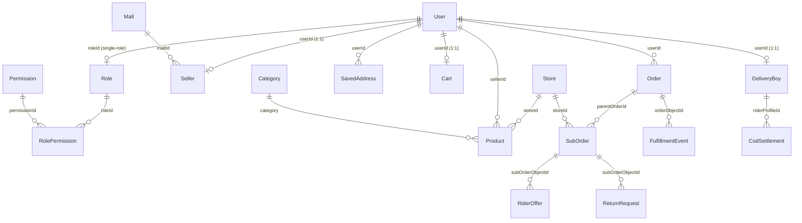
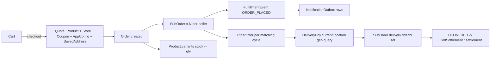

# 07 — Database (MongoDB + Mongoose)

> **Created:** 2026-08-01
> **File type:** App deep-dive
> **Padhne ka time:** ~35 min

---

## WHAT — Yeh doc kya cover karti hai?

QuickBihar ka **poora data layer** — MongoDB collections, Mongoose schemas, har field ka matlab, relationships (refs), indexes (normal + compound + unique + 2dsphere geo + TTL), sub-schemas, hooks (pre-save/pre-validate), aur virtuals. Yeh single source of truth hai "data kaha aur kaise store hota hai" ke liye.

---

## WHY — Yeh samajhna kyun zaroori?

Kyunki **schema hi contract hai**. Agar aapko fields, defaults, aur relationships clear hain toh aap koi bhi feature safely extend kar sakte ho. Galat samajh = data corruption, orphan refs, ya missing index se slow query. Yeh doc har collection ko exact code se document karti hai (hallucination nahi).

---

## WHERE — Connection + model organization

```
Connection:  server/src/config/db.ts  →  connectDB()  (Mongoose 9)
Models:      server/src/modules/<common|clothing>/<feature>/<feature>.model.ts
Naming:      mongoose.model("<Name>", schema)  →  collection = pluralized lowercase
```

- **`common/`** modules = vertical-agnostic (User, Order, Store, Cart, ...).
- **`clothing/`** modules = clothing-specific (Product, SizeChart).
- Zyadatar schemas mein `{ timestamps: true }` (createdAt/updatedAt auto).
- IDs: default Mongo `_id` (ObjectId); business IDs alag se generate hote hain (`orderId`, `subOrderId`, `returnId`, etc.).

---

## HOW — Collections ek nazar mein (domain-wise)

```
IDENTITY & ACCESS      Catalog                Commerce
├─ User                ├─ Product (clothing)  ├─ Cart (TTL 30d)
├─ Role                ├─ Category            ├─ Coupon
├─ Permission          ├─ SizeChart (clothing)├─ SavedAddress
└─ RolePermission      ├─ Store               └─ PaymentMethod
                       ├─ ClothingStoreConfig
PROFILES               ├─ Mall                ORDERS & FULFILLMENT
├─ Seller              └─ MallReview          ├─ Order
└─ DeliveryBoy                                ├─ SubOrder
                       NOTIFICATIONS          ├─ FulfillmentEvent (ledger)
CONFIG & POLICY        ├─ Notification        ├─ ReturnRequest
├─ AppConfig (single)  ├─ NotificationOutbox  ├─ RiderOffer
├─ RefundPolicy        ├─ NotificationRead    └─ CodSettlement
└─ Banner              ├─ NotificationTrack
                       └─ DeviceToken
```

**~32 collections.** Neeche har important collection field-by-field. `_id` (ObjectId) aur `createdAt`/`updatedAt` (jaha `timestamps:true`) implied hain — har table mein repeat nahi kar raha.

---

## HOW — Core relationships (Mermaid ER)



> **Refs are IDs, not embedded docs.** Mongoose `populate()` se join hota hai (SQL FK jaisa nahi — application-level join). Isiliye `verifyJWT` har baar `roleId` populate karta hai. Dekho [08_Authentication.md](./../features/authentication.md).

---

## COLLECTION — `User` (`user.model.ts`)

| Field | Type | Notes |
|-------|------|-------|
| `username` | String | unique, lowercase, indexed |
| `email` | String | unique, lowercase, indexed |
| `fullName` | String | indexed |
| `phone` | String | **Required** for partner (SELLER / RIDER) applicants — collected at `POST /auth/register` (Zod `^\+?\d{10,15}$`) or backfilled via `PATCH /users/profile` from the web `google-phone` sub-phase. Used by admins to verify the applicant's identity before approving the partner application. |
| `avatar` | `{ url, fileId }` | ImageKit |
| `fcmToken` | String | push ke liye (native FCM) |
| `password` | String | **required**, bcrypt hash (10 rounds), pre-save hook |
| `roleId` | ref `Role` | **required, indexed — single role** |
| `isVerified` | Boolean | default `false`, indexed |
| `isBlocked` | Boolean | default `false`, indexed |
| `deletedAt` / `deletedBy` / `deletionReason` | Date / ref User / String | soft-delete |
| `refreshToken` | String | rotation ke liye DB mein store |

**Methods:** `isPasswordCorrect(pw)`, `generateAccessToken()` (`{_id,email,username,fullName}`, `1d`), `generateRefreshToken()` (`{_id}`, `ENV.REFRESH_TOKEN_EXPIRY`).
**Hook:** `pre("save")` → agar password modified toh `bcrypt.hash(pw, 10)`.

> **Phone is the verification key.** New users via `POST /auth/register` must supply `phone` (Zod-enforced). For Google sign-ups that didn't carry a `phone_number` claim, the web client walks through a `google-phone` sub-phase that calls `PATCH /users/profile` to backfill one before the partner application can be submitted. The admin then uses the persisted phone to call/verify the applicant before flipping the partner application to `APPROVED`. See [authentication.md → Admin verification gate](./../features/authentication.md#admin-verification-gate-login--dashboard).

> **Single-role:** `roleId` ek hi field hai (array nahi). Detail: [09_Authorization_RBAC.md](./../features/authorization-rbac.md).

---

## COLLECTION — RBAC trio (`rbac.model.ts`)

`{ timestamps: true, versionKey: false }` (baseOptions).

**`Role`**

| Field | Type | Notes |
|-------|------|-------|
| `name` | String (enum RoleEnum) | unique, indexed |
| `description` | String | |
| `isActive` | Boolean | default `true`, indexed |

**`Permission`**

| Field | Type | Notes |
|-------|------|-------|
| `code` | String | unique, indexed (e.g. `CREATE_ORDER`) |
| `module` | String (enum ModuleEnum) | indexed |
| `domain` | String (enum DomainEnum) | default `GLOBAL`, indexed |
| `description` | String | |

**`RolePermission`** (join table)

| Field | Type | Notes |
|-------|------|-------|
| `roleId` | ref `Role` | indexed |
| `permissionId` | ref `Permission` | indexed |
| `description` | String | |
| — | compound index | **UNIQUE `{roleId, permissionId}`** (duplicate mapping block) |

---

## COLLECTION — `Product` (`clothing/products/product.model.ts`)

Clothing vertical ka core catalog document.

| Field | Type | Notes |
|-------|------|-------|
| `title` | String | required |
| `slug` | String | required, **unique** |
| `description` / `shortDescription` / `brand` | String | |
| `category` | String | **required** |
| `subCategory` | String | |
| `gender` | enum Men/Women/Kids/Unisex | default `Unisex` |
| `price` / `originalPrice` | Number | **required** |
| `discountPercentage` | Number | auto-computed (pre-validate) |
| `currency` | String | default `INR` |
| `isGstApplicable` / `gstPercentage` | Boolean / Number | default `false` / `0` |
| `images[]` | `{ url*, fileId* }` | ImageKit |
| `sellerId` | ref `User` | required, indexed |
| `storeId` | ref `Store` | required, indexed |
| `scope` | enum GLOBAL/SELLER | default `GLOBAL`, indexed |
| `variants[]` | `{ size*, color*, price, stock*, sku }` | **required** — stock yaha rehta hai |
| `totalStock` | Number | auto-sum of variant stock (pre-validate) |
| `ratings` | `{ average, count }` | |
| `sizeChartId` | ref `SizeChart` | |
| `details` | `{ fit, pattern, material, collar, sleeve, washCare, sku }` | |
| `tags[]` / `seo` | | text index (title/description/tags) |
| `isFeatured/isTrending/isNewArrival` | Boolean | |
| `deliveryInfo` | `{ isExpressAvailable, isCodAvailable(true), estimatedDays(3), returnPolicy }` | |
| `logistics` | `{ pickupLocation, warehouseName, latitude, longitude }` | pickup point |
| `policyRefs` | 4× ref `RefundPolicy` | return/refund/shipping/terms |
| `isActive` / `isDeleted` | Boolean | default `true` / `false` |
| `approvalStatus` | enum DRAFT/PENDING_REVIEW/APPROVED/REJECTED | **default `APPROVED`**, indexed |
| `reviewedBy/reviewedAt/rejectionReason` | | moderation |

**Hook:** `pre("validate")` → product SKU + variant SKUs auto-generate, `discountPercentage` + `totalStock` compute. **Virtual:** `discountLabel`.

> ⚠️ **RECONCILIATION (important):** `approvalStatus` ka default **`APPROVED`** hai — matlab product create hote hi **live** ho jaata hai (auto-approve), moderation optional hai. Yeh 03_Frontend.md ke "products save as PENDING" claim ko **override** karta hai — code ka sach `APPROVED` hai. Yahi pattern `Coupon`, `SizeChart` (default APPROVED) aur `Mall.status` (default APPROVED) mein bhi hai. Dekho [10_Product_System.md](./../features/products.md).

---

## COLLECTION — `Category` (`category.model.ts`)

| Field | Type | Notes |
|-------|------|-------|
| `title` | String | required, **unique** |
| `slug` | String | required, unique, lowercase |
| `image` / `imagePublicId` | String | required (ImageKit) |
| `banner` / `bannerPublicId` | String | optional |
| `parentId` | ref `Category` | indexed (self-ref = subcategory tree) |
| `priority` / `sortOrder` | Number | default `0` |
| `isActive` / `isFeatured` | Boolean | default `true` / `false` |
| `seo` | `{ metaTitle, metaDescription, keywords[] }` | |

---

## COLLECTION — `Store` (`store.model.ts`)

`{ timestamps: true, versionKey: false }`.

| Field | Type | Notes |
|-------|------|-------|
| `sellerId` | ref `User` | required, indexed |
| `name` | String | required |
| `description` / `logoUrl` / `bannerUrl` / `storeImages[]` / `storeVideo` | | |
| `type` | enum StoreType | required, indexed |
| `address` | `{ line1, city, state, pincode, country(India), postalCode }` | |
| `contact` | `{ email, phone }` | |
| `categoryConfig` | `{ primaryCategory, subcategories[], assignedByAdmin }` | |
| `deliveryConfig` | `{ deliveryAreas[], shippingFee, freeShippingThreshold }` | |
| `policyRefs` | 4× ref `RefundPolicy` | |
| `currentLocation` | GeoJSON Point `{ type, coordinates[] }` | **2dsphere index** |
| `isOpen` / `isActive` / `isVerified` | Boolean | default `false` / `true` / `false` |
| `timings[]` | `{ day, openTime, closeTime, isClosed }` | |
| `deliveryRadiusKm` / `minOrderAmount` / `deliveryFee` | Number | |
| `isSetupComplete` | Boolean | default `false`, indexed |
| `setupCompletedAt` / `setupMissingFields[]` | | onboarding progress |

**Index:** `{ currentLocation: "2dsphere" }` — geo query (nearby stores, rider matching).
**Related:** `ClothingStoreConfig { storeId(unique), availableBrands[], returnDays, hasTrial }` — clothing-specific store config (1:1 with Store).

---

## COLLECTION — `Mall` (`mall.model.ts`) + `SizeChart`

**`Mall`** (`{ versionKey:false }`): `name*`, `slug*(unique)`, `description`, `address{line1,city,state,pincode,latitude,longitude}`, `contact{managerName,email}`, `logoUrl`/`coverImageUrl` (+publicIds), `images[]{url,fileId}`, `mobileNumber`, `isMobileVisible(true)`, `totalStores(0)`, `rating(4.5)`, `reviewCount(0)`, `isFeatured`, `featuredRank(1–10)`, `isActive(true)`, `status(enum PENDING/APPROVED/REJECTED, default APPROVED)`, `requestedBy/reviewedBy/reviewedAt/rejectionReason`. Indexes: `{address.city, isActive}`, `{isActive, isFeatured, featuredRank}`.

**`SizeChart`** (`clothing/sizeChart`): `name*`, `category*`, `unit(inches/cm)`, `fields[]` (dynamic column names), `data[]` (rows, `strict:false` = dynamic chest/length keys), `howToMeasure[]`, `scope(GLOBAL/SELLER)`, `sellerId`/`storeId`/`productIds[]`, `isActive(true)`, `approvalStatus(default APPROVED)`. **Unique compound:** `{name, category, sellerId}`.

---

## COLLECTION — `Cart` (`cart.model.ts`)

| Field | Type | Notes |
|-------|------|-------|
| `userId` | ref `User` | required, **unique**, indexed (1 cart/user) |
| `items[]` | `{ productId*, sku*, quantity(min1) }` (`_id:false`) | SKU variant identify karta hai |

> **TTL index:** `{ updatedAt: 1 }` with `expireAfterSeconds: 2592000` (**30 din**). Inactive cart 30 din baad **auto-delete** ho jaati hai. Yeh MongoDB TTL monitor karta hai.

---

## COLLECTION — `Coupon` (`coupon.model.ts`)

| Field | Type | Notes |
|-------|------|-------|
| `code` | String | required, **unique**, uppercase |
| `description` | String | required |
| `discountType` | enum (DiscountType) | default `PERCENTAGE` |
| `discountValue` | Number | required |
| `minOrderValue` / `maxDiscountAmount` | Number | |
| `startDate` / `endDate` | Date | required |
| `usageLimit(100)` / `usedCount(0)` / `usageLimitPerUser(1)` | Number | |
| `scope` | enum GLOBAL/SELLER | default `GLOBAL`, indexed |
| `sellerId` / `storeId` | ref | indexed (seller coupon) |
| `approvalStatus` | enum DRAFT/PENDING_REVIEW/APPROVED/REJECTED | **default `APPROVED`**, indexed |
| `isActive` | Boolean | default `true` |
| `appliesTo` | enum ALL/SPECIFIC | default `ALL` |
| `productIds[]` | ref `Product` | SPECIFIC coupon ke liye |

**Virtual:** `isExpired` (`Date.now() > endDate`). `toJSON`/`toObject` mein virtuals on.

---

## COLLECTION — `SavedAddress` (`savedAddress/savedAddresses.model.ts`)

| Field | Type | Notes |
|-------|------|-------|
| `userId` | ref `User` | required, indexed |
| `fullName` / `phone` / `street` / `city` / `state` / `pincode` | String | required |
| `landmark` | String | |
| `addressType` | enum HOME/WORK/OTHER | default `HOME` |
| `isDefault` | Boolean | default `false` |
| `latitude` / `longitude` | Number | **required** (GPS pin) |

**Hook:** `pre("save")` → agar `isDefault:true`, baaki addresses ka `isDefault:false` (single default guarantee).

> ⚠️ **GPS mandatory:** `latitude`/`longitude` required hain. Checkout mein GPS pin zaroori (0,0 = order fail). Dekho [05_Mobile_App.md](./../apps/mobile-app.md), [11_Order_System.md](./../features/orders.md).

---

## COLLECTION — `PaymentMethod` (`paymentMethod.model.ts`)

`userId(ref, indexed)`, `provider(enum RAZORPAY/PAYPAL/STRIPE/OTHER, default RAZORPAY)`, `methodType*` (card/upi/wallet), `last4`, `brand`, `isDefault(false)`, `providerToken` (saved-card token). **Hook:** `pre("save")` single-default enforce (SavedAddress jaisa). Detail: [12_Payment_System.md](./../features/payments.md).

---

## COLLECTION — `Order` (`order.model.ts`) ★ parent order

Ek customer checkout = **ek Order**. Multi-seller cart hone pe items **per-seller SubOrders** mein split hote hain (neeche).

| Field | Type | Notes |
|-------|------|-------|
| `orderId` | String | required, **unique**, uppercase, indexed — `QB-<last6ofDate><rand 1000–9999>` (pre-validate) |
| `userId` | ref `User` | required |
| `items[]` | orderItem sub-schema | neeche |
| `totalAmount` / `mrpTotal` / `productDiscount` / `discountAmount` / `shippingFee` | Number | pricing breakdown |
| `dynamicDeliverySurcharge` | Number | rain/peak/festival/night surcharge |
| `platformCommissionTotal` / `riderPayoutEstimateTotal` | Number | marketplace economics |
| `appGrossRevenue` / `appNetAfterRiderEstimate` | Number | platform revenue snapshot |
| `pricingSnapshot` | Mixed | **poora pricing calc freeze** (audit) |
| `totalTax` / `payableAmount` | Number | `payableAmount` **required** |
| `shippingAddress` | sub-schema | required; `latitude`/`longitude` **required** |
| `status` | enum OrderStatus | default `PENDING_PAYMENT` |
| `delivery` | embedded `{ partnerUserId, partnerProfileId, status(UNASSIGNED), otp{code,generatedAt,verifiedAt}, payoutAmount, currentLocation, events[] }` | order-level delivery snapshot |
| `paymentInfo` | `{ razorpayOrderId*, razorpayPaymentId, razorpaySignature }` | Razorpay |
| `couponCode` / `couponCodes[]` / `couponDiscounts[]` | | multi-coupon (per-seller) |
| `cancellationReason` / `rejectedAt` / `cancelledAt` / `refundedAt` | | lifecycle timestamps |

**`orderItem` sub-schema** (`_id:false`): `productId*`, `title`, `sku`, `size`, `color`, `quantity(min1)`, `price`, `sellerId(indexed)`, `storeId(indexed)`, `sellerSubtotal(0)`, `settlementStatus(enum PENDING/AVAILABLE/PAID/REVERSED, default PENDING)`, `pickupLocation`, `warehouseName`, `latitude`, `longitude`.
**`shippingAddress` sub-schema:** `fullName`, `phone`, `street`, `city`, `state`, `pincode*`, `landmark`, `latitude*`, `longitude*`.
**Hook:** `pre("validate")` → `orderId` generate. **Virtuals:** `deliveryPartner`, `deliveryPartnerLocation`, `deliveryOtp`.
**Indexes:** `{delivery.partnerUserId:1, createdAt:-1}`, `{delivery.status:1, createdAt:-1}`.

> **COD sentinel:** COD order mein `paymentInfo.razorpayOrderId` = `"COD"` (literal string). Detail: [12_Payment_System.md](./../features/payments.md).

---

## COLLECTION — `SubOrder` (`subOrder.model.ts`) ★ per-seller fulfillment unit

**Ek seller = ek SubOrder.** Rider matching, timeline, delivery — sab SubOrder level pe. Yeh fulfillment ka asli unit hai.

| Field | Type | Notes |
|-------|------|-------|
| `subOrderId` | String | required, **unique**, uppercase, indexed |
| `parentOrderId` | ref `Order` | required, indexed |
| `sellerId` / `storeId` | ref `User` / `Store` | required, indexed |
| `items[]` | (same shape as order items) | is seller ke items |
| `subtotal` | Number | required |
| `tax` / `shippingFee` / `dynamicDeliverySurcharge` | Number | |
| `platformCommission` / `sellerNet` / `appNetAfterRider` | Number | per-seller economics |
| `pricingSnapshot` | Mixed | |
| `payableAmount` | Number | **required** |
| `status` | enum SubOrderStatus (~40 values) | default `CONFIRMED`, indexed |
| `packageDetails` | `{ dimensions, weight, packageCount(1), isFragile, isCod, otpRequired(true), pickupNotes, pickupTiming, lockedAt }` | packing |
| `delivery` | `{ riderId, riderProfileId, status, pickupOtp, deliveryOtp, payoutAmount, distanceKm, bonuses{rain,peak,festival,night}, pickupPhoto, deliveryPhoto, deliverySignature, assignedAt, currentLocation, events[] }` | rider + proof |
| `timeline[]` | `{ status, actor(enum CUSTOMER/SELLER/RIDER/SYSTEM/ADMIN), actorId, timestamp, ipAddress, deviceInfo, metadata }` | **audit trail** |

**Indexes:** `{sellerId:1, status:1}`, `{delivery.riderId:1, delivery.status:1}`.

**SubOrderStatus forward flow (verified):**
```
CONFIRMED → PROCESSING → PACKED → READY_FOR_PICKUP
   → RIDER_ASSIGNED/RIDER_ACCEPTED → PICKED_UP → IN_TRANSIT
   → NEAR_CUSTOMER → DELIVERED → COMPLETED
```
**Return flow (M2):** `RETURN_INITIATED → RETURN_APPROVED → RETURN_PICKUP_SCHEDULED → RETURN_PICKED_UP → RETURNED → REFUNDED` (+ `DISPUTED` admin branch). Detail: [11_Order_System.md](./../features/orders.md).

---

## COLLECTION — `FulfillmentEvent` (`fulfillment/fulfillmentEvent.model.ts`) ★ event ledger

**DB-first realtime ka source of truth.** Har state change ek immutable event. Socket/push isi se derive hote hain (event pehle DB mein, phir emit).

| Field | Type | Notes |
|-------|------|-------|
| `eventId` | String | unique, indexed, default `evt_<ts>_<rand>` |
| `sequence` | Number | required, indexed — **ordering guarantee** |
| `type` | String | required, indexed (event type) |
| `orderId` / `orderObjectId` | String / ref `Order` | indexed |
| `subOrderId` / `subOrderObjectId` | String / ref `SubOrder` | indexed |
| `status` | String | indexed |
| `actor` | enum CUSTOMER/SELLER/RIDER/SYSTEM/ADMIN | required, indexed |
| `actorId` | ref `User` | indexed |
| `recipientIds[]` | ref `User` | kis-kis ko yeh event dikhna hai |
| `rooms[]` | String | socket rooms |
| `metadata` | Mixed | |
| `occurredAt` | Date | default now, indexed |

**Indexes:** `{orderId,sequence}`, `{subOrderId,sequence}`, `{recipientIds,occurredAt:-1}`, `{rooms,occurredAt:-1}`. Detail: [14_Notifications.md](./../features/notifications.md), 23_Request_Lifecycle.md.

---

## COLLECTION — `ReturnRequest` (`fulfillment/returnRequest.model.ts`)

| Field | Type | Notes |
|-------|------|-------|
| `returnId` | String | unique, indexed, default `ret_<ts>_<rand>` |
| `parentOrderId` | ref `Order` | required, indexed |
| `subOrderObjectId` / `subOrderId` | ref `SubOrder` / String | required, indexed |
| `customerId` / `sellerId` | ref `User` | required, indexed |
| `riderId` | ref `User` | indexed (return pickup rider) |
| `status` | enum (8 values) | default `RETURN_REQUESTED`, indexed |
| `reason` | String | required |
| `notes` / `pickupOtp` / `proofPhoto` | | |
| `timeline[]` | Mixed[] | audit |

**Status enum:** `RETURN_REQUESTED / RETURN_APPROVED / RETURN_REJECTED / RETURN_PICKUP_SCHEDULED / RETURN_PICKED_UP / RETURNED / REFUNDED / DISPUTED`. **Indexes:** `{customerId,createdAt:-1}`, `{sellerId,status}`.

---

## COLLECTION — `RiderOffer` (`fulfillment/riderOffer.model.ts`) ★ matching engine

Rider matching loop har ~10s open sub-orders ke liye nearest riders ko offer bhejta hai. Ek offer = ek RiderOffer doc.

| Field | Type | Notes |
|-------|------|-------|
| `offerId` | String | unique, indexed, default `offer_<ts>_<rand>` |
| `subOrderObjectId` / `subOrderId` | ref / String | required, indexed |
| `parentOrderId` / `sellerId` | ref | indexed |
| `riderId` / `riderProfileId` | ref `User` / `DeliveryBoy` | required, indexed |
| `status` | enum OPEN/ACCEPTED/REJECTED/EXPIRED/CANCELLED | default `OPEN`, indexed |
| `stage` | Number 1–4 | radius escalation stage |
| `radiusKm` | Number | required |
| `payoutAmount` | Number | required (rider ko kitna milega) |
| `distanceKm` / `riderDistanceToStoreKm` | Number | proximity |
| `expiresAt` | Date | required, indexed (offer timeout) |
| `respondedAt` / `metadata` | | |

**Const:** `MAX_RIDER_REJECTIONS_PER_SUB_ORDER = 3`.
**Indexes:** `{riderId,status,expiresAt}`, `{subOrderObjectId,status}`, `{subOrderObjectId,riderId,status,respondedAt:-1}`, aur **partial unique** `{subOrderObjectId,riderId,status}` where `status:"OPEN"` — ek rider ko ek sub-order ka ek hi OPEN offer (duplicate offer block).

---

## COLLECTION — `CodSettlement` (`fulfillment/codSettlement.model.ts`)

Rider ne COD cash collect kiya → platform ko deposit → settlement record.

| Field | Type | Notes |
|-------|------|-------|
| `riderId` / `riderProfileId` | ref `User` / `DeliveryBoy` | required, indexed |
| `amount` | Number | required (min 0) |
| `previousLiability` / `newLiability` | Number | required — liability ledger |
| `status` | enum PENDING/VERIFIED/REJECTED | **default `VERIFIED`**, indexed |
| `referenceId` / `note` | String | |
| `depositedAt` | Date | default now |
| `verifiedBy` | ref `User` | admin |

**Index:** `{riderId, createdAt:-1}`. Detail: [12_Payment_System.md](./../features/payments.md).

---

## COLLECTION — `NotificationOutbox` (`fulfillment/notificationOutbox.model.ts`)

Reliable delivery ke liye **outbox pattern** — event ko channel-wise (socket/push/email/sms) deliver karne ka queue + retry state.

| Field | Type | Notes |
|-------|------|-------|
| `idempotencyKey` | String | required, **unique**, indexed — duplicate send block |
| `eventId` | String | indexed (FulfillmentEvent link) |
| `channel` | enum SOCKET/PUSH/EMAIL/SMS | required, indexed |
| `status` | enum PENDING/SENT/FAILED/SKIPPED | default `PENDING`, indexed |
| `recipientId` / `room` | ref / String | indexed |
| `title` / `body` / `payload` | | |
| `attempts(0)` / `nextAttemptAt` / `sentAt` / `lastError` | | **retry with backoff** |

**Indexes:** `{status, nextAttemptAt}` (retry scan), `{recipientId, createdAt:-1}`. Detail: [14_Notifications.md](./../features/notifications.md).

---

## COLLECTION — `Seller` (`seller/seller.model.ts`) — seller profile + wallet

`User` (auth) se alag: `Seller` business + payout + wallet profile hai (1:1 via `userId`).

| Field | Type | Notes |
|-------|------|-------|
| `userId` | ref `User` | **unique** (1:1) |
| `businessName` / `gstNumber` | String | |
| `mallId` / `mallUnit` / `mallFloor` | ref `Mall` / String | mall tenancy (indexed) |
| `mallRequest` | `{ mallId, mallUnit, mallFloor, message, status(PENDING/APPROVED/REJECTED), requestedAt, reviewedBy, reviewedAt, rejectionReason }` | mall join request |
| `bankDetails` | `{ accountNumber, ifsc, bankName, pan, upi, aadhar }` | ⚠️ sensitive |
| `payoutMethods[]` | `{ type(BANK/UPI/PAYPAL/STRIPE_CONNECT)*, label, status(PENDING_VERIFICATION/VERIFIED/REJECTED), isDefault, bank{...}, upi{upiId}, paypal{email}, stripeConnect{accountId}, rejectionReason, verifiedBy, verifiedAt, createdAt }` | multi-payout |
| `wallet` | `{ availableBalance(0), pendingPayoutBalance(0), lifetimeEarnings(0) }` | min 0 |
| `address` | `{ address, city, state, pincode }` | |
| `currentLocation` | GeoJSON Point | **2dsphere** |
| `sellerType` | enum (StoreType.CLOTHING) | |
| `isVerified` | Boolean | default `false` |
| `status` | enum PENDING/APPROVED/REJECTED | |

> ⚠️ **PII/financial:** `bankDetails` + `payoutMethods` mein account/PAN/Aadhaar/UPI. In fields ko kabhi API response mein blindly expose mat karo — serializer se filter. Dekho 19_Security.md.

---

## COLLECTION — `DeliveryBoy` (`deliveryBoy/delivery.model.ts`) — rider profile + KYC + wallet

| Field | Type | Notes |
|-------|------|-------|
| `userId` | ref `User` | **unique** (1:1) |
| `bankDetails` / `payoutMethods[]` | (Seller jaisa, `BANK`/`UPI` only) | ⚠️ sensitive |
| `address` | `{ address, city, state, pincode }` | |
| `vehicleType` / `vehicleNumber` / `licenseNumber` | String | |
| `documents` | `{ drivingLicense, aadharCard, panCard, vehicleRC, profilePhoto }` — har ek `{ ...urls, status(PENDING/APPROVED/REJECTED default PENDING), rejectionReason }` | **per-document KYC review** |
| `isVerified` | Boolean | default `false` |
| `wallet` | `{ availableBalance, pendingPayoutBalance, lifetimeEarnings, collectedCodLiability }` | COD liability yaha track |
| `status` | enum PENDING/APPROVED/REJECTED | default `PENDING` |
| `isOnline` | Boolean | default `false` (matching ke liye) |
| `currentLocation` | GeoJSON Point | **2dsphere** — live rider location |

**Index:** `{ currentLocation: "2dsphere" }` — rider matching `$nearSphere` isse chalti hai.

> **`collectedCodLiability`** — rider ne kitna COD cash collect kiya jo abhi platform ko deposit nahi hua. `CodSettlement` isse ghata deta hai.

---

## COLLECTIONS — Notifications (5 collections)

Notification system **campaign + per-user tracking** ke liye alag collections use karta hai:

| Collection | Key fields | Kaam |
|-----------|-----------|------|
| `Notification` | `title*, description*, body, imageUrl, channel(general/promotions/orders/system), deliveryChannel(IN_APP/FCM/BOTH), deliveryType(ALERT/SILENT/LIVE_ACTIVITY), targetType(ALL/ROLE/SPECIFIC)*, targetRole, targetUser, status(PENDING…SENT/FAILED), redirectType(none/product/category/mall/external), redirectId, deepLink, scheduledAt, expiresAt, notificationType(NORMAL/RICH), priority(HIGH/MEDIUM/LOW), actionButtonText, sentCount/deliveryCount/openCount/failedCount, jobId, error` | **Campaign / broadcast** definition |
| `NotificationRead` | `userId*, notificationId*, readAt` — **unique `{userId,notificationId}`** | Read state (in-app) |
| `NotificationTrack` | `notificationId*, userId*, status(DELIVERED/OPENED), deliveredAt, openedAt` — **unique `{notificationId,userId}`** | Delivery/open analytics |
| `DeviceToken` | `fcmToken*(unique), userId` | FCM token registry (user 1:N devices) |
| `NotificationOutbox` | (upar Fulfillment section mein) | Reliable per-channel delivery + retry |

**`Notification` hook:** `pre("validate")` legacy records migrate karta hai (purana `deliveryType` value `BOTH/IN_APP/FCM` ko `deliveryChannel` mein shift + `status:"COMPLETED"→"SENT"`). Detail: [14_Notifications.md](./../features/notifications.md).

> **Do "notification" cheezein confuse mat karo:** `Notification` = marketing/broadcast campaigns (admin banata hai). `FulfillmentEvent` + `NotificationOutbox` = transactional order events (system banata hai). Alag pipelines.

---

## COLLECTIONS — Config, Policy, Content

**`AppConfig`** (`appConfig.model.ts`) — **singleton** (ek hi document; DAO/service enforce karta hai, schema nahi). Sections: `store`, `policies`, `contact`, `socialLinks`, `seo`, `appearance`, `shipping{freeShippingThreshold(2000), shippingFee(99)}`, `tax`, `currency{code(INR),symbol(Rs.)}`, `marketplace{commissionPercent = ENV.MARKETPLACE_COMMISSION_PERCENT}`, `delivery{defaultRadiusKm(5), estimatedMinutes(45), riderPayoutAmount(40), riderPayoutRules{upto3Km/upto5Km/upto8Km/extraPerKmAfter8...}, bonusRules{rain/peak/festival/night + AUTO/FORCE_ON/FORCE_OFF modes + peakWindows/festivalWindows/nightStart/nightEnd}}`. Defaults `ENV` se aate hain → **runtime-tunable pricing/payout knobs**. Detail: [16_Environment.md](./../operations/environment.md), [12_Payment_System.md](./../features/payments.md).

**`RefundPolicy`** (`refundPolicy.model.ts`) — `name*, policyType(RETURN/REFUND/SHIPPING/TERMS/GENERAL, default REFUND, indexed), category, description, returnWindowDays(0), refundProcessingDays(0), conditions[], refundType, returnShipping, isReturnable(true), isExchangeAvailable(true), isActive(true)`. Product + Store `policyRefs` (4×) isse refer karte hain.

**`Banner`** (`banner.model.ts`) — `title, subtitle, image*, imagePublicId*, redirectType(product/category/collection/external)*, redirectId(refPath), externalUrl, placement(home_top/home_middle/category), priority(0), startDate/endDate, isActive(true), clicks/impressions, isAds, scope(GLOBAL/SELLER), sellerId/storeId, approvalStatus(**default APPROVED**)`. **Hook:** `pre("save")` → agar `endDate < now` toh `isActive=false` (auto-expire).

**`Wishlist`** (`wishlist.model.ts`) — `userId*, productId*`; **unique `{userId,productId}`** (no dup).

---

## HOW — Cross-cutting patterns (jo baar-baar dikhte hain)

| Pattern | Kaha | Matlab |
|---------|------|--------|
| **`approvalStatus` default `APPROVED`** | Product, Coupon, SizeChart, Banner (+ `Mall.status`) | Content create hote hi **live** (auto-approve). Moderation optional/retroactive. |
| **`scope: GLOBAL / SELLER`** | Product, Coupon, SizeChart, Banner | GLOBAL = platform-wide; SELLER = us seller ka (multi-tenant seam). |
| **GeoJSON `2dsphere`** | Store, Seller, DeliveryBoy (`currentLocation`) | `$nearSphere` geo queries (nearby store, rider matching). |
| **TTL index** | Cart (`updatedAt`, 30d) | Auto-expire stale docs. |
| **`sellerId` + `storeId` refs** | Product, Coupon, SubOrder, order items | Multi-seller marketplace ka backbone. |
| **Business ID + `_id`** | Order(`QB-…`), SubOrder, Return(`ret_…`), Offer(`offer_…`), Event(`evt_…`) | Human/external-facing ID alag from Mongo `_id`. |
| **`pricingSnapshot` (Mixed)** | Order, SubOrder | Pricing calc freeze (audit — rules baad mein badle toh bhi order immutable). |
| **`timeline[]` / `events[]`** | SubOrder, ReturnRequest, Order.delivery | Append-only audit trail (actor + timestamp). |
| **Single-default hook** | SavedAddress, PaymentMethod | `pre("save")` baaki ka `isDefault:false`. |
| **Soft-delete** | User (`deletedAt`), Product (`isDeleted`) | Hard-delete se bachte hain. |

---

## HOW — Notable indexes (performance-critical)

```
UNIQUE          User.username/email, Product.slug, Order.orderId, SubOrder.subOrderId,
                Category.title/slug, Coupon.code, Cart.userId, DeviceToken.fcmToken,
                RolePermission{roleId,permissionId}, Wishlist{userId,productId},
                NotificationRead{userId,notificationId}, SizeChart{name,category,sellerId},
                RiderOffer{subOrderObjectId,riderId,status} (partial: status=OPEN)

2dsphere        Store.currentLocation, Seller.currentLocation, DeliveryBoy.currentLocation

TTL             Cart.updatedAt (expireAfterSeconds 2592000 = 30d)

COMPOUND        Order{delivery.partnerUserId,createdAt}, SubOrder{sellerId,status},
                SubOrder{delivery.riderId,delivery.status}, FulfillmentEvent{orderId,sequence},
                RiderOffer{riderId,status,expiresAt}, ReturnRequest{sellerId,status},
                NotificationOutbox{status,nextAttemptAt}, Mall{address.city,isActive}

TEXT            Product{title,description,tags} (search)
```

---

## FLOW — Ek order create hone pe kaunse collections touch hote hain



**Ek checkout ~8–10 collections ko touch karta hai** — isiliye stock deduction atomic + rollback hona zaroori. Detail: [11_Order_System.md](./../features/orders.md), [12_Payment_System.md](./../features/payments.md).

---

## ⚠️ RECONCILIATION — `approvalStatus` (doc 03 correction)

`03_Frontend.md` mein likha tha ki products **`PENDING`** status pe save hote hain. **Code ka sach alag hai:** `product.model.ts` mein `approvalStatus` ka **default `"APPROVED"`** hai (same for `Coupon`, `SizeChart`, `Banner`, aur `Mall.status`). Matlab platform **auto-approve** model pe chal raha hai — content create hote hi live. Agar moderation chahiye toh create pe explicitly `PENDING_REVIEW` set karna padega (ya schema default badalna padega). Yeh doc **authoritative** hai; 03/10 ko isi ke hisaab se align karna hai.

---

## DEPENDENCIES

- **Isse pehle:** [04_Backend.md](./../apps/server.md) (layered architecture — DAO/model layer)
- **Related:** [08_Authentication.md](./../features/authentication.md) (User + roleId populate), [09_Authorization_RBAC.md](./../features/authorization-rbac.md) (RBAC trio), [11_Order_System.md](./../features/orders.md) (Order/SubOrder lifecycle), [12_Payment_System.md](./../features/payments.md) (wallet/settlement/COD)
- **Config:** [16_Environment.md](./../operations/environment.md) (AppConfig defaults ENV se)

---

## RISKS

- ⚠️ **Auto-approve default (`APPROVED`)** — koi bhi seller product/coupon/banner turant live kar sakta hai bina admin review. Marketplace trust/moderation gap. Business decision confirm karo.
- ⚠️ **PII/financial fields** — `Seller`/`DeliveryBoy` mein bank account, IFSC, PAN, Aadhaar, UPI. Encryption-at-rest + response serialization se filter zaroori. Dekho 19_Security.md.
- ⚠️ **Refs = application-level joins** — orphan refs possible (product delete ho par order item usko point karta rahe). Cleanup/soft-delete discipline chahiye.
- ⚠️ **`pricingSnapshot`/`timeline` = `Mixed`** — schema validation nahi, koi bhi shape ghus sakta hai. Consistency application code pe depend karti hai.
- ⚠️ **AppConfig singleton schema-level enforce nahi** — do docs ban gaye toh config ambiguous. DAO/service pe bharosa.

---

## IMPROVEMENTS

- `approvalStatus` default `PENDING_REVIEW` karna (agar moderation chahiye) — ya explicit product intent.
- Sensitive financial fields ke liye field-level encryption + dedicated serializer.
- `pricingSnapshot`/`timeline` ke liye typed sub-schemas (Mixed ki jagah) — validation + safety.
- Referential integrity checks (cascade soft-delete ya cleanup jobs).
- ER diagram ko auto-generate karna (schema se) taaki drift na ho.

---

*Verified against `user.model.ts`, `rbac.model.ts`, `product.model.ts`, `category.model.ts`, `store.model.ts`, `mall.model.ts`, `sizeChart.model.ts`, `cart.model.ts`, `coupon.model.ts`, `savedAddresses.model.ts`, `paymentMethod.model.ts`, `order.model.ts`, `subOrder.model.ts`, `fulfillmentEvent.model.ts`, `returnRequest.model.ts`, `riderOffer.model.ts`, `codSettlement.model.ts`, `notificationOutbox.model.ts`, `seller.model.ts`, `delivery.model.ts`, `notification.model.ts` (+ read/track/deviceToken), `appConfig.model.ts`, `refundPolicy.model.ts`, `banner.model.ts`, `wishlist.model.ts` — sab 2026-08-01 ko padhe gaye. `approvalStatus` default = `APPROVED` explicitly reconciled against 03_Frontend.md's earlier "PENDING" claim.*


