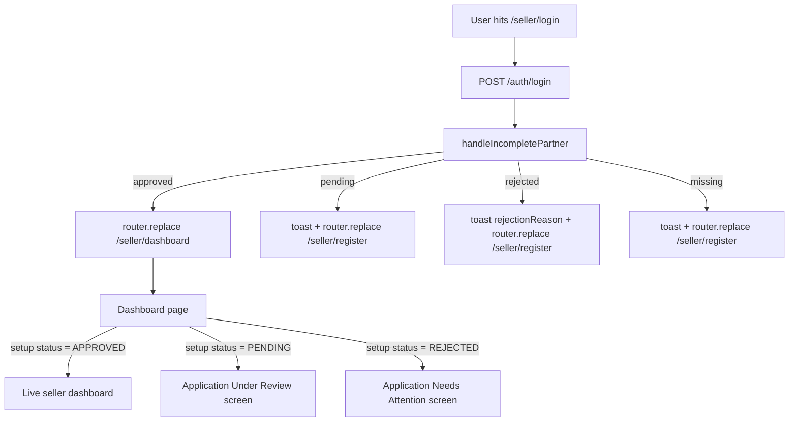

# Authentication

> Owner: `server/src/modules/common/auth/`
> Related: [google-oauth.md](./google-oauth.md) · [authorization-rbac.md](./authorization-rbac.md)

This document describes how a caller proves their identity to the QuickBihar server and how the server grants a session. The auth model is **credential-agnostic** — a user may hold one or both of:

- A **Google identity** (verified by `google-auth-library`).
- A **password** (bcrypt-hashed, optional on top of Google).

Email is the natural linking key. A single user can have a Google sign-in, a password sign-in, or both, attached to the same `identities[]` array on the `User` record.

Phone number is **not** an authentication credential (you cannot sign in with it), but it is a **required** verification field for any partner registering as a **seller** or **rider**. For standard customer accounts (`role: USER`), the phone number is completely **optional**.
For sellers and riders, phone is collected **at registration time like any other field** directly in Section 1 of the onboarding registration form (`1. Business Profile` for sellers, `1. Vehicle & Driver Details` for riders) — **not** before registration (no preliminary email/password form) and **not** after registration (no interstitial phone screen). When the partner submits their application, the mobile number is validated (10 to 15 digits) and synced to their user profile via `PATCH /users/profile`. Admin cross-checks this phone before approving the application.

> **Why "phone at registration time like other fields"** — partners authenticate with Google in one click, and then fill their business/vehicle details, required contact mobile number, bank account, and documents in one unified form. This eliminates redundant multi-screen signups while ensuring the admin always has a validated phone number to review before activating the partner. Phone is **required** for `role: SELLER | RIDER` and **optional** for `role: USER` (customer sign-up).

---

## TL;DR — what changed (Phase 1-4)

The previous implementation was email + mobile-OTP (`/auth/request-otp`, `/auth/verify-otp`, Redis `otp:*` keys, `otp_cooldown` 60s). It has been replaced.

| Old | New |
|-----|-----|
| Mobile OTP is the only sign-in path | Google OAuth is the primary sign-in path |
| `requestOTP`, `verifyOTPAndAuthenticate` | `googleAuthOrCreate` (verifies Google `id_token`) |
| Redis `otp:*` keys, `otp_cooldown` | `pwd_reset:*` keys (15-min replay protection) |
| `/auth/request-otp`, `/auth/verify-otp` | `/auth/google`, `/auth/set-password`, `/auth/link-google` |
| `/auth/request-reset` (existed but inactive) | `/auth/request-reset`, `/auth/reset-password` (wired) |
| `isVerified` gate on login | Removed — Google users are inherently verified |
| `legacyOtpOnly: true` for OTP-created users | Set on synthetic emails (`<phone>@quickbihar.local`); cleared on first Google sign-in |

If you find any reference to `requestOTP`, `verifyOTPAndAuthenticate`, `redis.set("otp:`, or `/auth/request-otp` in the code, it is **stale** and should be removed.

---

## Endpoints

All routes are mounted under `/api/v1/auth` in [server/src/modules/common/auth/auth.router.ts](../../../server/src/modules/common/auth/auth.router.ts).

| Method | Path | Auth | Rate limit | Purpose |
|--------|------|------|-----------|---------|
| `POST` | `/register` | public | `authRateLimiter` | `{ email, password, fullName, role?: "USER" \| "SELLER" \| "RIDER", phone? }`. New users get `USER` role and start as ACTIVE. **Phone contract is role-conditional** — required for SELLER / RIDER, optional for USER (default). On web, sellers and riders authenticate via Google and fill their required phone number directly at registration time in Section 1 of the onboarding application form. |
| `POST` | `/login` | public | `authRateLimiter` | Email/username + password. Sets `accessToken` + `refreshToken` cookies (web). |
| `POST` | `/google` | public | `authRateLimiter` | Body: `{ idToken, client: "web" \| "mobile" }`. Verifies Google ID token, finds-or-creates the user, returns a token pair. Web path also sets cookies. |
| `POST` | `/set-password` | required | `strictAuthRateLimiter` | Set a password on the currently-authenticated user. Idempotent — overwrites. Adds a `"password"` identity row. |
| `POST` | `/link-google` | required | `strictAuthRateLimiter` | Link a Google identity to an existing password-only account. Email must match. |
| `POST` | `/request-reset` | public | `authRateLimiter` | Email-only. Always returns the same response to prevent account enumeration. Sends a 15-minute reset link via Resend. |
| `POST` | `/reset-password` | public | `strictAuthRateLimiter` | Body: `{ token, newPassword }`. Consumes the reset JWT, marks it as used in Redis. |
| `POST` | `/refresh-token` | public | `authRateLimiter` | Exchanges a valid `refreshToken` (cookie or body) for a new token pair. Old refresh token is invalidated. |
| `GET` | `/config` | public | — | Returns public frontend configuration (e.g. `{ googleClientId }`). Used as a runtime fallback when `NEXT_PUBLIC_*` environment variables were not embedded at Docker image build time. |
| `POST` | `/logout` | optional/auth | — | Clears the refresh token server-side and clears the cookies. |

### Rate limits

Defined in `server/src/middlewares/rateLimit.middleware.ts` and applied in `auth.router.ts`:

- `authRateLimiter` — coarse throttle on all public auth endpoints.
- `strictAuthRateLimiter` — tighter cap on the endpoints that can change credentials (`set-password`, `link-google`, `reset-password`).

---

## Google sign-in flow (the primary path)

1. **Client obtains an ID token.**
   - Web (`@react-oauth/google`): `GoogleLogin` → `credentialResponse.credential`.
   - Mobile (`@react-native-google-signin/google-signin` v15): `signIn().idToken`.
2. **Client posts `{ idToken, client }` to `POST /api/v1/auth/google`.**
3. **Server verifies the token** in `googleOAuth.service.ts` via `google-auth-library`:
   - Signature is checked against Google's public keys.
   - `audience` is the Web client ID, plus the Android client ID when `client === "mobile"`, plus the iOS client ID if configured.
   - `email_verified === true` is enforced.
   - Any failure becomes a generic `401 Invalid or expired Google token` — the underlying Google error is never echoed.
4. **Server finds-or-creates the user** in `auth.service.ts → googleAuthOrCreate`:
   - **New email → create ACTIVE `USER`.** No email verification round-trip. No admin approval.
   - **Existing user with the same email** → append a `google` identity row (unless the email is already linked to a *different* Google `sub` — that returns `409`).
   - **Avatar promotion** — if Google has a picture and the user has none, use the Google one.
   - **Legacy OTP merge** — if `legacyOtpOnly` is true, flip it to false.
   - **Phone backfill** — if Google's `id_token` payload includes a `phoneNumber` / `phone_number` claim **and** the user record has no phone, persist it.
5. **Server issues a token pair** and, on the web path, sets `accessToken` + `refreshToken` httpOnly cookies. Mobile clients read the tokens from the JSON body.

### Partner onboarding flow (`PartnerRegisterForm.tsx`)

Sellers and riders follow a streamlined, single-step onboarding flow without duplicate registration screens:

```
Phase 1: "auth"             ← Single "Continue with Google" sign-in card (no redundant email/password forms)
Phase 2: "application"      ← Unified onboarding form:
                               • Section 1: Business Profile (Seller) / Vehicle Details (Rider) + Required Mobile Number
                               • Section 2: Address & Location
                               • Section 3: Payout Bank Account & Government ID
                               • Section 4: Verification Documents Upload
Phase 3: "submitted"        ← "Application received — admin will review" status screen
```

**Mobile number at registration time:**
- Unauthenticated partners click **Continue with Google** to sign in.
- They immediately land in **Phase 2 ("application")** where `Mobile Number *` is captured directly in Section 1 alongside business or vehicle fields.
- There is **no phone prompt before registration** (no email signup form) and **no phone prompt after registration** (no intermediate modal).
- On submitting the application, the form validates the phone number (10 to 15 digits), syncs it to the user profile via `PATCH /users/profile`, and posts the onboarding payload to `onboardingApi.apply()`.
- Normal customer accounts (`USER` role) are unaffected: phone numbers remain **optional** for customers.

### Strict Single-Partner-Account & Cross-Role Collision Prevention

To maintain operational integrity and prevent fraud, QuickBihar enforces a strict **one active partner role per email and phone number** policy:

1. **Cross-Role Blocking (Even When PENDING)**:
   - A single user account (`userId` / email) cannot create both Rider and Seller accounts.
   - If an account has an existing application in `PENDING` or `APPROVED` status, applying for the opposite role is blocked immediately on both the server (`onboarding.service.ts → apply`) and the frontend (`PartnerRegisterForm.tsx`).
   - If a user with a pending/approved Seller application navigates to `/delivery/register` (or vice versa), the UI displays a dedicated **Partner Account Notice** instead of showing the form.

2. **Phone Number Collision Guard for Partners**:
   - A phone number cannot be reused to create multiple partner accounts.
   - When an application is submitted via `POST /api/v1/onboarding/apply`, the server checks whether the phone number is already associated with:
     - Any user holding an approved `Seller` or `DeliveryBoy` profile.
     - Any active application in `PENDING` or `APPROVED` status in the `Application` collection (across all accounts).
   - If a match is found, the submission is rejected with `400 Bad Request` ("This phone number is already linked to an active application...").

3. **Anti-Spam Rate Limiting**:
   - `onboardingRateLimiter` is applied to `/api/v1/onboarding/apply` and `/api/v1/onboarding/documents` (capped at 6 requests per 10-minute window per IP) to prevent bot spam and rapid repeated submissions.

4. **In-Page Logout & Account Switching**:
   - Every partner onboarding screen provides a clear **Log Out** button:
     - **Application Form**: Top session bar displays the signed-in Google email and a `[Log Out]` button.
     - **Submitted / Status Screen**: A `[Log Out & Switch Account]` button allows partners awaiting admin approval to switch accounts.
     - **Cross-Role Conflict Screen**: A `[Log Out to Switch Account]` button lets partners quickly sign out and use another Google account.
   - Logging out clears cookies, tokens, and client state (`useAuthStore → clearAuth`), returning to the single-click Google sign-in screen without leaving the page.

### Audience check (why three Client IDs)

`verifyGoogleIdToken` accepts any of the configured audiences:

```ts
const audience: string[] = [ENV.GOOGLE_CLIENT_ID];
if (client === "mobile" && ENV.GOOGLE_ANDROID_CLIENT_ID) {
  audience.push(ENV.GOOGLE_ANDROID_CLIENT_ID);
}
if (ENV.GOOGLE_IOS_CLIENT_ID) {
  audience.push(ENV.GOOGLE_IOS_CLIENT_ID);
}
```

This way the same `/auth/google` route accepts tokens issued for the Web, Android, and iOS clients without requiring a separate per-platform route. See [google-oauth.md](./google-oauth.md) for the full Cloud Console setup.

---

## Password sign-in flow (secondary)

`POST /auth/login` accepts `{ email, password }` (or `{ phone, password }` for backwards-compatible identifier resolution — but the model is email-first). It checks `isPasswordCorrect` (bcrypt compare) and, on success, issues a token pair. There is **no** `isVerified` gate — a user who knows the password is the user.

New users self-register with `POST /auth/register` (`{ email, password, fullName, role?, phone? }`) and are immediately ACTIVE. **Phone is required for `role: SELLER | RIDER`** at the Zod layer (a `.refine` enforces the conditional rule); **optional for `role: USER`** (the default — customer sign-up). On the web, sellers and riders authenticate with Google and submit their phone number at onboarding registration time alongside their business/vehicle details. The server persists `phone` on create *if provided* and, on the update path (`PATCH /users/profile`), updates the user's verified contact number.

### Linking a password to a Google-only account

`POST /auth/set-password` (auth required) is the migration path:

```ts
user.password = password;            // pre-save hook hashes
if (!identities.some(i => i.provider === "password")) {
  identities.push({ provider: "password", providerId: `pwd-${user._id}-...`, email, linkedAt });
}
user.identities = identities;
```

### Linking a Google identity to a password-only account

`POST /auth/link-google` (auth required) verifies the ID token and asserts `profile.email === user.email`. Returns 409 if the email is already linked to a different Google `sub`.

---

## Password reset

The reset flow was a stub in the old codebase. It is now wired:

1. `POST /auth/request-reset` accepts `{ email }`. If the user exists, a JWT with `aud: "reset"` and 15-minute TTL is signed (using `RESET_PASSWORD_JWT_SECRET` if set, else `REFRESH_TOKEN_SECRET`) and emailed via `MailService.sendResetPasswordLink`.
2. The response is **always** the same string, regardless of whether the email is registered, to prevent account enumeration.
3. The user clicks the link → the client posts `{ token, newPassword }` to `POST /auth/reset-password`. The server verifies the JWT, checks `aud === "reset"`, rejects replayed tokens via a 15-minute Redis key (`pwd_reset:<userId>:<tokenTail>`), and saves the new password.

`RESET_PASSWORD_JWT_SECRET` is optional; if unset the system reuses `REFRESH_TOKEN_SECRET`. Use a separate secret in production.

---

## Session model

### Token pair

- **Access token** — HS256 JWT signed with `ACCESS_TOKEN_SECRET`, 1-day TTL. Payload: `{ _id, email, username, fullName }`.
- **Refresh token** — HS256 JWT signed with `REFRESH_TOKEN_SECRET`, 10-day TTL. Payload: `{ _id }`. The latest issued refresh token is stored on the `User.refreshToken` field, so a re-issued refresh token automatically invalidates the previous one.

Both tokens are issued by `user.generateAccessToken()` / `user.generateRefreshToken()` (defined in the `User` schema) and returned to the caller by every successful auth endpoint.

### Cookie vs body

| Client | Access token | Refresh token |
|--------|--------------|----------------|
| Web (Next.js) | `accessToken` httpOnly cookie + JSON body | `refreshToken` httpOnly cookie + JSON body |
| Mobile (Expo) | JSON body only | JSON body only |

Cookie options (`server/src/utils/cookie.util.ts`):

```ts
{
  httpOnly: true,
  secure: NODE_ENV === "production",
  sameSite: NODE_ENV === "production" ? "none" : "lax",
  path: "/",
}
```

> The cookies do **not** set `maxAge`/`expires` — they are session cookies (cleared on browser close). This is a known gap; see the [security notes](#security-notes) below.

### Refresh-rotation

`POST /auth/refresh-token` accepts a refresh token (cookie or body), verifies it, and re-issues **both** a new access token and a new refresh token. The old refresh token is invalidated because the user record now holds a different value:

```ts
if (incomingRefreshToken !== user.refreshToken) {
  throw new ApiError(401, "Refresh token is expired or used");
}
```

This is single-use rotation; refresh-token theft has a narrow replay window (one request).

### `verifyJWT` middleware

`server/src/middlewares/auth.middleware.ts` runs on every protected request:

1. Read the token from `req.cookies.accessToken` first, then `Authorization: Bearer ...`.
2. `jwt.verify` with `ACCESS_TOKEN_SECRET`.
3. `UserDAO.findById(decoded._id)` — every protected request reads the user from DB.
4. Attach the user to `req.user`.

Legacy `isAdmin`, `isSeller`, `isDelivery`, `isSellerOrAdmin` short-cuts are re-exported here but are now thin wrappers over `validateRole` from the RBAC module. Use `validateRole` / `validatePermission` directly in new code; see [authorization-rbac.md](./authorization-rbac.md).

### Single-flight refresh (clients)

The web client (`web/src/lib/axios.ts`) and mobile client (`mobile/src/api/axiosInstance.ts`) both implement a single-flight refresh queue. If 5 requests fire at once and the access token has expired, only one `/auth/refresh-token` call is made; the other four wait for the new token and retry.

---

## User model (auth-relevant fields)

`server/src/modules/common/user/user.model.ts`:

| Field | Type | Notes |
|-------|------|-------|
| `email` | `String` (unique, indexed) | Lowercase + trimmed. The natural linking key across providers. |
| `username` | `String` (unique, indexed) | Lowercase + trimmed. For password users: derived from email prefix. For Google users: `<emailPrefix>_<4-digit-random>`. |
| `password` | `String` (optional) | Bcrypt 10 rounds (pre-save hook). Optional — Google-only users have no password. |
| `identities[]` | `[{ provider, providerId, email, linkedAt }]` | All credentials attached to this account. Compound unique index on `(provider, providerId)` prevents the same Google `sub` from being linked twice. |
| `roleId` | `ObjectId → Role` | Required. See [authorization-rbac.md](./authorization-rbac.md). Auto-upgraded from `USER` → `SELLER` / `DELIVERY` on the next request after the partner application is admin-approved. |
| `phone` | `String` | Required for partner (SELLER / RIDER) applicants — collected at `POST /auth/register` (Zod `.refine` enforces the conditional rule) or backfilled via `PATCH /users/profile` from the web `google-phone` sub-phase (used by Google partner sign-ups). Optional for plain USER (customer) sign-ups. Validated `^\+?\d{10,15}$`. Used by admins to verify the applicant's identity before approval. |
| `isVerified` | `Boolean` | Defaults to `false`. Set to `true` on registration and on Google sign-in. **Not** used as a login gate anymore — see the "Admin verification gate" section below for the SELLER / RIDER approval flow. |
| `isBlocked` | `Boolean` | Admin can flip this; `POST /auth/login` returns 403 when true. |
| `legacyOtpOnly` | `Boolean` | True for users whose email is a synthetic `<phone>@quickbihar.local`. They must add a real email before using email-password auth. Cleared automatically on first Google sign-in. |
| `refreshToken` | `String` | Latest issued refresh token. Cleared on logout. |
| `fcmToken` | `String` | Push token. Not auth-related but lives on the user record. |
| `deletedAt` | `Date` | Soft-delete marker. |

---

## Roles and onboarding

Roles are looked up by **name**, not by string literal at the call site, via `rbacService.getRoleByName(RoleEnum.X)`.

| Role | Auto-assigned? | How someone gets it |
|------|----------------|---------------------|
| `USER` | Yes (Google sign-in) | Brand-new Google user → `USER`. Also the default for `POST /auth/register`. |
| `SELLER` | No | Seller registers a partner application; stays `PENDING` until admin approves (which flips the `Seller.status` to `APPROVED` and the `User.roleId` is auto-upgraded by `ensureAuthRole` on the next request). The seller dashboard itself **also** gates on this — a PENDING or REJECTED application is shown a "Application Under Review" / "Application Needs Attention" screen instead of the live dashboard, so the role + application status are checked in two places (login hook + dashboard gate). |
| `DELIVERY` | No | Same flow as `SELLER`, against `DeliveryBoy`. The delivery dashboard has the same gate as the seller dashboard (added in Phase 5). |
| `ADMIN` | No | Seeded by the boot script (`ADMIN_EMAIL` + `ADMIN_PASSWORD` env vars). |
| `SUPER_ADMIN` | No | Manual DB change. |

`serializeAuthUser` (in `auth.serializer.ts`) calls `ensureAuthRole` before returning. `ensureAuthRole` checks for an approved `Seller` or `DeliveryBoy` profile and auto-promotes the role — so a user who registers a partner application but hasn't been approved still serializes as `USER`. The moment the admin approves the partner application, the next request flips the role transparently.

See [authorization-rbac.md](./authorization-rbac.md) for the full permission matrix.

---

## Validation

`server/src/modules/common/auth/auth.validation.ts` defines Zod schemas:

- `authenticateSchema` — `{ email, password }`
- `registerSchema` — `{ email, password, fullName, role?: "USER" \| "SELLER" \| "RIDER", phone? }` (password min 8 chars, phone `^\+?\d{10,15}$` when present) with a `.refine` that requires `phone` whenever `role` is `SELLER` or `RIDER`. Password partner sign-ups collect it in the auth form; Google partner sign-ups use `PATCH /users/profile` from the `google-phone` sub-phase.
- `googleAuthSchema` — `{ idToken, client: "web" | "mobile", legacyPhone? }`
- `setPasswordSchema` — `{ password, currentPassword? }` (currentPassword required when a password identity already exists — server-side enforced)
- `linkGoogleSchema` — `{ idToken }`
- `requestResetSchema` — `{ email }`
- `resetPasswordSchema` — `{ token, password }`

Zod failures bubble as `ApiError(400, "Validation failed", issues)`.

---

## Admin verification gate (login + dashboard)

A user can have the `SELLER` or `DELIVERY` role on their `User.roleId` and *still* not be allowed to use the seller/rider dashboard — the role gets flipped on admin approval, but approval can be reversed, an application can be `REJECTED`, or the role can be out of sync with the partner profile. Two layers guard against that:

1. **Login-time check** — `useRoleLogin` / `useRoleGoogleAuth` in `web/src/features/auth/hooks/useAuth.ts` (the `handleIncompletePartner` helper) calls `onboardingApi.status()` immediately after a successful login. If the user is missing the partner role OR the latest application for that type is not `APPROVED` AND no `sellerProfile` / `riderProfile` exists, the helper toasts the status (`PENDING` → info toast, `REJECTED` → error toast with `rejectionReason`, missing → "Please complete … registration first") and `router.replace`s to `/seller/register` or `/delivery/register`. The dashboard never even sees the request.
2. **Dashboard-time check** — even if the login hook is bypassed (cached credentials, deep link, etc.), the seller and delivery dashboard pages themselves call the same onboarding status hook (`useSellerSetupStatusV2` / `useDeliverySetupStatus`) and render the pending/rejected gate UI when the result isn't `APPROVED`. The user sees a "Check Approval Status" button that re-fetches the status, plus a "Sign out" button. The live dashboard is not rendered.



> **Why two layers?** The login hook handles the *common* case (user just signed in) and avoids a bounce. The dashboard hook handles the *rare* case (cached creds, deep link, role drifted from application status) and keeps the dashboard self-defending so a stale cookie or a manual role change can't leak a live dashboard to a pending user. Both read the same `onboardingApi.status()` source of truth, so there's no drift.

## Security notes

- **ID-token-only on Google path.** The server never accepts a Google `access_token` as proof of identity — only the ID token. The signature + audience + expiry check is enough.
- **Generic errors.** Failed Google verification throws `Invalid or expired Google token` — the underlying Google error (which can contain token contents) is never echoed.
- **Account enumeration protection.** `/auth/request-reset` always returns the same response, regardless of whether the email is registered.
- **Single-use reset tokens.** The reset JWT is replay-protected by a 15-minute Redis key (`pwd_reset:<userId>:<tokenTail>`).
- **Rate limits.** `authRateLimiter` is wired on every public auth route; `strictAuthRateLimiter` is on the credential-changing routes. There is no general rate limiter on the rest of the API — that gap is tracked in the security review.
- **Cookies.** `httpOnly: true`, `secure` in production, `sameSite: "none"` in production (so cross-site mobile dashboards work) / `"lax"` in dev. `maxAge` and `expires` are **not** set — the cookies are session cookies, cleared on browser close. Adding a `maxAge` to match the access-token TTL is a small follow-up.
- **DB read per request.** `verifyJWT` reads the user from MongoDB on every protected request (the role guard needs the populated `roleId`). At scale this is a hotspot; consider a small in-memory cache keyed on `decoded._id` + token-version for hot users.
- **No password change history / no breach check.** Out of scope for now.

---

## Where to look in the code

- `server/src/modules/common/auth/googleOAuth.service.ts` — `verifyGoogleIdToken`
- `server/src/modules/common/auth/auth.service.ts` — `register`, `login`, `logoutUser`, `refreshAccessToken`, `googleAuthOrCreate`, `setPassword`, `linkGoogle`, `requestPasswordReset`, `consumePasswordReset`
- `server/src/modules/common/auth/auth.controller.ts` — HTTP handlers
- `server/src/modules/common/auth/auth.router.ts` — routes + rate-limit wiring
- `server/src/modules/common/auth/auth.validation.ts` — Zod schemas
- `server/src/modules/common/auth/auth.serializer.ts` — `serializeAuthUser`, `ensureAuthRole`
- `server/src/modules/common/user/user.model.ts` — `User` schema, password hash, JWT generators
- `server/src/middlewares/auth.middleware.ts` — `verifyJWT`, `verifyOptionalJWT`, legacy role short-cuts
- `server/src/utils/cookie.util.ts` — cookie options
- `server/src/utils/mail.service.ts` — `sendResetPasswordLink` (Resend)
- `web/src/lib/axios.ts` and `mobile/src/api/axiosInstance.ts` — single-flight refresh on the clients
