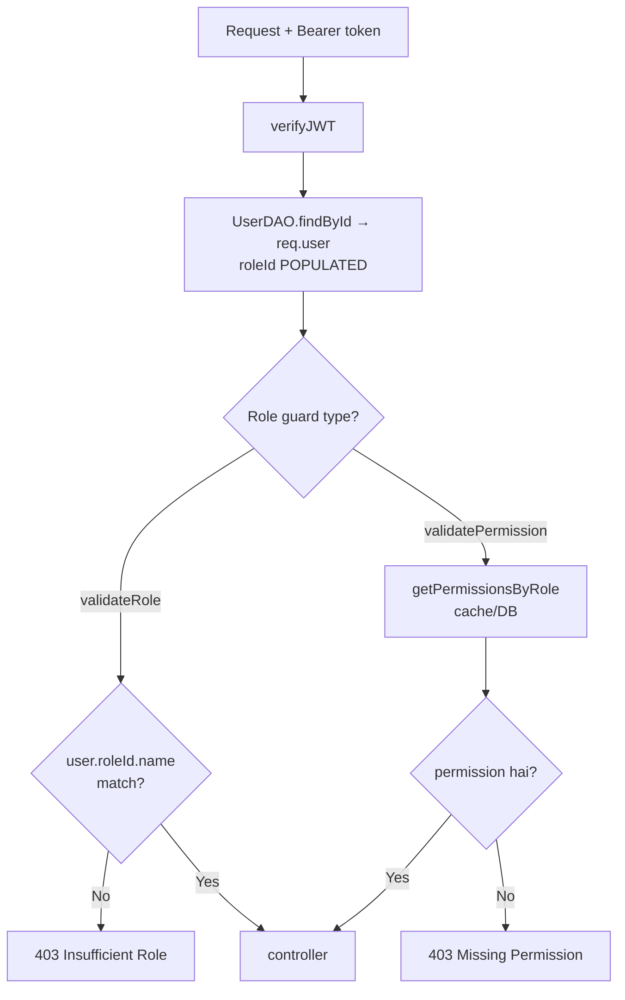

# 09 — Authorization (RBAC)

> **Created:** 2026-08-01
> **File type:** Security deep-dive
> **Padhne ka time:** ~25 min

---

## WHAT — Authorization kya hai?

Authentication ne bataya "tum kaun ho". **Authorization** batata hai "tum kya kar sakte ho". QuickBihar ek **custom RBAC** (Role-Based Access Control) system use karta hai — 3 collections: **Role**, **Permission**, **RolePermission**.

---

## WHY — RBAC kyun (simple role check ki jagah)?

Kyunki alag-alag roles ko alag-alag cheezein karne ki permission chahiye. Sirf "isAdmin" check kaafi nahi jab aapko fine-grained control chahiye (jaise "yeh seller coupon bana sakta hai par category nahi"). RBAC permissions ko roles se **decouple** karta hai — permission add/remove karo bina code badle.

---

## WHERE — RBAC ka poora code

| File | Kaam |
|------|------|
| `modules/common/rbac/rbac.model.ts` | Role, Permission, RolePermission schemas |
| `modules/common/rbac/rbac.types.ts` | RoleEnum, ModuleEnum, DomainEnum |
| `modules/common/rbac/rbac.constants.ts` | PERMISSIONS list (har permission ka code) |
| `modules/common/rbac/ROLE_PERMISSION_MAP.ts` | ★ Kaunse role ke paas kaunsi permissions |
| `modules/common/rbac/rbac.service.ts` | Role/permission CRUD + assign logic |
| `modules/common/rbac/rbac.middleware.ts` | ★ `validateRole`, `validatePermission`, `checkPermissions` |
| `modules/common/rbac/rbac.dao.ts` | DB queries + permission cache |
| `modules/common/rbac/rbac.routes.ts` | RBAC management endpoints |
| `middlewares/auth.middleware.ts` | `isAdmin`/`isSeller`/etc. (RBAC ke wrappers) |

---

## HOW — Data model (3 collections)

```
┌─────────────┐         ┌──────────────────┐         ┌──────────────┐
│    Role     │◄────────│  RolePermission  │────────►│  Permission  │
│             │  roleId │  (join table)    │ permId  │              │
│ name (enum) │         │  roleId          │         │ code (unique)│
│ isActive    │         │  permissionId    │         │ module (enum)│
└─────────────┘         │  UNIQUE(role,perm)│        │ domain (enum)│
      ▲                 └──────────────────┘         └──────────────┘
      │ roleId (ref)
┌─────────────┐
│    User     │   ← har user ke paas EK roleId (single-role system)
│  roleId     │
└─────────────┘
```

### Role schema
```
name:     enum RoleEnum (USER/SELLER/DELIVERY/ADMIN/SUPER_ADMIN), unique, indexed
description: String
isActive: Boolean (default true, indexed)
```

### Permission schema
```
code:        String, unique, indexed  (e.g. "CREATE_ORDER")
module:      enum ModuleEnum (PRODUCT/ORDER/USER/...), indexed
domain:      enum DomainEnum (CLOTHING/GLOBAL), default GLOBAL, indexed
description: String
```

### RolePermission schema (join table)
```
roleId:       ref Role, indexed
permissionId: ref Permission, indexed
UNIQUE compound index: { roleId, permissionId }  ← duplicate mapping nahi
```

> **Single-role system (verified):** User ke paas **ek hi `roleId`** hota hai (`user.model.ts` mein `roleId` single field, array nahi). `assignUserToRole` bas `user.roleId` set kar deta hai. `removeUserFromRole` ek **no-op** hai (code mein comment: "single-role mode — no action taken").

---

## WHO — 5 roles (RoleEnum)

```
┌─────────────┬────────────────────────────────────────────────┐
│ USER        │ Customer                                        │
│ SELLER      │ Dukaandaar                                      │
│ DELIVERY    │ Rider (mobile clients kabhi "RIDER" bolte hain) │
│ ADMIN       │ Staff / operations                              │
│ SUPER_ADMIN │ Sabse upar — SAARI permissions                  │
└─────────────┴────────────────────────────────────────────────┘
```

> **RIDER alias:** `RIDER_ROLE_ALIAS = "RIDER"` — yeh **RoleEnum ka member NAHI hai**. Purane mobile clients "RIDER" bolte hain jo actually "DELIVERY" role hai. Yeh compatibility ke liye hai.

---

## HOW — Role → Permission map (`ROLE_PERMISSION_MAP.ts`)

Yeh file define karti hai ki seed ke time kaunse role ko kaunsi permissions milengi:

| Role | Kya kar sakta hai (permissions ka summary) |
|------|---------------------------------------------|
| **USER** | `VIEW_PRODUCT`, `CREATE_ORDER`, `CREATE_REVIEW` (bas — customer minimal) |
| **SELLER** | Store CRUD, product create/update, order view/update/cancel, coupon CRUD, banner CRUD, return approve/reject, payment/payout view+process, transactions, seller+platform analytics |
| **DELIVERY** | `VIEW_ORDER`, `UPDATE_DELIVERY_STATUS`, `HANDLE_PAYMENT`, `VIEW_PAYOUT` (rider minimal) |
| **ADMIN** | Sab SELLER waali + category/attribute CRUD, `VERIFY_STORE`, `ASSIGN_ROLE`, `MANAGE_PERMISSION` |
| **SUPER_ADMIN** | `Object.values(PERMISSIONS)` — **SAARI permissions** (poora access) |

**Interesting observations (verified):**
- **SELLER ke paas kaafi permissions hain** — banners, coupons, payouts bhi. Yeh design hybrid marketplace ke liye hai (seller kaafi self-manage karta hai).
- **DELIVERY minimal** — sirf order dekh sakta hai + delivery status update + payment handle (COD collect) + payout dekh sakta hai.
- **SUPER_ADMIN** dynamically saari permissions leta hai (`.map(p => p.code)`) — koi permission chhoot nahi sakti.

---

## HOW — 3 authorization middlewares (`rbac.middleware.ts`)

### 1. `validateRole(...roleIds)` — role check
```javascript
validateRole(RoleEnum.ADMIN, RoleEnum.SUPER_ADMIN)
// user.roleId._id === roleId  OR  user.roleId.name === roleId  → allow
// nahi → 403 "Insufficient Role"
```
Yeh **role name ya id** dono se match karta hai. Zyadatar name se (jaise "ADMIN").

### 2. `validatePermission(permissionId)` — single permission check
```javascript
// user.roleId._id se getPermissionsByRole → permission map
// assignedPermissions[permissionId] hai? → allow : 403
```
> **Bug fix note (code comment se):** Pehle yeh `req.params.roleId` padhta tha (galat — caller ka role nahi). Ab **caller ke role** pe gate karta hai. Comment: "the guard threw 400 on every request" — ab fixed.

### 3. `checkPermissions(requiredPermissions[])` — multiple permissions (ALL)
```javascript
// requiredPermissions.every(p => primaryPerms[p])  → sab honi chahiye
// koi missing → 403
```

### Convenience wrappers (`auth.middleware.ts`)
```javascript
isAdmin       = validateRole(ADMIN, SUPER_ADMIN)
isSuperAdmin  = validateRole(SUPER_ADMIN)
isSeller      = validateRole(SELLER)
isDelivery    = validateRole(DELIVERY)
isSellerOrAdmin = custom (SELLER/ADMIN/SUPER_ADMIN)
```

---

## HOW — Permission caching (performance)

`getPermissionsByRole` **cached** hai (`rolePermissionDao.getCachedPermissions`). Jab permission assign/remove hoti hai, cache invalidate hota hai (`invalidateCache(roleId)`). Isse har request pe DB join nahi karna padta.

```
Request → validatePermission → getPermissionsByRole(roleId)
                                    │
                                    ├─ cache hit → turant return
                                    └─ cache miss → DB join → cache set
```

Detail: [15_Caching.md](./../data/caching.md).

---

## FLOW — Ek protected request pe authorization (cross-ref with auth)



**Cross-reference chain (yeh yaad rakho):**
```
verifyJWT (auth.middleware)  →  req.user set (roleId populated)
     ↓
validateRole / validatePermission (rbac.middleware)  →  role/permission check
     ↓
controller  →  service
```
Auth aur RBAC ek doosre pe depend karte hain — `verifyJWT` **pehle** chalna zaroori hai (warna `req.user` undefined). Dekho [08_Authentication.md](././authentication.md).

---

## RBAC management endpoints (`/api/v1/rbac`)

Saare `validateRole(ADMIN)` se protected:

| Method | Path | Kaam |
|--------|------|------|
| POST/GET | `/permissions` | Permission create / list |
| GET/PATCH/DELETE | `/permissions/:id` | Permission get/update/delete |
| POST/GET | `/roles` | Role create / list |
| GET/PATCH/DELETE | `/roles/:id` | Role get/update/delete |
| POST/DELETE | `/roles/:roleId/permissions/:permissionId` | Permission assign/remove to role |
| GET | `/roles/:roleId/permissions` | Role ki permissions |
| POST | `/user-roles/assign` | User ko role assign |
| POST | `/user-roles/revoke` | (single-role: no-op) |
| GET | `/user-roles/:userId` | User ka role |

---

## WHEN — RBAC seed (fresh deploy pe)

Roles + permissions DB mein hone chahiye tabhi authorization kaam karega. Seed script (`db/rbacSeed.ts` / `seed/seed.ts`) roles upsert karta hai (RoleEnum ke हर value ke liye ek Role) aur `ROLE_PERMISSION_MAP` ke hisaab se permissions assign karta hai.

> ⚠️ **CRITICAL:** `server.ts` mein `seedRbac()` **commented out** hai. Fresh DB pe RBAC manually seed karna padega, warna koi bhi role guard fail hoga (kyunki `getRoleByName` 404 dega). Dekho 24_Developer_Guide.md.

---

## DEPENDENCIES

- **Isse pehle:** [08_Authentication.md](././authentication.md) (authorization se pehle authentication)
- **Related:** [15_Caching.md](./../data/caching.md) (permission cache), 19_Security.md
- **Seed:** 24_Developer_Guide.md

---

## RISKS

- ⚠️ **`/api/v1/rbac` pe `verifyJWT` explicitly nahi dikha.** `app.ts` mein `rbacRouter` bina `verifyJWT` ke mount hai, aur router khud sirf `validateRole(ADMIN)` lagata hai. `validateRole` `req.user` pe depend karta hai jo `verifyJWT` set karta hai. Iska matlab ya toh yeh routes **fail-closed** (hamesha 403, kyunki `req.user` undefined) ho rahe hain, ya kahin upstream `verifyJWT` expected hai. **Yeh flow verify karna chahiye** — maine code padha par yeh spot ambiguous hai. (Baaki routers jaise order/delivery apne andar `router.use(verifyJWT)` karte hain; rbac router nahi karta.)
- ⚠️ **Single-role limitation** — ek user ka ek hi role. Multi-role use case (jaise seller + rider dono) support nahi.
- ⚠️ **Permission cache invalidation** — agar cache invalidate na ho toh purani permissions reflect hongi. Assign/remove pe hi invalidate hota hai (verified).

---

## IMPROVEMENTS

- `rbac.routes.ts` mein `router.use(verifyJWT, validateRole(ADMIN))` explicitly lagana (defense-in-depth + clarity).
- Idempotent auto-seed on boot (RBAC roles/permissions).
- Multi-role support agar future mein zaroorat pade.

---

*Verified against `rbac.model.ts`, `rbac.service.ts`, `rbac.middleware.ts`, `ROLE_PERMISSION_MAP.ts`, `rbac.routes.ts`, `auth.middleware.ts` — sab 2026-08-01 ko padhe gaye. `/rbac` verifyJWT gap explicitly flagged as needing verification (honesty note).*
