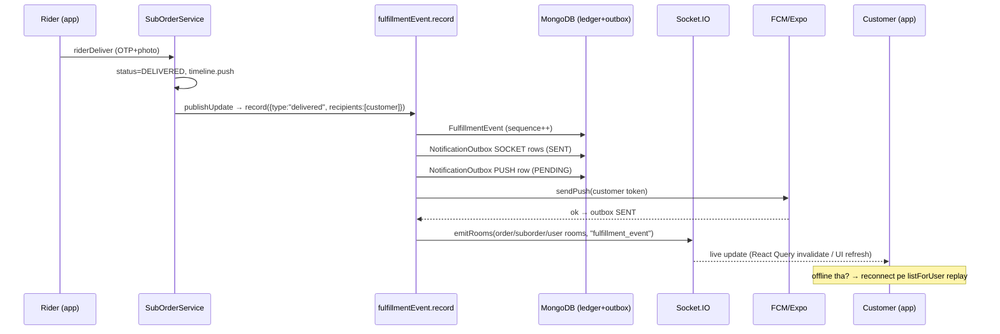

# 14 — Notifications & Realtime

> **Created:** 2026-08-01
> **File type:** Feature deep-dive
> **Padhne ka time:** ~35 min

---

## WHAT — Yeh doc kya cover karti hai?

QuickBihar ka **realtime + notification engine** — do alag subsystems:

```
1. TRANSACTIONAL (fulfillment events)   ← order/sub-order status changes
   record() → FulfillmentEvent ledger → NotificationOutbox → Socket.IO + FCM push
   (DB-first, idempotent, replayable)

2. CAMPAIGN (admin broadcasts)          ← marketing/promo push
   notification.queue (BullMQ) → notification.worker → FCM multicast + Expo + IN_APP socket
   (fan-out, chunked, ALERT/SILENT/LIVE_ACTIVITY)
```

Dono **Socket.IO** (live in-app) aur **FCM/Expo push** (device notifications) use karte hain. Realtime layer web (React Query cache invalidation) aur mobile dono ko feed karta hai.

---

## WHY — DB-first realtime kyun (seedha socket kyun nahi)?

Naive approach: status change hua → seedha `socket.emit`. Problem: agar client us waqt offline/disconnected tha, **event gum** ho gaya. Koi record nahi, koi replay nahi.

QuickBihar ka approach: **pehle DB mein likho, phir emit karo.**

```
Status change → FulfillmentEvent (immutable ledger, sequenced) → THEN socket + push
```

Fayde:
1. **No lost events** — client reconnect pe `listForUser` se poora timeline replay kar sakta hai.
2. **Idempotency** — `NotificationOutbox` mein har delivery ka ek row (deterministic key), duplicate send se bachaव.
3. **Audit** — kaunsa event kab kaha bheja gaya, sab DB mein.
4. **Ordering** — per-scope `sequence` number, events ka sahi order guarantee.

> ★ Yeh **event-sourcing-lite** pattern hai. Ledger source of truth, socket/push sirf delivery channels. Dekho [11_Order_System.md](././orders.md) jaha har state transition `publishUpdate` → `record()` call karta hai.

---

## WHERE — Files

| File | Kaam |
|------|------|
| `modules/common/socket/socket.service.ts` | ★ Socket.IO server: JWT auth, rooms, location updates |
| `modules/common/fulfillment/fulfillmentEvent.service.ts` | ★ `record()` — ledger + outbox + emit; `listForUser` replay |
| `modules/common/fulfillment/fulfillmentEvent.model.ts` | Immutable event ledger (eventId, sequence, rooms) |
| `modules/common/fulfillment/notificationOutbox.model.ts` | Idempotent delivery ledger (SOCKET/PUSH rows) |
| `modules/common/notification/notification.service.ts` | Firebase Admin init + `sendPush` (FCM/Expo routing) |
| `modules/common/notification/notification.queue.ts` | BullMQ queue (`notification-queue`, Redis) |
| `modules/common/notification/notification.worker.ts` | ★ Campaign worker — FCM multicast + Expo + IN_APP socket |
| `modules/common/notification/notification.model.ts` | Campaign doc (targetType, deliveryChannel/Type) |
| `constants/socketEvents.ts` | Event name registry (web/mobile mirror) |

---

## WHERE — Socket events (`socketEvents.ts` registry)

```
ORDER_STATUS_UPDATE      "order_status_update"       → specific user
NEW_ORDER                "new_order"                 → admins room
ORDER_CONFIRMED          "order_confirmed"           → admins room
STOCK_UPDATE             "stock_update"              → all users (broadcast)
FULFILLMENT_EVENT        "fulfillment_event"         → resolved rooms
RIDER_JOB_OFFER          "rider_job_offer"           → rider (matching)
RIDER_OFFER_CLOSED       "rider_offer_closed"        → rider (offer taken/expired)
DELIVERY_LOCATION_UPDATED"delivery_location_updated" → order/suborder room
NEW_NOTIFICATION         "new_notification"          → campaign IN_APP
NOTIFICATION_STATUS_UPDATE "notification_status_update" → admins (campaign progress)
JOIN/LEAVE_ORDER_ROOM, JOIN/LEAVE_SUBORDER_ROOM, UPDATE_DELIVERY_LOCATION (client→server)
```

> ⚠️ **Manual mirror:** yeh file `web/src/constants/socketEvents.ts` aur mobile ke event names ka **manual mirror** hai. Ek jagah naam badla, doosri jagah bhoolna = silent break. Dekho [03_Frontend.md](./../apps/web-dashboard.md) + RISKS.

---

## HOW — Socket layer (`socket.service.ts`)

### Connection auth (handshake JWT)

Har socket connection **authenticate** hota hai connect se pehle (`io.use` middleware):

```
1. token = handshake.auth.token || headers.authorization ("Bearer ...")
2. token missing → reject "Authentication error: Token missing"
3. jwt.verify(token, ACCESS_TOKEN_SECRET) → decoded._id
4. User.findById(decoded._id).populate("roleId")  → nahi mila? reject
5. socket.user = user  → connection allow
```

> ★ HTTP `verifyJWT` jaisa hi, par socket handshake pe. Bina valid token ke socket connect hi nahi hota — **security boundary yaha real hai** (proxy.ts ke ulta, dekho [03_Frontend.md](./../apps/web-dashboard.md)).

### Room model (dual naming)

Connect hote hi user apne role-based rooms join karta hai. **Har room ke do naam** hain (colon `:` aur underscore `_`) — legacy compatibility ke liye:

```
Sab users:  user:<id>    + user_<id>
Role:       role_<rolename lowercase>
SELLER:     seller:<id>  + seller_<id>
DELIVERY:   rider:<id>   + rider_<id>
ADMIN/SUPER:admin + admins
On-demand:  order:<id>/order_<id>, suborder:<id>/suborder_<id>  (join event pe)
```

`emitToRoom` dono naming variants pe emit karta hai (`room.replace(":", "_")`). Yeh **tech debt** hai — do naming schemes ek saath maintain karna. Dekho RISKS.

### Room-join authorization (ownership check)

Order/sub-order room join karne se pehle **ownership verify** hota hai (koi doosre ka order track na kar sake):

```
canJoinOrderRoom(user, orderId):
  admin? → allow
  order.userId === user? → allow (customer)
  order.items[].sellerId === user? → allow (seller)
  order.delivery.partnerUserId === user? → allow (rider)
  warna → deny ("Order room access denied")

canJoinSubOrderRoom(user, subOrderId):
  admin / suborder.sellerId / suborder.delivery.riderId / parentOrder.userId → allow
```

> ★ **Yeh important security detail hai:** socket rooms bhi RBAC-gated hain. Sirf JWT valid hona kaafi nahi — us specific order/suborder ka stakeholder hona padta hai. Warna koi bhi authenticated user kisi bhi order ka live tracking dekh leta.

### Live location tracking (`UPDATE_DELIVERY_LOCATION`)

Rider apni location socket se bhejta hai → DB update → order/suborder room mein broadcast:

```
rider emits UPDATE_DELIVERY_LOCATION { orderId|subOrderId, lat, lng, heading }
  → DeliveryBoy.currentLocation update (2dsphere point)
  → subOrder.delivery.currentLocation update (agar suborder)
  → emit "delivery_location_updated" to suborder room
  → parent order bhi update (backward compat) + emit to order room
```

`orderId.includes("-")` se decide hota hai ki yeh subOrderId hai ya parent orderId (subOrderId format mein `-` hota hai). Customer live map pe rider ka movement dekhta hai.

### Emit helpers

```
emitToUser(userId)      → user:<id> + user_<id> + tracked socketIds
emitToAdmins()          → admin + admins
emitToOrderRoom(id)     → order:<id> + order_<id>
emitToSubOrderRoom(id)  → suborder:<id> + suborder_<id>
emitToRoom(room)        → room (+ underscore variant if colon)
emitToAll()             → io.emit (global broadcast, e.g. STOCK_UPDATE)
```

`userSockets` Map (`userId → socketIds[]`) multi-device support ke liye — ek user ke kai devices, sab ko emit.

---

## HOW — Transactional fulfillment events (`record()`)

Yeh **subsystem 1** ka dil hai. Har order/sub-order state change (dekho [11_Order_System.md](././orders.md) ka `publishUpdate`) yaha aata hai:

```
record({ type, status, actor, orderId, subOrderId, metadata, rooms, recipients }):
  1. recipientIds resolve (valid ObjectIds)
  2. rooms compute: explicit rooms + order:<id> + suborder:<id> + user:<recipientId>
  3. sequence = countDocuments(scopeFilter) + 1   ← per suborder/order monotonic
  4. FulfillmentEvent.create({ eventId, sequence, ...})   ← IMMUTABLE ledger row
  5. queueSocketNotifications(eventId, rooms, payload)     ← SOCKET outbox rows (SENT)
  6. queuePushNotifications(eventId, recipients, payload)  ← PUSH outbox + FCM send
  7. emitRooms(rooms, payload)                             ← live socket emit (+ admins)
  return payload
```

- **`eventId`**: `evt_<timestamp>_<random>` — globally unique.
- **`sequence`**: per-scope counter (suborder ya order). Client events ko sahi order mein laga sakta hai (out-of-order socket delivery ke against).
- **`recipientIds` + `rooms`** dono ledger pe store hote hain → `listForUser` inhi se filter karta hai.

### Replay feed (`listForUser`)

Client reconnect pe ya history ke liye:

```
listForUser(user, { limit≤200, after }):
  rooms = roleRoomsFor(user)   (user:, seller:, rider:, admins based on role)
  filter: recipientIds == user  OR  rooms ∈ user ke rooms
  after cursor → occurredAt > anchor.occurredAt
  sort occurredAt asc, sequence asc → normalized payloads
```

Isse client apna poora fulfillment timeline rebuild kar sakta hai, chahe kuch events live miss hue hon.

---

## HOW — NotificationOutbox (idempotency + audit)

Har delivery attempt ka **ek row** banta hai, deterministic key ke saath:

```
SOCKET: idempotencyKey = `${eventId}:SOCKET:${room}`   status="SENT"  (fire-and-forget)
PUSH:   idempotencyKey = `${eventId}:PUSH:${recipientId}`
        status = token ? "PENDING" : "SKIPPED"
```

Schema (`INotificationOutbox`):
```
idempotencyKey (unique index!), eventId, channel(SOCKET/PUSH/EMAIL/SMS),
status(PENDING/SENT/FAILED/SKIPPED), recipientId, room, title, body,
payload, attempts, nextAttemptAt, sentAt, lastError
```

- **`idempotencyKey` unique** — same event+room/recipient ka duplicate row nahi banega (`insertMany({ordered:false}).catch()` races swallow karta hai). Yeh **double-notification guard** hai.
- SOCKET rows `insertMany` (bulk, audit-only, SENT maan liya).
- PUSH rows individually created, phir send, phir `SENT` ya `FAILED` (5-min `nextAttemptAt` retry window).

### Push send lifecycle (per recipient)

```
1. Users query: recipients with fcmToken exists & non-empty
2. token nahi → outbox row SKIPPED (koi send nahi)
3. token hai → outbox PENDING → sendPush(token, title, body, {eventId,orderId,...})
     success → updateOne status="SENT", attempts++
     fail    → status="FAILED", lastError, nextAttemptAt = now+5min, attempts++
```

> ⚠️ **CRITICAL honesty (verified):** Outbox pe `nextAttemptAt` retry window set hota hai, par code mein **koi worker/cron jo PENDING/FAILED rows ko drain kare woh nahi mila** (`NotificationOutbox.find` sirf yahi service likhti hai, koi consumer nahi). Iska matlab: filhaal outbox ek **idempotency guard + audit ledger** hai, par **automatic push retry actually wired nahi** hai. Failed push abhi retry nahi hota (sirf record hota hai). Dekho RISKS.

---

## HOW — Push delivery (`sendPush`, Firebase + Expo)

### Firebase Admin init (`notification.service.ts`)

```javascript
if (admin.apps.length === 0)
  admin.initializeApp({
    credential: admin.credential.cert({
      projectId: ENV.FIREBASE_PROJECT_ID,
      clientEmail: ENV.FIREBASE_CLIENT_EMAIL,
      privateKey: ENV.FIREBASE_PRIVATE_KEY.replace(/\\n/g, "\n"),  // env escaping fix
    }),
  });
```

> ⚠️ `FIREBASE_PRIVATE_KEY` sensitive secret hai (env se, `\n` un-escape). Iske alawa repo mein `quickbihar-firebase-adminsdk-*.json` service-account file bhi ho sakti hai — **kabhi commit/echo mat karo**. Dekho 19_Security.md.

### Token routing (Expo vs native FCM)

```
token.startsWith("ExponentPushToken[" | "ExpoPushToken[")  → Expo Push API (exp.host)
else                                                        → native Firebase FCM
```

Ek hi codebase dono handle karta hai kyunki mobile Expo (SDK 56) pe hai par kuch native FCM tokens bhi ho sakte hain. `sendPush` per-token route karta hai; campaign worker unhe **do buckets** mein baant ke bhejta hai.

---

## HOW — Campaign notifications (subsystem 2: BullMQ worker)

Admin promo/announcement bhejta hai → **BullMQ** (Redis-backed queue) → worker fan-out. HTTP request block nahi hota (async job).

```
Admin POST /notifications/send → Notification doc create + notificationQueue.add(job)
        │
        ▼ (BullMQ, Redis, concurrency: 2)
notification.worker consumes job:
  1. Notification.findById; expired? → FAILED
  2. status → PROCESSING (emit NOTIFICATION_STATUS_UPDATE to admins)
  3. Target users resolve:
       SPECIFIC → targetUser
       ROLE     → Role lookup → users with roleId
       ALL      → all DeviceTokens (broadcast)
  4. Tokens split: expoTokens vs fcmTokens
  5. FCM: chunkArray(fcmTokens, 500) → admin.messaging().sendEachForMulticast
     Expo: chunkArray(expoTokens, 100) → POST exp.host/--/api/v2/push/send
  6. IN_APP: socket emit NEW_NOTIFICATION (ALL / role room / per-user)
  7. sentCount/failedCount tally → status SENT → emit to admins
```

### Delivery channels & types

```
DeliveryChannel: FCM | IN_APP | BOTH        ← push aur/ya in-app socket
DeliveryType:    ALERT | SILENT | LIVE_ACTIVITY
  ALERT         → visible notification block (title/body/image)
  SILENT        → data-only (background refresh; apns content-available, android normal)
  LIVE_ACTIVITY → ongoing (iOS live activity; PENDING/PROCESSING/SENT = ongoing)
```

- **Chunking** kyun: FCM multicast max 500 tokens/call, Expo ~100/call. Bade audience ke liye chunks mein bhejte hain.
- **Deep links**: `redirectType` (product/category/mall/external) se `quickbihar://...` deep link generate.
- **Image optimization**: ImageKit URLs pe `tr=w-800,q-80,f-auto` transform apply (`optimizeNotificationImageUrl`).
- **Action buttons**: `actionButtonText` → category ID mapping (`PROMOTION_BUY_NOW` etc.) for interactive push.

---

## FLOW — Sub-order DELIVERED → customer notified (end-to-end)



---

## WHO — Kaun kya notify hota hai

| Actor | Kaunse events / notifications |
|-------|------------------------------|
| **Customer** | Order status (confirmed/packed/out-for-delivery/delivered/returned), live rider location, campaign promos |
| **Seller** | New order, return requests, payout/settlement, low-stock, campaign (role) |
| **Rider** | Job offers (`RIDER_JOB_OFFER`), offer closed, COD settled |
| **Admin** | New order, notification campaign progress (`NOTIFICATION_STATUS_UPDATE`), all fulfillment events (admins room) |

---

## DEPENDENCIES

- **Isse pehle:** [11_Order_System.md](././orders.md) (jaha har transition `publishUpdate` → `record()` call karta hai)
- **Related:** [08_Authentication.md](././authentication.md) (socket handshake JWT), [09_Authorization_RBAC.md](././authorization-rbac.md) (room-join ownership), [03_Frontend.md](./../apps/web-dashboard.md) (web socket cache invalidation), [05_Mobile_App.md](./../apps/mobile-app.md) (push handling)
- **Infra:** [15_Caching.md](./../data/caching.md) (Redis — BullMQ same Redis), [16_Environment.md](./../operations/environment.md) (FIREBASE_*, REDIS_URL, ACCESS_TOKEN_SECRET)
- **External:** Firebase FCM, Expo Push API, Redis (BullMQ), Socket.IO

---

## RISKS

- ⚠️ **Push retry not wired (verified)** — `NotificationOutbox` pe `nextAttemptAt`/`FAILED` set hota hai par koi worker/cron unhe drain karke re-send nahi karta. Failed push abhi **retry nahi hota** — sirf record hota hai. Idempotency + audit kaam karta hai, delivery guarantee nahi.
- ⚠️ **In-process Socket.IO (single-instance)** — `socketService` in-memory `userSockets` Map + local `io` use karta hai. Multi-instance deploy pe ek instance ka emit doosre instance ke connected clients tak nahi pahunchega. Socket.IO Redis adapter chahiye horizontal scale ke liye. Consistent with [11_Order_System.md](././orders.md) ka in-process matching loop risk.
- ⚠️ **`sequence` via `countDocuments` (race)** — sequence = `countDocuments + 1`. Do events ek saath aayein toh same sequence mil sakta hai (unique index nahi sequence pe). High concurrency pe ordering collision. Atomic counter better.
- ⚠️ **socketEvents.ts manual mirror** — server, web, mobile teeno alag copy. Naam mismatch = silent break. Shared package chahiye.
- ⚠️ **Dual room naming (`:` + `_`)** — har emit do rooms pe, har join do rooms. Maintenance overhead + double emit. Legacy migration adhura.
- ⚠️ **Campaign "ALL" broadcast cost** — `targetType:"ALL"` saare `DeviceToken` fetch karta hai + 500-token chunks. Bahut bade user base pe memory/time spike. Rate limiting/pagination nahi.
- ⚠️ **FCM secret handling** — `FIREBASE_PRIVATE_KEY` env mein; service-account JSON repo mein na aaye. Token substrings logs mein print hote hain (partial) — production logging review karo.
- ⚠️ **BullMQ concurrency: 2** — ek worker, 2 concurrent jobs. Bade campaign backlog pe slow. Tuning/scaling verified nahi.

---

## IMPROVEMENTS

- **Outbox drain worker** — cron/BullMQ job jo `status:{PENDING,FAILED}, nextAttemptAt≤now` rows ko re-send kare (retry ko actually wire karo).
- **Socket.IO Redis adapter** — multi-instance realtime ke liye (`@socket.io/redis-adapter`).
- **Atomic sequence** — per-scope counter document ya Mongo `$inc` se sequence generate (countDocuments race khatam).
- **Shared socketEvents package** — server/web/mobile ek source se import.
- **Single room naming** — colon ya underscore, ek choose karke migrate.
- **Campaign audience pagination** — "ALL" broadcast ko batch/stream karo, memory bound.
- **Delivery receipts** — Expo/FCM receipt polling se actual delivery confirm (abhi sirf send success track).

---

*Verified against `socket.service.ts` (JWT handshake, rooms, ownership guards, location), `fulfillmentEvent.service.ts` (record/listForUser/outbox), `fulfillmentEvent.model.ts`, `notificationOutbox.model.ts`, `notification.worker.ts` (BullMQ FCM/Expo fan-out), `notification.service.ts` (Firebase init/sendPush), aur `socketEvents.ts` on 2026-08-01. Outbox retry gap (no drain consumer) aur sequence-via-countDocuments race code se confirm kiye gaye — hallucinate nahi.*
