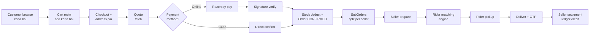

# 00 — Project Overview

> **Created:** 2026-08-01 · **Updated:** 2026-09-05 (sellers and riders require admin approval before they can use their dashboards — phone is required for SELLER/RIDER in their onboarding registration form, optional for normal USERs; partners authenticate via Google and register in a single streamlined step)
> **File type:** Foundation doc
> **Padhne ka time:** ~10 min

---

## WHAT — Yeh project kya hai?

QuickBihar ek **hyperlocal multi-vertical e-commerce platform** hai. Simple shabdon mein: ek aisa app jaha **local sellers** apne saaman bech sakte hain, **customers** order kar sakte hain, aur **local riders** (delivery boys) order pickup karke deliver karte hain — sab kuch ek chhote geographic area (hyperlocal) ke andar.

"Multi-vertical" ka matlab: platform ek se zyada business types (verticals) support karne ke liye design kiya gaya hai:
- 👕 **Clothing** (apparel) — **abhi yeh LIVE hai**, poora working hai.
- 🍔 **Food** — abhi sirf placeholder/scaffold hai (screens hain par backend logic nahi).
- 💍 **Jewelery** — abhi sirf placeholder/scaffold hai.

> ⚠️ **Important honesty note:** Code mein `food` aur `jewelery` ke folders/screens toh dikhte hain, par unka koi real backend product model ya order flow nahi hai. Poora business logic abhi **clothing** ke around bana hai. Isko detail mein 28_Add_New_Business_Type.md aur 30_Tech_Debt.md mein samjhaaya gaya hai.

---

## WHO — Kaun use karta hai? (Actors)

System mein 5 tarah ke log hain. Yeh RBAC roles se match karte hain (dekho [09_Authorization_RBAC.md](./../features/authorization-rbac.md)):

```
┌─────────────┬──────────────────────────────────────────────────────┐
│ Role        │ Kaun hai / kya karta hai                              │
├─────────────┼──────────────────────────────────────────────────────┤
│ USER        │ Customer — mobile app pe browse + order karta hai     │
│ SELLER      │ Dukaandaar — web seller portal pe products/orders     │
│ DELIVERY    │ Rider/courier — order pickup + deliver (web + mobile) │
│ ADMIN       │ Staff — web admin portal, operations manage karta hai │
│ SUPER_ADMIN │ Sabse upar — poore system config ka access            │
└─────────────┴──────────────────────────────────────────────────────┘
```

> **Note:** Kabhi-kabhi purane mobile clients "RIDER" bolte hain jo actually "DELIVERY" role hi hai (alias). Code mein iske liye `RIDER_ROLE_ALIAS = "RIDER"` constant hai. Detail: [09_Authorization_RBAC.md](./../features/authorization-rbac.md).

Har actor ka apna entry point hai:

| Actor | Kaha se use karta hai |
|-------|----------------------|
| Customer (USER) | Mobile app (`mobile/`) |
| Seller | Web seller portal (`web/` → `/seller/*`) — **gated on admin approval of the partner application** |
| Rider (DELIVERY) | Web delivery portal (`/delivery/*`) **aur** mobile rider tab — **gated on admin approval of the partner application** |
| Admin / Super Admin | Web admin portal (`/admin/*`) **aur** mobile admin tab |

> **Identity verification:** sellers and riders collect a phone number at sign-up (Zod-validated, `^\+?\d{10,15}$`). The admin uses the phone to verify the applicant before approving the partner application; an unapproved applicant can sign in but is redirected to `/seller/register` or `/delivery/register` instead of the live dashboard. Detail: [authentication.md → Admin verification gate](./../features/authentication.md#admin-verification-gate-login--dashboard).

---

## WHY — Yeh project kyun exist karta hai? (Business model)

Business model ek **HYBRID MARKETPLACE** hai. Iska matlab platform paise 3 tarah se banata hai (yeh sab pricing engine mein code kiya gaya hai — dekho [11_Order_System.md](./../features/orders.md) aur `orderPricing.service.ts`):

1. **Marketplace Commission** — har seller ki sale ka ek % (default `15%`, env `MARKETPLACE_COMMISSION_PERCENT`) platform rakhta hai.
2. **Delivery Fee** — customer se shipping fee (agar order chhota hai; badे order pe free).
3. **Dynamic Surcharge** — rush/rain/night/festival ke time extra charge (rider ko bonus dene ke liye).

Aur platform ka kharcha:
- **Rider Payout** — rider ko distance ke hisaab se paisa (3km tak ₹20, 5km tak ₹30, 8km tak ₹45, phir extra per km).

Iska naam code mein **`HYBRID_MARKETPLACE_V1`** hai (pricing snapshot ka model field).

### Ek line mein revenue formula:

```
App Gross Revenue  = Platform Commission + Delivery Fee + Dynamic Surcharge
App Net (estimate) = App Gross Revenue − Rider Payout Estimate
```

Yeh exact formula `orderPricing.service.ts` mein hai (verified). Poori calculation [11_Order_System.md](./../features/orders.md) mein.

---

## WHEN — Kab kya hota hai? (High-level lifecycle)

Ek typical order ka safar (bird's eye view):



Har box ka detailed flow apni doc mein hai. Sabse important:
- Payment: [12_Payment_System.md](./../features/payments.md)
- Order split + fulfillment: [11_Order_System.md](./../features/orders.md)
- Rider matching: [11_Order_System.md](./../features/orders.md) (matching engine section)

---

## WHERE — Code kaha hai? (High-level map)

```
quickbihar.in/
├── server/     ← Backend brain (Express + Mongoose). Sabse important app.
├── web/        ← Admin/Seller/Delivery dashboards (Next.js)
├── mobile/     ← Customer + Rider mobile app (Expo)
├── nginx/      ← Reverse proxy config (production routing)
├── deploy/     ← Alternate nginx configs + deploy README
├── docs/       ← Yeh docs + purani audit/architecture docs
├── docker-compose.yml   ← Saari services ek saath chalane ke liye
└── .github/workflows/   ← CI/CD (build → Docker Hub → VPS deploy)
```

Detailed folder-by-folder breakdown: [01_Folder_Structure.md](././folder-structure.md).

---

## HOW — Teeno apps kaise juड़े hain? (Integration)

```
                    ┌──────────────────────────────┐
                    │   nginx proxy (port 80)      │
                    │   single origin routing      │
                    └───────────────┬──────────────┘
          /api/, /socket.io/ │      │ /web/, /_next/ │ /
                             ▼      ▼                ▼
                    ┌──────────┐ ┌──────┐  ┌──────────────┐
                    │ server   │ │ web  │  │ mobile-web   │
                    │ :8000    │ │:3000 │  │ (static)     │
                    └────┬─────┘ └──────┘  └──────────────┘
                         │
              ┌──────────┼───────────┐
              ▼          ▼           ▼
        ┌─────────┐ ┌───────┐ ┌───────────┐
        │ MongoDB │ │ Redis │ │ External  │
        │(Mongoose)│ │(cache+│ │ Razorpay  │
        │         │ │ queue)│ │ ImageKit  │
        └─────────┘ └───────┘ │ FCM/Expo  │
                              │ Resend    │
                              └───────────┘
```

- **Web aur Mobile** dono **server ki REST API** (`/api/v1/*`) use karte hain.
- Realtime updates ke liye dono **Socket.IO** se connect hote hain.
- Server sab external services ko orchestrate karta hai.

Deep architecture: [02_System_Architecture.md](././system-architecture.md).

---

## FLOW — Ek naye developer ka mental model

Agar aap yeh 5 cheezein samajh lo, toh aap 80% system samajh gaye:

1. **Server sab kuch control karta hai.** Web/mobile sirf "clients" hain jo API call karte hain. Business logic kabhi client pe trust nahi hota.
2. **Order → SubOrder split** — ek order agar 3 alag sellers ke items ka hai, toh woh 3 SubOrders mein tut jaata hai (`QB-XXXX-S1`, `-S2`, `-S3`). Har seller apna SubOrder independently handle karta hai.
3. **Realtime = DB + Socket.** Pehle DB mein event likho, phir socket emit karo. DB source of truth hai.
4. **RBAC har API pe.** Har protected route pehle JWT verify karta hai, phir role/permission check.
5. **common vs clothing** — yeh seam poore codebase mein hai. Isko samajhna future-proofing ke liye zaroori hai.

---

## DEPENDENCIES — Yeh doc kis pe depend karti hai / kaun ispe depend karti hai

- **Aage padho:** [01_Folder_Structure.md](././folder-structure.md) → [02_System_Architecture.md](././system-architecture.md)
- **Related:** 24_Developer_Guide.md (setup karne ke liye)

---

## RISKS — Is level pe kya dhyan rakhein

- ⚠️ **Multi-vertical abhi adhoora hai.** Marketing/PM ko lagta hoga food/jewelery ready hai — nahi hai. Sirf clothing production-ready hai.
- ⚠️ **Single VPS deployment.** Abhi ek hi self-hosted VPS pe sab chalta hai (koi horizontal scaling nahi). Detail: 17_Deployment.md.

---

## IMPROVEMENTS — Future ideas

- Multi-vertical ko sach mein generalize karna (abhi `sellerType: "CLOTHING"` kai jagah hardcoded hai).
- Managed database + Redis (abhi self-hosted).
- Roadmap: 32_TODO.md.

---

*Verified against codebase on 2026-08-01. Pricing model, roles, aur integration sab actual code (`orderPricing.service.ts`, `rbac.types.ts`, `docker-compose.yml`, `nginx/default.conf`) se confirm kiya gaya.*
