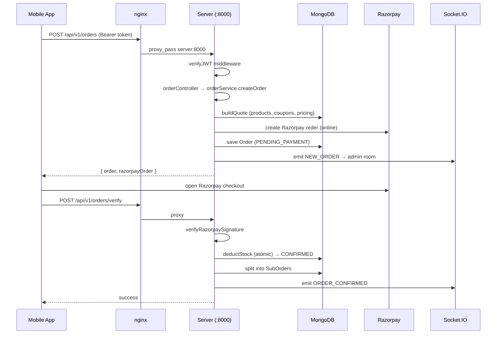

# 02 — System Architecture

> **Created:** 2026-08-01
> **File type:** Foundation doc
> **Padhne ka time:** ~25 min

---

## WHAT — Yeh doc kya cover karti hai?

Poore system ka **bird's-eye view**: teeno apps (server/web/mobile) kaise ek doosre se baat karte hain, request kaha se aati hai aur kaha jaati hai, kaunsi external services use hoti hain, aur server ke andar ka **layered architecture** kaisa hai.

---

## WHY — Architecture samajhna kyun zaroori hai?

Agar aapko high-level picture nahi pata, toh aap ek chhoti si change karte time bhi confuse ho jaoge — "yeh request kaha jaa rahi hai? socket kyun connect ho raha hai? nginx kya kar raha hai?" Yeh doc woh mental model deti hai.

---

## HOW — Teeno apps kaise judे hain? (Top-level)

Production mein **sab kuch ek hi origin (nginx port 80)** se serve hota hai. nginx ek **reverse proxy** hai jo path dekh kar decide karta hai ki request kaha bheji jaaye.

```
                          ┌─────────────────────────────────┐
                          │      Internet (browser/app)     │
                          └────────────────┬────────────────┘
                                           │
                                           ▼
                          ┌─────────────────────────────────┐
                          │   nginx proxy  (container :80)   │
                          │   quickbihar-proxy               │
                          └───┬─────────┬─────────┬──────────┘
             /api/  /socket.io/│  /web/  │ /_next/ │  /  (everything else)
                               ▼         ▼         ▼
                       ┌───────────┐ ┌────────┐ ┌──────────────┐
                       │  server   │ │  web   │ │  mobile-web  │
                       │  :8000    │ │ :3000  │ │  (static)    │
                       │  (Bun)    │ │(Next16)│ │  (Expo web)  │
                       └─────┬─────┘ └────────┘ └──────────────┘
                             │
              ┌──────────────┼─────────────────┐
              ▼              ▼                  ▼
        ┌──────────┐   ┌──────────┐    ┌──────────────────┐
        │ MongoDB  │   │  Redis   │    │  External APIs   │
        │(Mongoose)│   │ (cache + │    │  Razorpay        │
        │          │   │  BullMQ) │    │  ImageKit        │
        └──────────┘   └──────────┘    │  FCM (Firebase)  │
                                        │  Expo Push       │
                                        │  Resend (email)  │
                                        │  open-meteo (rain)│
                                        └──────────────────┘
```

### nginx routing (production ka asli config)

`nginx/default.conf` (LIVE config) exactly yeh routing karta hai:

| Path prefix | Kaha jaata hai | Kyun |
|-------------|---------------|------|
| `/api/` | `server:8000` | Saari REST API |
| `/socket.io/` | `server:8000` | Realtime WebSocket handshake (explicitly proxy karna zaroori, warna static container pe gir jaata) |
| `/web/` | `web:3000` | Next.js dashboards |
| `/_next/` | `web:3000` | Next.js static assets + built-in paths |
| `/` (baaki sab) | `mobile-web:80` | Expo mobile-web static app |

> ⚠️ **Order matters:** `/socket.io/` ko alag se proxy karna **zaroori** hai. Agar yeh block hata do, toh WebSocket handshake `/` (mobile-web) pe gir jaata hai aur realtime tut jaata hai. Config mein iska comment bhi likha hai.

Detail: 17_Deployment.md.

---

## WHERE — Server ka andar ka architecture (Layered)

Server **layered (N-tier) architecture** follow karta hai. Har HTTP request in layers se guzarti hai:

```
   HTTP Request
        │
        ▼
┌───────────────────────────────────────────────────────────┐
│  app.ts — Express app                                       │
│  ┌─────────────────────────────────────────────────────┐  │
│  │ MIDDLEWARE CHAIN (order matters!)                    │  │
│  │  1. loggerMiddleware        (request log)            │  │
│  │  2. cors                    (origin whitelist)       │  │
│  │  3. cookieParser            (cookies → req.cookies)  │  │
│  │  4. express.json (16kb)     (body parse)             │  │
│  │  5. express.urlencoded      (form parse)             │  │
│  │  6. express.static("public")                         │  │
│  │  7. responseExtensions      (res.ok/created/...)     │  │
│  └─────────────────────────────────────────────────────┘  │
│        │                                                    │
│        ▼   (25 routers mounted at /api/v1/*)               │
│  ┌─────────────────────────────────────────────────────┐  │
│  │ ROUTER   → verifyJWT → role guard → controller       │  │
│  │              (per-route middleware)                  │  │
│  └─────────────────────────────────────────────────────┘  │
│        │                                                    │
│        ▼                                                    │
│  CONTROLLER  (req/res handling, asyncHandler wrap)          │
│        │                                                    │
│        ▼                                                    │
│  SERVICE     (★ business logic — asli kaam yaha)           │
│        │                                                    │
│        ▼                                                    │
│  DAO         (DB queries — Data Access Object)             │
│        │                                                    │
│        ▼                                                    │
│  MODEL       (Mongoose schema) → MongoDB                   │
│                                                             │
│  errorHandler (last middleware — sab errors → JSON)        │
└───────────────────────────────────────────────────────────┘
```

**Ek line mein:** `router → middleware → controller → service → dao → model → MongoDB`, aur beech mein Zod validator request check karta hai.

### app.ts — 25 routers

`server/src/app.ts` mein ye sab routers mount hote hain (`/api/v1/` prefix ke saath):

```
/api/v1/auth            → auth (login, register, OTP, refresh)
/api/v1/admin           → admin operations
/api/v1/sellers         → seller profile + wallet + settlement
/api/v1/malls           → seller malls
/api/v1/delivery        → rider fulfillment + matching + payouts
/api/v1/events          → fulfillment event feed (durable)
/api/v1/notifications   → push notifications
/api/v1/onboarding      → seller/rider application
/api/v1/stores          → store + serviceability
/api/v1/categories      → product categories
/api/v1/users           → user identity
/api/v1/rbac            → roles + permissions
/api/v1/banners         → home banners
/api/v1/products        → ★ CLOTHING product catalog
/api/v1/size-charts     → ★ CLOTHING size charts
/api/v1/coupons         → discount codes
/api/v1/addresses       → saved addresses
/api/v1/orders          → ★★ order + suborder + pricing
/api/v1/labels          → shipping labels
/api/v1/payment-methods → saved payment methods
/api/v1/cart            → shopping cart
/api/v1/wishlist        → wishlist
/api/v1/app-config      → global app config
/api/v1/refund-policies → refund policies
```

> **Note:** `products` aur `size-charts` `modules/clothing/` se aate hain (vertical-specific). Baaki sab `modules/common/` se. Yeh wahi **common/clothing seam** hai. Dekho [01_Folder_Structure.md](././folder-structure.md).

---

## WHEN — Server start hone pe kya hota hai? (Boot sequence)

`server/src/server.ts` **entry point** hai. Boot order:

```
1. createServer(app)              ← HTTP server banaya (Express app wrap)
2. socketService.init(httpServer) ← Socket.IO attach kiya (SAME server pe)
3. connectDB()                    ← MongoDB connect (async)
      │
      └─ connect hone ke BAAD:
         4. matchingService.start()      ← rider matching loop (10s polling)
         5. startNotificationWorker()    ← BullMQ notification worker
         6. httpServer.listen(port)      ← 0.0.0.0:8000 pe sunna shuru
```

**Important observations (code se verified):**
- **Socket.IO aur HTTP ek hi server pe** chalte hain (`httpServer` dono ko share karta hai). Isiliye nginx mein `/socket.io/` bhi `server:8000` pe jaata hai.
- **Saare seeders commented out hain** (`seedAdmin`, `seedUsers`, `seedRbac`, etc.) — production mein manually seed karna padta hai, auto nahi hota.
- **Matching loop aur notification worker** MongoDB connect hone ke baad hi start hote hain (warna DB access fail hoga).
- Agar `connectDB()` fail ho jaaye, toh server **listen hi nahi karega** — sirf error print karke ruk jaata hai.

Detail: 23_Request_Lifecycle.md.

---

## HOW — Realtime architecture (DB = source of truth)

Yeh system ka **sabse important design principle** hai:

```
     Koi event hota hai (order confirm, rider assign, status change)
                          │
                          ▼
              ┌───────────────────────────┐
              │ 1. DB mein likho (PEHLE)  │   ← durable, source of truth
              │    - FulfillmentEvent      │
              │    - NotificationOutbox     │
              └───────────┬───────────────┘
                          │
                          ▼
              ┌───────────────────────────┐
              │ 2. Socket.IO emit (BAAD)  │   ← sirf "notification"
              │    (room-based)            │      (agar client online hai)
              └───────────┬───────────────┘
                          │
                          ▼
              ┌───────────────────────────┐
              │ 3. Push notification       │   ← agar app background mein
              │    (FCM / Expo via BullMQ) │
              └───────────────────────────┘
```

**Kyun yeh order?** Kyunki socket **reliable nahi hai** — client offline ho sakta hai, connection drop ho sakta hai. Agar sirf socket pe bharosa karo, toh event kho jaayega. Isliye pehle DB mein likho (event kabhi nahi khoyega), phir socket sirf "turant bata do" ke liye use karo. Client reconnect hone pe DB se history fetch kar leta hai.

Detail: [14_Notifications.md](./../features/notifications.md).

---

## Client-side architecture (web + mobile)

Dono clients (web + mobile) ka pattern **same** hai:

```
┌────────────────────────────────────────────────────────┐
│  UI Component                                            │
│      │                                                   │
│      ▼                                                   │
│  React Query hook  (useQuery / useMutation)             │
│      │              ↑                                    │
│      ▼              │ invalidateQueries (refetch)        │
│  api function       │                                    │
│      │              │                                    │
│      ▼              │                                    │
│  axios instance ────┼──→ server /api/v1/*               │
│  (auth interceptor  │                                    │
│   + silent refresh) │                                    │
│                     │                                    │
│  Socket.IO client ──┘  (event aane pe cache invalidate) │
└────────────────────────────────────────────────────────┘
```

- **axios interceptor**: har request mein token attach karta hai; 401 aane pe **single-flight silent refresh** karta hai (ek hi refresh call, baaki requests queue mein wait karti hain). Web: `web/src/lib/axios.ts`. Mobile: `mobile/src/api/axiosInstance.ts`.
- **Socket → React Query bridge**: socket event aane pe relevant query invalidate hoti hai → automatic refetch → UI update. Web: `web/src/hooks/useFulfillmentRealtime.ts`.

Detail: [03_Frontend.md](./../apps/web-dashboard.md), [05_Mobile_App.md](./../apps/mobile-app.md), [06_API_Flow.md](./../apps/api-flow.md).

---

## FLOW — Ek complete request ka safar (example: order place)



Poora order flow: [11_Order_System.md](./../features/orders.md). Payment detail: [12_Payment_System.md](./../features/payments.md).

---

## External services (server kis-kis se baat karta hai)

| Service | Kaam | Kaha configure hota hai |
|---------|------|------------------------|
| **MongoDB** | Primary database (Mongoose ODM) | `config/db.ts` |
| **Redis** | Cache + BullMQ queue + OTP storage | `config/redis.config.ts` |
| **Razorpay** | Online payment + signature verify | `utils/razorpay.util.ts` |
| **ImageKit** | Image upload/CDN | `config/imagekit.config.ts`, `utils/imagekit.util.ts` |
| **Firebase FCM** | Push notification (native devices) | `quickbihar-firebase-adminsdk-*.json` |
| **Expo Push** | Push notification (Expo apps) | `notification` module |
| **Resend** | Transactional email (OTP, etc.) | `utils/mail.service.ts` |
| **open-meteo** | Rain detection (dynamic surcharge) | `orderPricing.service.ts` |

Detail: [16_Environment.md](./../operations/environment.md).

---

## DEPENDENCIES

- **Isse pehle:** [00_Project_Overview.md](././overview.md), [01_Folder_Structure.md](././folder-structure.md)
- **Iske baad:** [03_Frontend.md](./../apps/web-dashboard.md), [04_Backend.md](./../apps/server.md), [05_Mobile_App.md](./../apps/mobile-app.md)
- **Deep:** [06_API_Flow.md](./../apps/api-flow.md), 23_Request_Lifecycle.md

---

## RISKS

- ⚠️ **Single origin (nginx) single point of failure.** Agar nginx config galat ho jaaye ya container down ho, toh poora system down (API, web, mobile sab).
- ⚠️ **Socket + HTTP ek hi process mein.** Agar server crash kare toh realtime bhi jaata hai. Koi separate socket server nahi.
- ⚠️ **Seeders commented out.** Fresh deploy pe RBAC roles/permissions manually seed karne padte hain, warna login/authorization tut sakta hai.

---

## IMPROVEMENTS

- Socket.IO ko alag service mein nikaalna (horizontal scaling ke liye) — abhi monolith hai.
- nginx config ko health-check + failover ke saath robust banana.
- Boot sequence mein automatic (idempotent) RBAC seed add karna, taaki fresh deploy safe ho.

---

*Verified against `app.ts` (25 routers + middleware order), `server.ts` (boot sequence), `nginx/default.conf` (routing), aur `docker-compose.yml` — sab 2026-08-01 ko padhe gaye.*
