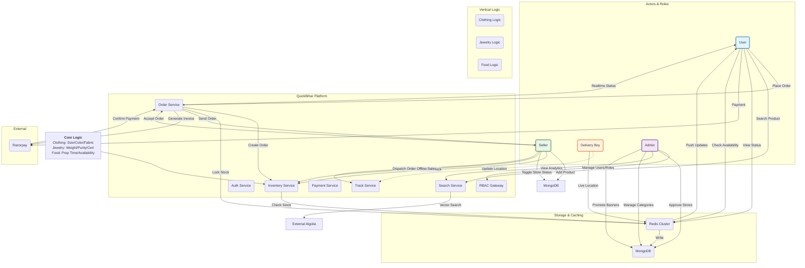

---

# QuickBihar.in Architecture & System Design

This section details the complete English translation of the QuickBihar system, the logic flow for each vertical, the technology stack rationale, and the system architecture diagram.

---

## What is QuickBihar.in?

**QuickBihar.in** is a **hyperlocal multi-vertical commerce platform**.

In simple terms, it is:
*   A **shopping application**.
*   A **local marketplace**.
*   A **delivery platform**.
*   And a **business management system**.

The system comprises 3 major business verticals:
1.  **Clothing**
2.  **Jewelry**
3.  **Food**

And it serves 4 major user roles:
1.  **User** (Consumer)
2.  **Seller** (Merchant)
3.  **Delivery Boy** (Logistics)
4.  **Admin / Super Admin** (Platform Control)

**Key Insight:** This app is not just for "displaying products." It is a **real commerce operating system** that transforms local businesses into online, manageable, scalable, and trackable entities.

---

## Why Was This App Built?

Real-world local commerce faces several critical pain points:

### 1. Weak Online Presence for Local Shops
Many clothing stores, jewelry shops, and food sellers operate offline without:
*   Proper online catalogs
*   Order tracking systems
*   Robust payment processing
*   Synchronized stock management

**QuickBihar** provides them with a structured digital framework.

### 2. Demand for Trusted Nearby Sellers
Users seek:
*   Fast, hyperlocal delivery
*   Verified local availability
*   Trusted store networks
*   Better customer support

### 3. Unique Logic for Different Categories
Clothing, jewelry, and food cannot be treated as a simple generic product list. They require domain-specific logic:
*   **Clothing:** Size, fabric, fit, color variants, return policies.
*   **Jewelry:** Weight, purity, certification, making charges, trust verification.
*   **Food:** Store operational hours, preparation time, live availability, delivery speed.

### 4. Need for Seller Ease of Use
Sellers need a simplified tool for:
*   Product uploading
*   Stock updates
*   Order management
*   Revenue tracking
*   Store control

---

## Main Purpose

The core mission of QuickBihar is:
> **To transform local Bihar businesses into smart, modern, scalable digital marketplaces.**

This ensures that users buy, sellers sell, delivery crews execute, admins control, and the system maintains perfect synchronization.

---

## Overall System Structure

The platform operates on three distinct layers:

### 1. Business Layer (Commerce Core)
Handles actual transactions:
*   Product listing & variants
*   Shopping cart & Orders
*   Payment processing
*   Delivery logistics
*   Review systems

### 2. Operations Layer (Business Control)
Manages real-world business operations:
*   Store open/close status
*   Inventory management
*   Order acceptance & dispatch
*   Live tracking
*   Serviceability status

### 3. Control Layer (Platform Management)
Handles platform-wide governance:
*   RBAC (Role-Based Access Control)
*   Admin approvals & verifications
*   Category & Banner management
*   Fraud detection
*   Analytics & policies

---

## Detailed Vertical Logic

### 1. Clothing Vertical
The most structured domain.
*   **Product Fields:** Name, brand, fabric, fit, pattern, sleeve, neck type, occasion, gender, size chart, color variants, price, discount, stock, images, reviews.
*   **Variant:** The actual sellable unit (e.g., Size M, Color Blue).
*   **User Flow:** Browse → Select Size/Color → Add to Cart → Order → Track.
*   **Seller Flow:** Upload Product → Define Attributes → Set Variants → Manage Stock & Pricing.

### 2. Jewelry Vertical
Trust-sensitive domain with dynamic pricing.
*   **Product Fields:** Material, purity, weight, stone type, certification, hallmark, making charges, price per gram, return policy.
*   **Pricing Logic:** Dynamic based on weight, purity, and market rates.
*   **Trust Features:** Mandatory certification upload, authenticity verification, clear return policies.
*   **Variant:** Weight difference, design change, stone variation, purity grade.

### 3. Food Vertical
Real-time domain focused on availability and timing.
*   **Product Fields:** Store open/close status, item availability, prep time, delivery radius, veg/non-veg, combos, addons.
*   **Timing Critical:** Strict management of open hours, preparation time, and dispatch windows.
*   **Seller Flow:** Toggle Store Status → Manage Menu Availability → Accept/Reject Orders → Track Prep Time.

### 4. The Store Entity
A crucial entity governing the seller's location capabilities.
*   **Attributes:** Name, address, contact, working hours, open/close status, delivery radius, minimum order amount, delivery fee, verified status, busy status.
*   **Role:** Determines delivery zones, operating hours, order acceptance windows, and product validity.

---

## Technology Stack Rationale

### 1. MongoDB
*   **Why:** Flexible schema, document model suitable for nested product data (attributes/variants).
*   **Use:** Permanent storage for Users, Roles, Permissions, Sellers, Stores, Products, Orders, Payments, Reviews.

### 2. Redis
*   **Why:** Speed layer and atomic operations.
*   **Use:** Shopping cart, inventory locks (to prevent overselling), order deduplication, product caching, live tracking temporary data, rate limiting, sessions.

### 3. Socket.io
*   **Why:** Real-time bidirectional communication.
*   **Use:** Live delivery tracking, real-time order status updates, push notifications for Sellers and Users.

### 4. Zod & TypeScript
*   **Why:** Strong runtime validation and type safety.
*   **Use:** Validating complex product inputs, ensuring API contract consistency, preventing runtime errors.

### 5. Payment Gateway (Razorpay)
*   **Use:** Secure processing of transactions for various verticals.

---

## System Architecture Diagram

The diagram below illustrates how the components interact.

### Diagram Legend Explained:

1.  **Actors (Users, Sellers, etc.):** The people interacting with the system.
2.  **Platform Services:** The internal logic handling orders, inventory, and payments.
3.  **Storage:** MongoDB for permanent data, Redis for speed and atomic operations.
4.  **Flow Logic:**
    *   **User:** Browses → Adds to Cart → Orders → Pays → Tracks.
    *   **Seller:** Manages Store Status → Updates Inventory → Accepts Orders.
    *   **Delivery:** Updates Location in Real-Time.
    *   **Admin:** Manages Security, Policies, and Analytics.
5.  **Vertical Specifics:** The diagram implies that the "Order" service receives specific data structures based on whether it's Clothing, Jewelry, or Food (handled by the Vertical Logic layer).

This architecture ensures **scalability** (Redis/Mongo), **trust** (RBAC/Validation), **speed** (Socket.io/Redis), and **real-world accuracy** (Inventory sync).

---

## Detailed Role Responsibilities

To maintain a secure and functional ecosystem, QuickBihar enforces strict Role-Based Access Control (RBAC).

### 1. User (Consumer)
The user's primary journey focuses on discovery and purchase:
*   Sign up/Login securely.
*   Browse, search, and apply domain-specific filters (e.g., sort jewelry by purity, food by open status).
*   Add variations of products to the cart.
*   Place orders and complete secure payments.
*   Track deliveries in real-time via Socket.io.
*   Provide reviews and ratings upon completion.

### 2. Seller (Merchant)
Sellers manage the business operations from their dedicated store dashboards:
*   Create and manage store profiles (including offline/online sync and open/close status).
*   Upload domain-specific products (e.g., attaching size-charts for clothing, or purity certificates for jewelry).
*   Manage stock levels across variants to prevent overselling.
*   Accept or reject incoming orders (critical for Food vertical).
*   Deploy coupons and localized offers.
*   Track revenue and analytics.

### 3. Delivery Boy (Logistics)
Dedicated to fulfillment logistics:
*   Receive and accept geographically assigned orders.
*   Pick up from local sellers.
*   Broadcast live location to the server (relayed via Redis & Socket.io).
*   Verify delivery and mark orders as complete.

### 4. Admin / Super Admin (Platform Control)
Admins ensure platform integrity and quality control:
*   Verify seller authenticity (especially crucial for high-value Jewelry sellers).
*   Maintain global taxonomies (categories, attributes).
*   Manage global promotions (banners, global offers).
*   Handle user disputes, fraud prevention, and monitor overall analytics.
*   Configure platform-wide policies (delivery fees, application configurations).

---

## The 3-Layer Product Architecture

To dynamically handle Clothing, Jewelry, and Food within the same database cleanly, products are modeled in three layers:

1.  **Product (General Information):** Title, description, category, brand, images, tags, and cached rating calculations.
2.  **Attributes (Domain-Specific Fields):**
    *   *Clothing:* Fabric type, fit style, pattern, size chart mapping.
    *   *Jewelry:* Material type, purity level, certification documents.
    *   *Food:* Preparation time, Veg/Non-Veg indicators, cuisine tags.
3.  **Variant (The Sellable Unit):** The actual, specific item a user puts in their cart (e.g., "Size M, Blue"). It holds the exact SKU, size/color/weight, exact price, and current stock level.

---

## Solving the Offline-to-Online Stock Challenge

A major challenge for local commerce is offline walk-in sales reducing physical stock without the app knowing, leading to "overselling" online. 

**QuickBihar's Solution:**
1.  **Strict Inventory Logging:** Sellers are required to update offline sales through a unified inventory sync tool in their app.
2.  **Real-time Stock Validation:** At the exact moment a User clicks "Checkout", the backend compares cart quantity against real-time database stock.
3.  **Redis Inventory Locking:** During payment processing, Redis temporarily "locks" the inventory count to prevent race conditions where two online users buy the final item simultaneously.

---

## Complete Order Lifecycle Flow

The system orchestrates a standard 15-step lifeline for every transaction:
1.  User selects a specific product **Variant**.
2.  User adds it to the **Cart** (Redis cached).
3.  User proceeds to **Checkout** and selects an Address.
4.  User attempts **Payment** (Razorpay).
5.  System performs immediate **Stock Validation**.
6.  System executes a **Redis Stock Lock**.
7.  Payment succeeds; **Order is Formally Created**.
8.  Seller is sent an automatic **Notification**.
9.  Seller reviews and **Accepts the Order**.
10. System geographically assigns a **Delivery Boy**.
11. Delivery Boy arrives and **Picks up** the package.
12. Delivery begins; Socket.io broadcasts **Live Tracking**.
13. Order is marked as **Delivered**.
14. Redis Lock resolves into permanent **Inventory Deduction**.
15. User submits a **Rating/Review** (cached separately from the main product document for fast queries).

---

## Platform Features & Engineering Operations

### Search & Filtering (Optimized Discovery)
QuickBihar doesn't just display products; it requires complex, vertical-specific filtering:
*   *Clothing:* Filter by size, fit, fabric, occasion.
*   *Jewelry:* Filter by metal type, purity score, certification presence.
*   *Food:* Filter by "Open Now", preparation time, pure veg.

### Ratings & Reviews System
Ratings are not hardcoded to prevent database bottlenecks. The `Review` collection safely stores actual user reviews, while the `Product` collection only holds **cached aggregate fields** (e.g., `averageRating`, `ratingCount`). This ensures sub-millisecond product loading times.

### Backend Modularity
The platform is built as a **Modular Monolith** using **TypeScript** and **Zod** (for runtime payload validation). 
Rather than a tangled codebase, each feature (Auth, Roles, Users, Sellers, Orders, Cart, Analytics) strictly follows its own isolated pattern:
*   `Routes` → `Controllers` → `Services` → `DAOs (Data Access Objects)` → `Models/Schemas`.

This strict separation guarantees that QuickBihar goes beyond a basic application—it functions responsibly as a true **Hyperlocal Multi-Category Commerce Super App**.